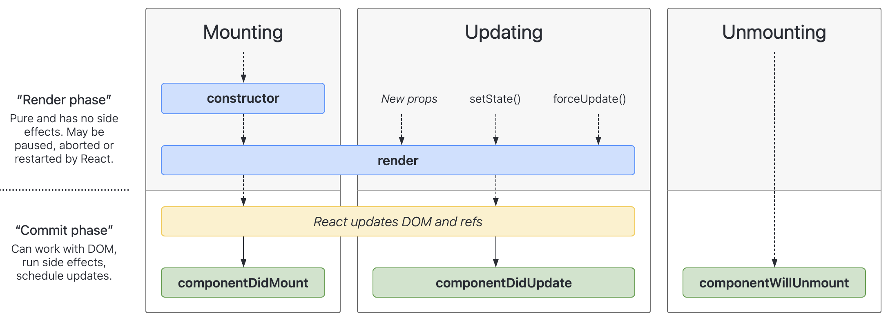
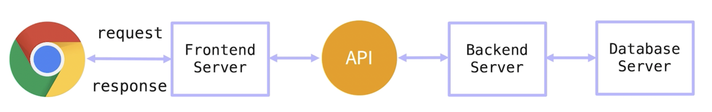

# BEAR U
<br />

## defaultProps
- props(프롭스) 기본값을 정의.
```javascript
// App.js
function App() {
  return <Hello />
}

// Hello.js
// 받아오는 porps.name이 없을 때 에러 발생
function Hello({name}) {
  return <h1>Hello, {name}</h1>
}

// 이럴 때, 기본 props 값을 정의해주는 것이 defaultProps
Hello.defaultProps = {
  name: 'React!'
}

export default Hello;
```
<br />
<br />

## 'children'으로 하위 컴포넌트 불러오기
- 감싸는 컴포넌트(ex. Wrapper)가 `{children}`을 넣어줘야 하위요소를 감싸준다.
```javascript
// Wrapper.js
function Wrapper({children}) {
  return <div></div>
}

// Hello.js
function Hello({name}) {
  return <h1>Hello, {name}</h1>
}

// App.js
function App() {
  return (
    <Wrapper>
      <Hello name="HaHa" />
      <Hello name="HaHa" />
    </Wrapper>
  )
}
```
<br />
<br />

## state 활용
```javascript
// Input.js
function Input () {
  const [inputs, setInputs] = useState({
    subject: "",
    score: "",
  })

  // input에 입력한 값으로 체인지 함수
  const onChange = (e) => {
    const { value, name } = e.target;
    setInputs({
      // 객체 값을 변경할 땐, 항시 복사를 먼저 한 후에 수정해야 한다.
      ...inputs,
      // name만 써주게되면 string으로 인식이 되기 때문에 []로 표시 한다.
      [name] : value
    })
  }

  return (<div>
    <h2>성적: {inputs.subject} {inputs.score}</h2>
    <input type="text" name="subject" placeholder="수학" value={inputs.subject} onChange={onChange} />
    <input type="text" name="score" placeholder="99" value={inputs.score} onChange={onChange} />
  </div>)
}
```
<br />

## Hook
### 라이프사이클 (lifecycle, 컴포넌트의 생명주기)

- 리액트 라이프 사이클 다이어그램 : [자세히보기](https://projects.wojtekmaj.pl/react-lifecycle-methods-diagram/)
<br />

- Mounting > Updating > Unmounting 순으로 진행이 된다.
- 페이지 안에서는 위에서 아래 방향으로 진행이 된다.
- **constructor** : 컴포넌트가 생겨나는 과정을 의미한다. (== 함수를 정의할 때 생겨난다)
- **render (렌더링)** : DOM에 등록을 하기 전에 렌더링 과정을 거친다. 브라우저에 DOM에 어떤 객체가 들어가서 브라우저 화면에 나타나도록 하는 것.
- 렌더링이 진행이 되면서 Updating 페이지가 함께 진행이 된다. 
- **Updating** : 업데이팅 페이지에서 하는 일은 함수에서 갖고 있는 props, state 값을 이용해서 리턴하고 있는 jsx 컴포넌트의 값을 업데이트 해준다.
- 하나의 컴포넌트 등록과 값이 업데이트 되는 렌더링을 모두 거친다.
- 리액트에서는 브라우저의 DOM에 컴포넌트를 업데이트 한다.
- 사용하다가 컴포넌트가 필요없어지게 된다면 **Unmounting** 페이지를 거쳐서 사라지게 된다.
<br />

### render 페이지와 commit 페이지
- **render 페이지** : 리액트에서 관리.
- **commit 페이지** : 브라우저에 나타나는 부분.
<br />
<br />


## useEffect
- 페이지가 로딩될 때 작동하는 Hook.
- 자동으로 호출이 되는 훅 => **useEffect**.
- 컴포넌트가 마운트가 되고 DOM이 변경이 된 다음, 렌더링이 일어난 다음 useEffect가 실행이 된다.

### useEffect 언제 필요할 까?
- **props 속한 값을 컴포넌트의 로컬 변수로 선언한 경우 :**,<br />컴포넌트의 로컬 변수가 props로 부터 오는 경우에 useEffect에서 할당.
- **외부 api를 호출해서 통신을 통해 어떤 값을 받아오거나 받아온 값을 state로 넣어주는 경우**
- **3rd party(써드파티) 라이브러리를 써서 무언가 다른 작업들을 해줘야 할 때**<br />* 3rd party(써드파디) 라이브러리란? 제 3자 라이브러리. 개인 개발자나 프로젝트 팀 혹은 업체 등에서 개발한 라이브러리.
- **렌더링이 다 되면, 화면에는 요소들이 다 나타나고 그 다음에 다시 한 번 데이터를 변경하는 그런 작업들을 useEffect가 한다.**

### useEffect 예제
```javascript
import React, { useState, useEffect } from "react";

function App() {
  const [count, setCount] = useState(0);
  useEffect(() => {
    console.log("useEffect");

    // 브라우저 타이틀 변경
    document.title = "You Clicked ${count} times";
  });
  return (
    <>
      <p>You clicked {count} times</p>
      <button
        onClick={() => {
          console.log("click");
          setCount(count + 1);
        }}
      >
        click me
      </button>
    </>
  );
}

export default App;
```
<br />
<br />

## useHistory
- `npm install react-router-dom` :<br />서로 다른 페이지로 이동할 떄 주로 쓰는 기능을 모아둔 패키지.
```javascript
import React from "react";
import { BrowserRouter as Router, Route, Link } from "react-router-dom";

function App() {
  return (
    <BrowserRouter>
      // to에 명시된 페이지로 이동.
      <Link to ="/home">Home</Link>

      <Routes>
        // 현재 경로에 맞는 컴포넌트를 보여준다.
        <Route path="/" element={<Index />} />
        <Route path="/home" element={<Home />} />
      </Routes>
    </BrowserRouter>
  );
}

function Index() {
  let navigate = useNavigate();
  function handleClick() {
    // 입력받은 경로로 이동이 된다.
    navigate("/home");
  }
  return (
    <>
      <h2>Index</h2>
      <button onClick={handleClick}>Go to Home</button>
    </>
  );
}

function Home() {
  return (
    <>
      <h2>Home</h2>
      <p>This is home</p>
    </>
  );
}

export default App;
```
<br />
<br />

## useRef (베어유 강의 내용 아님.)
- `useRef` 함수는 current 속성을 가지고 있는 객체를 반환하는데, 인자로 넘어온 초기값을 current 속성에 할당한다.
- 이 current 속성은 값을 변경해도 상태를 변경할 때 처럼 React 컴포넌트가 다시 랜더링되지 않는다. 
- React 컴포넌트가 다시 랜더링될 때도 마찬가지로 이 current 속성의 값이 유실되지 않는다.
- `useRef` 훅 함수가 반환하는 객체의 이러한 독특한 성질을 이용하여 startCounter()와 stopCounter() 함수를 구현했다.
```javascript
import React, { useState, useRef } from "react";

function App() {
  const [count, setCount] = useState(0);
  const intervalId = useRef(null);
  console.log(`랜더링... count: ${count}`);

  const startCounter = () => {
    intervalId.current = setInterval(
      () => setCount((count) => count + 1),
      1000
    );
    console.log(`시작... intervalId: ${intervalId.current}`);
  };

  const stopCounter = () => {
    clearInterval(intervalId.current);
    console.log(`정지... intervalId: ${intervalId.current}`);
  };

  return (
    <>
      <p>자동 카운트: {count}</p>
      <button onClick={startCounter}>시작</button>
      <button onClick={stopCounter}>정지</button>
    </>
  );
}

export default App;
```
<br />
<br />

## 나만의 Hook 만들기
- 동일한 기능을 여러곳에서 사용할 때 커스텀 Hook을 만든다.<br />Hook이라는 것이 함수이기 때문에 함수로 만들고 명명법은 **use**로 시작하여 훅 이름을 만들어준다.
  - **커스텀 훅(Hook) 사용 전**
    ```javascript
    import { useState } from "react";

    function App() {
      const [click1, setClick1] = useState(false);
      const [click2, setClick2] = useState(false);
      const [click3, setClick3] = useState(false);
      const [click4, setClick4] = useState(false);
      const [click5, setClick5] = useState(false);

      const toggle1 = () => {
        setClick1((click1) => !click1);
      };
      const toggle2 = () => {
        setClick2((click2) => !click2);
      };
      const toggle3 = () => {
        setClick3((click3) => !click3);
      };
      const toggle4 = () => {
        setClick4((click4) => !click4);
      };
      const toggle5 = () => {
        setClick5((click5) => !click5);
      };

      return (
        <>
          <button onClick={toggle1}>{click1 ? "Hello" : "Goodbye"}</button>
          <button onClick={toggle2}>{click2 ? "Hello" : "Goodbye"}</button>
          <button onClick={toggle3}>{click3 ? "Hello" : "Goodbye"}</button>
          <button onClick={toggle4}>{click4 ? "Hello" : "Goodbye"}</button>
          <button onClick={toggle5}>{click5 ? "Hello" : "Goodbye"}</button>
        </>
      );
    }

    export default App;
    ```
  - **커스텀 훅(Hook) 사용 후**
    - 불필요한 구현을 반복하는 것을 피할 수 있고 그래서 코드가 간결해진다.
    ```javascript
    import { useState } from "react";

    function App() {
      const [click1, toggle1] = useToggle(false);
      const [click2, toggle2] = useToggle(false);
      const [click3, toggle3] = useToggle(false);
      const [click4, toggle4] = useToggle(false);
      const [click5, toggle5] = useToggle(false);

      return (
        <>
          <button onClick={toggle1}>{click1 ? "Hello" : "Goodbye"}</button>
          <button onClick={toggle2}>{click2 ? "Hello" : "Goodbye"}</button>
          <button onClick={toggle3}>{click3 ? "Hello" : "Goodbye"}</button>
          <button onClick={toggle4}>{click4 ? "Hello" : "Goodbye"}</button>
          <button onClick={toggle5}>{click5 ? "Hello" : "Goodbye"}</button>
        </>
      );
    }

    const useToggle = (defaultValue = false) => {
      const [click, setClick] = useState(defaultValue);
      const toggle = () => setClick((click) => !click);

      return [click, toggle];
    };

    export default App;
    ```
<br />
<br />

## JSON 파일로 서버 만들기
### API 란?

- API는 Application Programming Interface(애플리케이션 프로그램 인터페이스)의 줄임말.<br /> API의 맥락에서 애플리케이션이라는 단어는 고유한 기능을 가진 모든 소프트웨어를 나타낸다.<br />인터페이스는 두 애플리케이션 간의 서비스 계약이라고 할 수 있다. 이 계약은 **요청과 응답을 사용하여 두 애플리케이션이 서로 통신하는 방법을 정의**한다. API 문서에는 개발자가 이러한 요청과 응답을 구성하는 방법에 대한 정보가 들어 있다.
- 우리가 만든 어떤 로직에 대한 프로그램이 있으면 그 프로그램을 다른 프로그램에서 사용할 수 있도록 프로그램적인 인터페이스를 제공하는 것을 API라고 한다.
- [API 자세히보기](https://aws.amazon.com/ko/what-is/api/)
<br />

### DB와 REST API
- **Database**
  - Create
  - Read
  - Update
  - Delete
- **REST API (Representational State Transfer API)**
  - POST
  - GET
  - PUT
  - DELETE
<br />

### REST의 특징
- [REST 자세히보기](https://meetup.toast.com/posts/92)
- **Uniform (유니폼 인터페이스)**<br />Uniform Interface는 URI로 지정한 리소스에 대한 조작을 통일되고 한정적인 인터페이스로 수행하는 아키텍처 스타일을 말한다.
- **Stateless (무상태성)**<br />REST는 무상태성 성격을 갖는다.<br />다시 말해 작업을 위한 상태정보를 따로 저장하고 관리하지 않는다. 세션 정보나 쿠키정보를 별도로 저장하고 관리하지 않기 때문에 **API 서버는 들어오는 요청만을 단순히 처리**하면 된다.<br />때문에 서비스의 자유도가 높아지고 서버에서 불필요한 정보를 관리하지 않음으로써 구현이 단순해진다.
- **Cacheable (캐시 가능)**<br />REST의 가장 큰 특징 중 하나는 HTTP라는 기존 웹표준을 그대로 사용하기 때문에, 웹에서 사용하는 기존 인프라를 그대로 활용이 가능하다.<br />따라서 HTTP가 가진 캐싱 기능이 적용 가능하다. HTTP 프로토콜 표준에서 사용하는 Last-Modified태그나 E-Tag를 이용하면 캐싱 구현이 가능하다.
- **Self-descriptiveness (자체 표현 구조)**<br />REST의 또 다른 큰 특징 중 하나는 REST API 메시지만 보고도 이를 쉽게 이해 할 수 있는 자체 표현 구조로 되어 있다,
- **Client - Server 구조**<br />REST 서버는 API 제공, 클라이언트는 사용자 인증이나 컨텍스트(세션, 로그인 정보)등을 직접 관리하는 구조로 각각의 역할이 확실히 구분되기 때문에 클라이언트와 서버에서 개발해야 할 내용이 명확해지고 서로간 의존성이 줄어들게 된다.
- **계층형 구조**<br />REST 서버는 다중 계층으로 구성될 수 있으며 보안, 로드 밸런싱, 암호화 계층을 추가해 구조상의 유연성을 둘 수 있고 PROXY, 게이트웨이 같은 네트워크 기반의 중간매체를 사용할 수 있게 한다.
- **REST API 디자인 가이드**<br />REST API 설계 시 가장 중요한 항목은 다음의 2가지로 요약할 수 있다.<br />첫 번째, URI는 정보의 자원을 표현해야 한다.<br />두 번째, 자원에 대한 행위는 HTTP Method(GET, POST, PUT, DELETE)로 표현한다.
<br />

### HTTP 응답 상태 코드
- 잘 설계된 REST API는 URI만 잘 설계된 것이 아닌 그 리소스에 대한 응답을 잘 내어주는 것까지 포함되어야 한다.
- 정확한 응답의 상태코드만으로도 많은 정보를 전달할 수가 있기 때문에 응답의 상태코드 값을 명확히 돌려주는 것은 생각보다 중요한 일이 될 수도 있다.
- 혹시 200이나 4XX관련 특정 코드 정도만 사용하고 있다면 처리 상태에 대한 좀 더 명확한 상태코드 값을 사용할 수 있기를 권장하는 바이다.
- 상태코드에 대해서는 몇 가지만 정리 내용이다.
  |상태코드||
  |:---|:---|
  |200|클라이언트의 요청을 정상적으로 수행함|
  |201|클라이언트가 어떠한 리소스 생성을 요청, 해당 리소스가 성공적으로 생성됨(POST를 통한 리소스 생성 작업 시)|
  <br />

  |상태코드||
  |:---|:---|
  |400|클라이언트의 요청이 부적절 할 경우 사용하는 응답 코드|
  |401|클라이언트가 인증되지 않은 상태에서 보호된 리소스를 요청했을 때 사용하는 응답 코드<br />(로그인 하지 않은 유저가 로그인 했을 때, 요청 가능한 리소스를 요청했을 때)|
  |403|유저 인증상태와 관계 없이 응답하고 싶지 않은 리소스를 클라이언트가 요청했을 때 사용하는 응답 코드<br />(403 보다는 400이나 404를 사용할 것을 권고. 403 자체가 리소스가 존재한다는 뜻이기 때문에)|
  |405|클라이언트가 요청한 리소스에서는 사용 불가능한 Method를 이용했을 경우 사용하는 응답 코드|
  <br />
  
  |상태코드||
  |:---|:---|
  |301|클라이언트가 요청한 리소스에 대한 URI가 변경 되었을 때 사용하는 응답 코드<br />(응답 시 Location header에 변경된 URI를 적어 줘야 합니다.)|
  |500|서버에 문제가 있을 경우 사용하는 응답 코드|
<br />

### JSON SERVER 예제
- `db/data.json` 파일을 생성한다.
```javascript
{
  "items" : [
    {"id": 1, "task" : "숙제하기", "due": "20211231", "status":"todo"},
    {"id": 2, "task" : "숙제하기", "due": "20211231", "status":"todo"},
    {"id": 3, "task" : "숙제하기", "due": "20211231", "status":"todo"},
    ...
  ]
}
```
- 전역에 `json-server`를 설치한다.
  `npm install -g json-server` 설치 에러시 npm 앞에 `sudo`를 붙여준다.
- `json-server`를 실행하려면 `json-server --watch 파일경로 --port 포트번호`로 실행한다.
  ```
  json-server --watch ./src/db/data.json --port 3001
  ```
- `http://localhost:3001/items` => json 파일을 확인할 수 있다.
- `http://localhost:3001/items/1` => 1처럼 해당 id 값을 넣으면 그에 해당하는 id값 정보를 확인할 수 있다.
- 쿼리 셀렉트로 todo만 보고 싶을 때 items 뒤에 `?키=밸류` 값을 넣어주면 확인할 수 있다.
  ```
  http://localhost:3001/items?status=done
  ```
