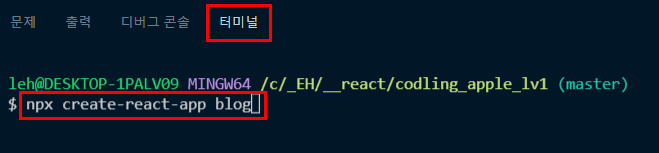
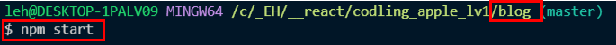
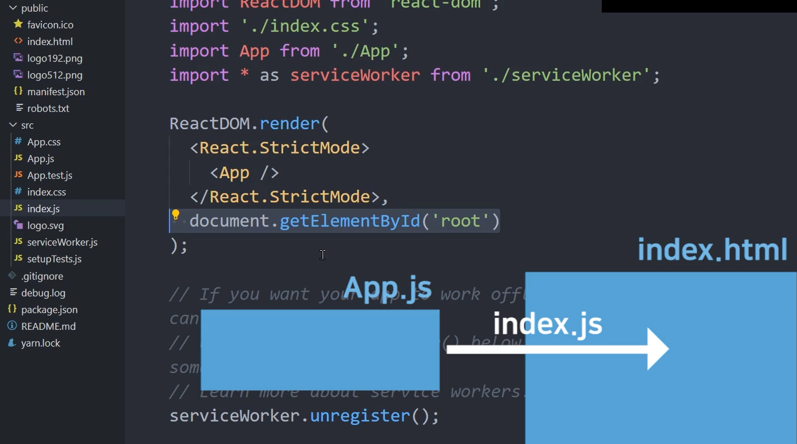
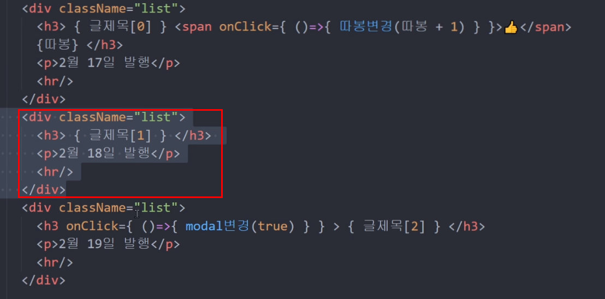
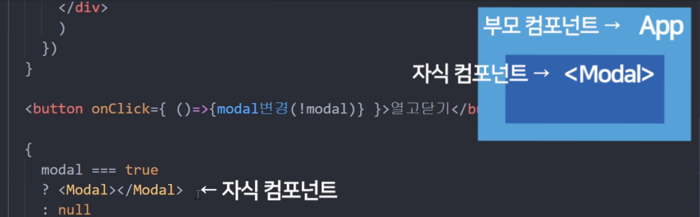
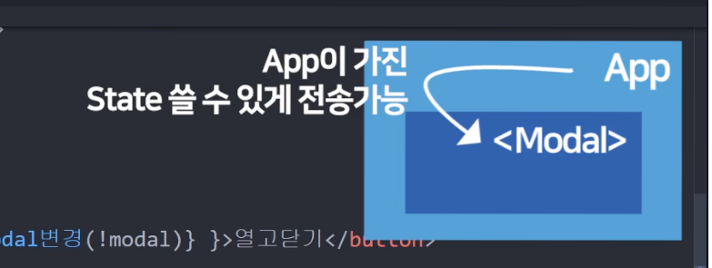
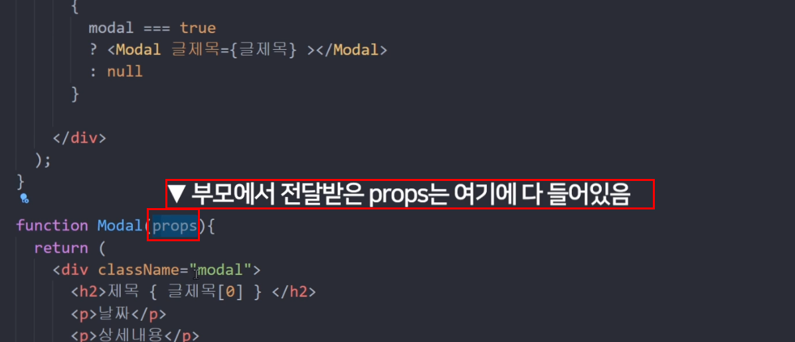
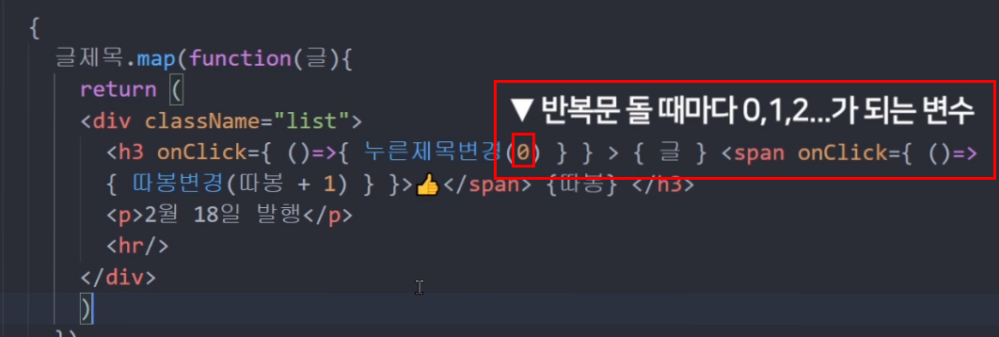

# React 리액트 기초부터 쇼핑몰 프로젝트까지

## 1. 리액트 React 설치와 개발환경 셋팅 (2021 ver)
- node.js 최신버전을 설치한다.<br />[node.js](https://nodejs.org/ko/)<br />(최신버전 미설치 시 오류가 날 수 있음. nodejs 공홈에서 최신버전을 다운로드 한다.)
- 리액트를 작업할 폴더를 생성한 후, 터미널에서 해당 폴더를 기준으로 하여 명령어를 실행한다.
  - npx = 라이브러리 설치 도와주는 명령어<br />(nodejs 설치가 잘 되어 있어야 이용이 가능)
  - create-react-app = 리액트 셋팅 다된 boilerplate<br />만들기 쉽게 도와주는 라이브러리
  - 설치가 완료가 되면 `success Uninstalled packages` 문구가 보여진다.
  ```
  npx create-react-app 프로젝트명
  ```
  
- 프로젝트명의 하위 폴더를 다시 open Folder로 연다.<br />(또는 vscode에서 Live Server 위치를 해당 폴더로 설정해준다)
- `src/app.js`가 메인 페이지이다.
- **작성한 코드 미리보기 뛰우기**
  - 생성한 폴더(예, blog)를 기준으로 `npm start` 명령어를 입력한다.<br />
    
    ```javascript
    // npm start 명령어 실행 시, 아래와 같이 보여진다.
    You can now view blog in the browser.

    Local:            http://localhost:3000
    On Your Network:  http://192.168.219.102:3000
    ```
<br />

### Tip. 설명
- **nodejs를 설치하는 이유는 create-react-app 라이브러리** 때문.<br />[Create React App](https://create-react-app.dev/docs/getting-started/)
  - nodejs를 설치하면 npm 이라는 툴 이용이 가능
  - npm으로 create-react-app 이용을 한 것<br />`npx create-react-app 프로젝트명`
  - 로컬서버를 실행할 땐, `npm start`
<br />

- /public/index.html = 메인페이지
- /src/App.js = 메인페이지에 들어갈 html 코드를 짜는 곳
- /src/index.js = App.js 의 코드를 index.js를 통해 index.html로 뿌려준다.<br />
  
  <br />

- /node_modules 폴더 = 라이브러리 모은 폴더
- /public 폴더 = static 파일 보관함<br />>(public 폴더에 있는 파일은 빌드 실행 시, 컴파일/압축이 되지 않는다.)
- /src 폴더 = 소스코드 보관함
- package.json : 설치한 라이브러리 목록<br />(라이브러리 버전 등을 확인할 수 있다)

<br />
<br />
<br />

## 2. JSX를 이용해 HTML 페이지 제작해보는건 처음이겠죠
- 메인페이지 작동원리
  - `/src/App.js` 의 코드를 `/src/index.js` 파일에서 `/public/index.html`로 가져다줘라 
    ```javascript
    // src/App.js
    function App() {
      return (
        // html 코드 작성
      );
    }

    // src/index.js
    document.getElementById('root') // root에 App.js 코드를 넣어주라는 의미
    ```
### JSX 문법
```javascript
// src/App.js
function App() {
  return (
    <div className="App">
      // html 코드 작성
    </div>
  );
}
```
- `<div class=""></div>`로 작성할 수 없다.<br />반드시, `<div className="black-nav"></div>`처럼 className 으로 class를 지정해줘야 한다. 자바스크립트 내 class가 있기 때문에 className 으로 지정한다.
  ```
  <div className="클래스명"></div>
  ```
- html/css처럼 코드 작성하면 된다.<br />`/src/App.css` 참고
  ```javascript
  function App() {
    return (
      <div className="App">
        <div className = "black-nav">
          <div>개발 Blog</div>
        </div>
      </div>
    );
  }
  ```
### 리액트의 장점, 데이터 바인딩
- 데이터 바인딩이란? 데이터를 html에 꽂아 넣는 것
  ```javascript
  // 전통적인 자바스크립트 데이터바인딩
  document.getElementById().innerHTML = ''

  // 리액트
  let posts = '강남 고기 맛집';
  <h4> { posts } </h4>  // { 변수명 }
  ```
- { 변수명, 함수 등} 사용이 가능하다.
  ```javascript
  import logo from './logo.svg';

  function App() {

    let posts = '강남 고기 맛집';
    function 함수() {
      return 100
    }

    return (
      <div className="App">
        <div className = "black-nav">
          // div 클래스명에 '강남 고기 맛집' 적용
          <div className={ posts }>개발 Blog</div> 
        </div>
          <h4> { posts } </h4>   // 강남 고기 맛집
          <h4> { 함수() } </h4>  // 100
             // 경로로 적용할 수도 있지만 변수명을 넣어 적용할 수 있다
      </div>
    );
  }
  ```
### JSX에서 style 속성을 적용할 때
`<div style ="font-size: 16px;"></div>` 이렇게 사용할 수가 없다.<br />자바스크립트에서 사용되는 기호가 있기 때문이다.<br />**style은 오브젝트 형식으로 적용을 해야 한다.**
  - '-'를 쓸 수 없다. camelCase 작명 관습에 따라 속성명을 `font-size`를 `fontSize`로 바꿔서 적용한다.
  - `style={ object 자료형으로 만든 스타일 }`
  ```javascript
  function App() {

    let posts = '강남 고기 맛집';

    return (
      <div className="App">
        <div className = "black-nav">
          <div style={ {color: 'blue', fontSize: '30px'} }>개발 Blog</div>
        </div>
          <h4> { posts } </h4>
      </div>
    );
  }
  ```
  - style 속성을 변수에 담아 데이터바인딩 으로 사용할 수 있다
  ```javascript
  function App() {
    let posts = {color: 'blue', fontSize: '30px'};

    return (
      <div className="App">
        <div className = "black-nav">
          <div style={ posts }>개발 Blog</div>
        </div>
      </div>
    );
  }
  ```
<br />
<br />
<br />

## 3. 중요한 데이터는 변수말고 리액트 state로 만들랬죠
- **데이터는 변수에 넣거나 state에 넣어 사용한다.**
### 리액트의 데이터 저장공간 state 만드는 법
1. `{useState}` 상단에 첨부(리액트의 내장함수 useState를 쓴다)
  ```javascript
  import React, { useState } from 'react';
  ```
2. `useState(데이터)`
  - `useState(데이터)`를 작성하면 2개의 배열`[a,b]`이 생긴다.<br />a = 데이터 / b = 데이터 수정하는 함수()
  ```javascript
  function App() {
    useState('남자 코트 추천');
  }
  ```
3. (참고) ES6 destructuring 문법을 이용한다
  - **ES6 destructuring 문법 간략 설명**
    - `var [a,b] = [10, 100];` 처럼 10을 a, 100을 b라는 변수에 넣고자 할 때 사용한다.<br />**즉, array, object에 있던 자료를 변수에 쉽게 담고 싶을 때**
  - `useState()`는 2개의 변수를 만들기 때문에 destructuring 문법을 사용하는 것.<br />[state데이터, state데이터 변경 함수]
  ```javascript
  function App() {
    let [a,b] =  useState('남자 코트 추천');
  }
  ```
4. 변수 대신에 state를 이용하여 쓸 수 있다
  ```javascript
  function App() {

    let [글제목, 글제목변경] =  useState('남자 코트 추천');

    return (
      <div className="App">
        <div className = "black-nav">
          <div>개발 Blog</div>
        </div>
        <div className="list">
          <h3>{ 글제목 }</h3>
          <p>2월 17일 발행</p>
          <hr />
        </div>
      </div>
    );
  }
  ```
5. **state는 변수 대신 데이터 저장공간<br />useState()를 이용해 만들어야 한다.**
  - `useState([])` 배열을 이용할 수 있다. (글제목3 참고)<br />`{글제목3[0]}`처럼 `[인덱스번호]`를 적용하면 된다.
  - `[인덱스번호]`를 사용하지 않은 경우, `남자 코트 추천강남 우동 맛집`처럼 배열 값이 모두 노출된다.
  ```javascript
  let [글제목, 글제목변경] =  useState('남자 코트 추천');
  let [글제목2, 글제목변경2] =  useState('남자 코트 추천2');
  let [글제목3, 글제목변경3] =  useState(['남자 코트 추천','강남 우동 맛집']);
  ```
### state에 데이터를 저장해놓는 이유?
- 웹이 App처럼 동작하게 만들고 싶을 때 사용한다.
- **state를 사용하면 새로고침없이 자동으로 재랜더링이 된다.**<br />(변수를 사용할 경우, 데이터 변경 시 새로고침이 되는 반면, state는 자동 재랜더링! 이게 가장 큰 차이)<br />(ex. 제목을 수정하거나 정렬 등을 할 때 재랜더링)
- **자주 바뀌는, 중요한 데이터는 변수 말고 state로 저장하여 사용한다.**

<br />
<br />
<br />

## 4. 버튼에 기능개발을 해보자 & 리액트 state변경하는 법
### 터미널에 뜨는 warnig(노랑 글씨)
- eslint가 잡아주는 문법 체크 사항을 제거하고 싶을 땐<br />`/* eslint-disable */`을 js파일 최상단에 써주면 된다.

### 좋아요 버튼을 만들어본다
1. html ul - 좋아요 버튼을 만든다.
  - 크롬 주소창에 대고 그림이모티콘을 클릭하거나 `window+.` 단축키를 클릭하면 된다.
  ```
   <h3>{ 글제목[0] } <span>👍</span> 1 </h3>
  ```
2. `onClick={ () => { 클릭될 때 실행할 JS } }` 또는 `onClick={ 정의된 함수명 }`
  - `정의된 함수명()`처럼 ()를 붙여서 쓰면 안 된다. **()를 적용하면 함수가 바로 실행이 된다.**
3. 버튼을 클릭할 때마다 console 창에 1이 찍힌다.
  ```
  <h3>{ 글제목[0] } <span onClick={ ()=>{console.log(1)} }>👍</span> 0 </h3>
  ```
4. 따봉을 누를 때마다 1씩 증가시키려고 한다.
  - 처음 초기값 0을 담은 state를 만든다.
    ```javascript
    function App() {
      // 따봉 초기값 0 세팅
      let [따봉, 따봉변경] = useState(0);

      return (
        <div className="App">
          <div className="list">
            <h3>{ 글제목[0] } <span>👍</span> { 따봉 } </h3>
            <p>2월 17일 발행</p>
            <hr />
          </div>
        </div>
      );
    }
    ```
  - 따봉을 클릭했을 때 실행시킬 클릭이벤트를 작성한다.
    ```
    <h3>{ 글제목[0] } <span onClick={ ()=>{} }>👍</span> { 따봉 } </h3>
    ```
  - `() => { 따봉 + 1 }`로 써주면 작동이 안 된다.<br />state는 변경할 수 없다. `따봉변경()` 처럼 **변경 함수를 사용하여 변경해야 한다.** `따봉변경(대체할 데이터)`
  - `따봉변경`함수를 사용하여 state 따봉 값을 변경한다.<br />(따봉 버튼을 클릭할 때마다 1씩 증가하게 된다.)
    ```
    <h3>{ 글제목[0] } <span onClick={ ()=>{ 따봉변경(따봉 + 1) } }>👍</span> { 따봉 } </h3>
    ```
5. useState()는 `[state, state변경함수]` 가 생성이 되는데, **값을 변경하고자 할 땐 state변경함수를 사용하여 변경한다.<br />그래야 자동으로 재랜더링이 된다.**(웹앱처럼 스무스하게 값이 변경이 된다.)

### 버튼을 클릭하여 state 값 변경하기
1. 버튼을 누르면 첫 번째 제목이 '여자 코트 추천'으로 변경한다.
2. 제목바꾸기 함수를 만들고 버튼에 제목바꾸기 함수를 적용한다.
  - `제목바꾸기()` 처럼 적용하면 안 된다. ()를 붙이면 **'함수를 실행해라'** 라고 받아드려진다!
  ```
  function 제목바꾸기() {
  }

  <button onClick={ 제목바꾸기 }>버튼</button>
  ```
3. 하드코딩으로 제목바꾸기 함수를 작성한다.
  - 하드코딩으로 할 경우, 배열의 수가 100개, 1000개.. 그 이상일 경우 하드코딩으로 해줄 수 없기 때문에 이런 방법은 옳지 않다.
  ```
  function 제목바꾸기() {
    글제목변경(['여자 코트 추천','강남 우동 맛집','놀러가고싶다']);
  }
  ```
4. **원본 state는 수정하면 안 된다. (특히 state가 Array, Object 자료형이면)**
5. state를 수정하려면 수정된 [데이터]를 만든다.<br />**state의 복사본을 만들어서 수정해야 한다.**
  ```
  function 제목바꾸기() {
    let newArray = 글제목;
    newArray[0] = '여자 코트 추천';
    글제목변경(newArray);
  }
  ```
6. 복사하여 코드를 작성했지만 state 값이 바뀌지 않았다.<br />**복사하는 행위는 맞지만 state 복사하는 방법이 옳지 않았다. state를 deep copy해서 수정해야 한다.**
  - `let newArray = 글제목;`은 복사가 아니라 값 공유이다.<br />(※ 참조, reference data type 특징)
  - 복사를 하고자 할 땐, `let newArray = [...글제목]`<br />(Object에서도 동일한 방식으로 복사가 가능하다)
  - **deep copy :** 값 공유가 아니다. 서로 독립적인 값을 가지는 복사.
  ```
  function 제목바꾸기() {
    let newArray = [...글제목];
    newArray[0] = '여자 코트 추천';
    글제목변경(newArray);
  }
  ```
7. **리액트 대 원칙! (immutable date)**
  - (리액트 권장방식) state는 직접 변경하면 안 된다. 
8. 정리) Array, Object sate 데이터 수정하는 방법
  - 일단 **변경함수**를 써야 한다.
  - 원본 state와 유사한 값으로 변경해야 한다<br />예시 1) `['남자 코트 추천','강남 우동 맛집','놀러가고싶다']`과 유사하게<br />예시 2) `useState(0)`와 유사하게
  - **state는 직접 건들면 절.대.안.된.다. deep copy해서 값을 변경해야 한다.**<br />`[...글제목]`처럼 copy해서 state를 변경한다.

  <br />
  <br />
  <br />

## 5. React Component
: 많은 div들을 한 단어로 줄이고 싶은 충동이 들 때

### Modal 창으로 띄우는 상세페이지 만들기
1. 페이지 구분은 라우터를 써야 하지만, 지금은 Modal 창을 띄워 상세페이지를 만들어 보려고 한다.
2. `return( <div></div><div></div> )` 처럼 `<div></div>`를 **여러개 쓸 수 없다.**<br />`<div></div>`를 감싸는 하나의 `<div></div>`가 필요하다.
  ```javascript
  function App() {
    return (
      <div>  // div와 div를 감싸는 하나의 div 필수!!
        <div></div>
        <div></div>
      </div>
    )
  };
  ```
3. html 코딩작업을 리액트의 Component 문법으로 적용한다.
  ```javascript
  function App() {
    return(
      <div className="modal">
        <h2>제목</h2>
        <p>날짜</p>
        <p>상세내용</p>
      </div>
    )
  }
  ```
  - 위의 코드를 리액트의 Component 문법으로 변환해본다.
  ```javascript
  function App() {
    return(
      <Modal></Modal>  // 3. 이름 지은 함수를 태그로 작성한다.
    )
  }
  function Modal() {   // 1. Modal 이라고 이름을 짓고
    return(
      <div className="modal">   // 2. 원하는 HTML를 작성한다.
        <h2>제목</h2>
        <p>날짜</p>
        <p>상세내용</p>
      </div>
    )
  }
  ```
  - `<Modal></Modal>` 또는 `<Modal />`로 쓸 수 있다.
4. **Component 유의사항**
  - **이름은 항시, 첫스펠링을 대문자로 한다.**
  - `return()` 안에 HTML를 작성할 땐 하나의 `<div></div>`로 감싸줘야 한다.
    ```html
    <!-- ★★★ 하나의 div로 감싸줘야 한다. ★★★ -->
    <div>
      <div>1</div>
      <div>2</div>
      <p>3</p>
    </div>
    ```
  - 하나의 `<div></div>`로 묶기 싫을 땐, 아래와 같은 방식으로 해도 된다. `<> </>` 사용하기.
    ```html
    <>
    <div>1</div>
    <div>2</div>
    <p>3</p>
    </>
    ```
5. **어떤 걸 Component로 만드는 게 좋을 까?**<br />(Component 만들어두면 관리가 편해진다.)
  - 반복적으로 사용하는 HTML 덩어리
  - 자주 변경되는 HTML UI들<br />(재랜더링을 자주 하는 UI들을 컴포넌트로 만들면 성능면에서도 해당 부분만 재랜더링 되기 때문에 컴포넌트 사용을 권장한다.)
  - 다른 페이지 만들때도 컴포넌트로 만든다.
6. Component 많이 만들 때 단점
  - state 쓸 때 복잡해진다.<br />(상위 component에서 만든 state 쓰려면 props 문법을 이용해야 한다.)

<br />
<br />
<br />

## 6. 클릭하면 동작하는 UI(모달창) 만드는 법
1. 글제목을 클릭하면 `<Modal />`을 보여지게 하려고 한다.
2. `<Modal />`은 일종의 자바스크립트 표현식/자료형 이다. 따라서 if문을 사용할 수 있다.
  ```
  if() {
    <Modal />
  } else {
    <div>
  }
  ```
  - 하지만, JSX 중간에 데이터바인딩으로 변수넣듯이 if문을 넣을 수는 없다.<br>(아래 코드 참고)
  ```javascript
  function App() {
    return (
      if () {
        <Modal />
      } else {
        <div></div>
      }
    )
  }
  ```
  - **if문 대신에 삼항연산자로 적용할 수 있다.**<br />JSX 안의 {} 내에서 쓰기 가능
  ```javascript
  function App() {
    return (
      1 < 3 ? console.log('맞아요') : console.log('틀려요')
      // 조건    참일 때 실행            거짓일 때 실행
    )
  }
  ```
  - 일종의 JSX 관습인데 텅빈 HTML을 뜻할 땐, `null`로 표기한다.
  ```javascript
  function App() {
    return(
      1 < 3 ? <Modal></Modal> : null
    )
  }
  ```
3. **리액트에서 UI를 만들 때 데이터를 이용한다.**
  - 모달창을 만들 때 on/off 스위치를 state 데이터로 보관하여 사용한다
  - `let [modal, modal변경] = useState(false)` 처럼 참 거짓 자료형으로 만든다.
    ```javascript
    function App() {
      let [modal, modal변경] = useState(false); // 모달창을 켜고 닫는 스위치
    }
    ```
  - 리액트에선 UI를 만들 때 state로 UI보임/안보임 스위치를 넣는다.
  - 예로 modal이 true이면 모달창을 보여주려는 삼항연산자
    ```javascript
    modal === true ? <Modal></Modal> : null;
    ```
4. 모달창의 UI보임/안보임 스위치 변수를 만든다.
  ```javascript
  function App() {
    let [modal, modal변수] = useState(false);
    modal === true ? <Modal></Modal> : null;
  }
  ```
  - 기본값을 false로 지정했기 때문에 현재는 모달창이 보여지지 않는다.<br />(사이트 첫 로드시 모달창 안 보임)
5. 제목을 누르면 모달창을 보여지게 한다.
  ```javascript
  function App() {
    <div>
      <div className="list">
        <h3 onClick={ () => { modal변경(true) } }>{ 글제목[2] }</h3>
        <p>2월 17일 발행</p>
        <hr />
      </div>

      {
        modal === true
        ? <Modal></Modal>
        : null
      }
    </div>
  }
  ```
6. 정리) React에서 클릭 시 등장하는 UI 만드는 법
  - UI가 보임/안보임 정보를 state로 저장해둔다
  - if문(삼항연산자)을 이용해 state가 true일 때 UI를 보여준다
  - 사용하는 예시) 햄버거 메뉴, 탭기능 등

### 연습 숙제 - 버튼을 누르면 모달창이 보여지고 다시 누르면 닫힘
- 내가 작성한 코드
  - `modal변경(!modal)`처럼 간단하게 할 수 있는 방법을 함수로 작성하여 사용함ㅠ_ㅠ
  ```javascript
  function App() {
    return (
      function bmodalheandler() {
        bmodal === true ? bmodal변경(false) : bmodal변경(true);
      }

      <div>
        <button onClick={ bmodalheandler }>버튼</button>

        {
          bmodal === true
          ? <Modal></Modal>
          : null
        }
      </div>
    )
  }
  ```
- **★★ 선생님의 코드 ★★**
  - **! 느낌표 기호는 true 왼쪽에 붙이면 false로 바꿔주고 false 왼쪽에 붙이면 true로 바꿔줍니다.**
  ```javascript
  function App() {
    return (
      <div>
        <button onClick={ ()=>{ modal변경(!modal) } }>버튼</button>

        {
          bmodal === true
          ? <Modal></Modal>
          : null
        }
      </div>
    )
  }
  ```

<br />
<br />
<br />

## 7. map / for
- map : 많은 div들을 반복문으로 줄이고 싶은 충동이 들 때
- 리액트에선 HTML도 반복문으로 반복시킬 수 있다.<br />(빨간 네모 테두리 친 영역이 반복적으로 사용. 해당 부분을 반복문을 사용하여 적용해보려고 한다.)<br />
  

### 반복문 쓰는 법
- JSX는 map() 함수를 이용하여 반복문을 쓴다.
- mpa() 함수란? array 내의 모든 데이터에 똑같은 자겁을 시켜주고 싶을 때 사용하는 자바스크립트 함수.
  - 예시) `var arr = [2,3,4]`에 전부 2를 곱해주고 싶다면
    - `arr.map(function(a){});` 에서 a는 파라미터로 arr에 담긴 모든 데이터를 뜻한다.
    - 따라서, a 파라미터로 2,3,4를 의미하며 2,3,4에 2를 곱해 새로운 배열을 만든다.
    - 일반적으로 `var newarr`처럼 새로운 변수를 만들어 map()을 이용해 만들어준다.
    ```javascript
    var arr = [2,3,4];
    var newarr = arr.map(function(a){
      return a * 2;
    });
    ```
- `{반복할데이터.map( function() { return <HTML> })}` 또는 <br />`{반복할데이터.map( () => { return <HTML> })}`
  - 예시1) 글제목을 이용해 반복문을 만들 경우, `<div>안녕</div>` 3번(글제목 배열 3개) 반복되어 화면에 출력된다.
    ```javascript
    function App() {
      let [글제목, 글제목변경] =  useState(['남자 코트 추천','강남 우동 맛집','ABC']);

      return (
        {
          글제목.map(function(){
            return <div>안녕</div>
          })  
        }
      )
    }
    ```
    - 글제목을 특정 HTML로 반복하여 보여지게 할 땐
      ```javascript
      {
       글제목.map(function(){
         return (
        <div className="list">
          <h3>{ 글제목[1] }</h3>
          <p>2월 17일 발행</p>
          <hr />
        </div>
         )
       }) 
      }
      ```
    - 위의 코드로 map()을 사용하게 되면 **글제목[1]의 값인 강남 우동 맛집**만 출력이 된다.
    - 글제목 데이터를 순서대로 출력하고자 할 땐 map 함수에 파라미터 값을 넣어준다. 파라미터는 array 안에 있던 하나하나의 데이터를 뜻한다.<br /> 아래의 코드에선 'a'의 파라미터로 적용했다. 파라미터 이름은 지정해주면 된다.
      ```javascript
      {
       글제목.map(function(a){
        return (
        <div className="list">
          <h3>{ a }</h3>
          <p>2월 17일 발행</p>
          <hr />
        </div>
         )
       }) 
      }
      ```

### for 반복문을 사용할 땐
- 보통 함수 안에서 사용한다.
- array에 HTML 추가하는 방식이다.
- array를 return으로 뱉어낸다.
```javascript
function App() {
  function 반복된 UI() {
    var array = [];
    for ( var i = 0; i < 3; i++ ) {
      array.push(<div>안녕</div>);
    }
    return array;
  }

  // 원하는 곳에 작성해준다.
  { 반복된 UI() }
}
```
- for in / for of은 for문과 동일하게 사용할 수 있다.

<br />
<br />
<br />

## 8. props(프롭스)
props : 자식이 부모의 state를 가져다쓰고 싶을 땐 말하고 쓰셔야합니다

### `<Modal>` 안에 진짜 글제목을 꽂아보자.
1. 만들어놓은 `let [글제목, 글제목변경]` 변수를 글제목을 클릭했을 때, 해당 값이 `<Modal>제목</Modal>`에 보여지게 하려고 한다.
2. 현재 `let [글제목, 글제목변경]` 변수는 `function App(){}` 함수에 정의되어 있어서 `function Modal()` 함수에선 **사용할 수가 없다.**<br />그런데 `App(){}` 컴포넌트 안에 있는 글제목 state를 `Modal(){}` 컴포넌트 안에서 쓰고 싶다면 어떻게 해야 할까?<br />
  
3. App 컴포넌트에 정의된 State를 Modal 컴포넌트에서 State를 쓸 수 있게 전송할 수 있다.<br />
  
4. 전송해줘야 자식컴포넌트는 부모컴포넌트가 가진 State 사용 가능
5. **즉, props로 전송해줘야 자식컴포넌트(Modal)는 부모컴포넌트(App)가 가진 State(글제목) 사용이 가능하다.**
6. <b style="color:blue">props로 자식에게 state 전해주는 법</b>
  - `<자식컴포넌트 작명={전송할state}>`  ==> `<Modal 글제목={글제목}></Modal>`<br />(작명은 보통 state와 동일하게 사용 한다.)
  - 자식컴포넌트에서 props 파라미터 입력 후 사용한다.<br />파라미터명도 작명이 가능하나 보통 props로 명시한다.<br />props 파라미터에 정보가 다 저장이 된다고 이해하면 된다.<br />
    
    ```javascript
    function App() {
      let [글제목, 글제목변경] =  useState(['남자 코트 추천','강남 우동 맛집','ABC']);
      return (
        <Modal 글제목 = {글제목}></Modal>
      )
    }
    function Modal(props) {
      return (
        <div>{props.글제목[0]}</div>  // 남자 코트 추천
      )
    }
    ```
    <br />
    <br />
    <br />

## 9. (UI 제작 패턴) props를 응용한 상세페이지 만들기
1. 제목을 누를 때 각각 다른 모달창이 뜨게 하려면?<br />(두번째 제목을 클릭하면 두번째 제목이 보여지게 하려고 한다.)
2. 각각 다른 모달창 제목 만드는 법
  - 몇 번째 제목 눌렀는 지 상태정보를 state에 저장하고
  - state가 0일 때 0번째 제목 출력, 1일 때 1번째 제목 출력을 해주면 된다.
  - 즉, UI와 관련된 중요정보들을 state로 저장해놓고 state에 따라서 UI가 수정되게 만들면 된다.<br />(데이터바인딩, IF문, for 반복문 등을 사용하여 만들면 된다)
3. 테스트로 버튼 3개를 만들어본다
  - 버튼 1을 클릭하면 남자 코트 추천<br />버튼 2를 클릭하면 강남 우동 맛집<br />버튼 3을 클릭하면 ABC
  ```javascript
  function App() {
    let [글제목, 글제목변경] =  useState(['남자 코트 추천','강남 우동 맛집','ABC']);

    return (
      <button onClick={ () => { } }>버튼 1</button>
      <button onClick={ () => { } }>버튼 2</button>
      <button onClick={ () => { } }>버튼 3</button>
    )
  }
  function Modal(props) {
    return (
      <div>{props.글제목[내가방금누른제목넘버}</div>
    )
  }
  ```
  - 내가방금누른제목넘버의 state를 만든다. `let [누른제목,누른제목변경] = useState(0)`
    ```javascript
    function App() {
      let [누른제목,누른제목변경] = useState(0);
      return(
        <button onClick={ () => { } }>버튼 1</button>
        <button onClick={ () => { } }>버튼 2</button>
        <button onClick={ () => { } }>버튼 3</button>

        {
          <Modal 누른제목={누른제목}></Modal>
        }
      )
    }
    function Modal(props) {
      return (
        <div>{props.글제목[props.누른제목}</div>
      )
    }
    ```
  - 버튼1, 2, 3을 클릭했을 때 누른제목에 숫자가 들어갈 수 있게 적용한다.<br />`누른제목변경()` 함수를 이용하여 state 값을 변경할 수 있다.<br />버튼을 클릭할 때마다 누른제목 state 값이 바뀌면서 Modal 창의 제목이 바뀌는 것을 확인할 수 있다.
    ```javascript
    function App() {
      let [누른제목,누른제목변경] = useState(0);
      return(
        <button onClick={ () => { 누른제목변경(0) } }>버튼 1</button>
        <button onClick={ () => { 누른제목변경(1) } }>버튼 2</button>
        <button onClick={ () => { 누른제목변경(2) } }>버튼 3</button>

        {
          <Modal 누른제목={누른제목}></Modal>
        }
      )
    }
    function Modal(props) {
      return (
        <div>{props.글제목[props.누른제목}</div>
      )
    }
    ```
4. `<button>버튼 1</button>`에 적용한 코드를 글제목 클릭 시 나타내게 수정한다.
  - 글제목 영역에 `onClick` 이벤트를 적용해준다.
    ```javascript
    function App() {
      return (
        {
          글제목.map(function(a){
          return (
          <div className="list">
            <h3 onClick={ () => { 누른제목변경(0)} }>{ a }</h3>
            <p>2월 17일 발행</p>
            <hr />
          </div>
            )
          }) 
        }
      )
    }
    ```
    
  - 반복문 돌 때마다 0,1,2 가 되는 숫자는 두번째 파라미터에 값을 저장해주면 된다.<br />
    
  - 두번째 파라미터에 i를 넣어준다.
    ```javascript
    function App() {
      return (
        {
          글제목.map(function(a,i){
          return (
          <div className="list">
            <h3 onClick={ () => { 누른제목변경(i)} }>{ a }</h3>
            <p>2월 17일 발행</p>
            <hr />
          </div>
            )
          }) 
        }
      )
    }
    ```

<br />
<br />
<br />

## 10. input
### input 다루기 1 : 사용자가 입력한 글을 변수에 저장하는 법
1. 리액트에서는 input 태그를 쓸 때 **반드시 닫아줘야 한다**<br/>`<input />` 또는 `<input></input>`
2. input에 입력한 값을 state에 저장을 한다.
  `useState('')`처럼 아무내용 없이 '' 초기값을 적용한다.
  ```javascript
  function App() {
    let [입력값, 입력값변경] = useState('');
  }
  ```
3. input에 입력한 값을 입력값 state로 저장한다.<br />(onClick과 같은 이벤트 핸들러를 적용해야 한다)
4. input에 onChange 이벤트를 적용한다.<br />onChange란? 뭔가 입력이 될 때 안의 함수가 실행됨을 의미한다.<br />`<input onChange={ () =>{} } />`
  - 자바스크립트 문법에 onInput과 onChang가 있는데, 리액트에선 onInput과 onChange가 동일한다. 따라서 onChange를 사용한다.
  - 테스트로 input에 입력할 때 콘솔로그 메시지를 나오게 할 수 있다.
    ```
    <input onChange={ () => { console.log('hi')} } />
    ```
5. input에 입력한 값을 받아올 땐, `e.target.value`를 사용해야 한다.
  - 이벤트 동작한 곳.value
  - value ==> input에 입력된 값
  - `<input onChange={ (e) => { e.target.value } } />`
6. 사용자가 input에 입력한 값을 입력값 state로 저장한다.
  - input에 입력한 값을 `e.target.value`으로 받아 `입력값변경()`를 통해 `입력값` state를 변경한다.
  - input에 입력한 값이 `{입력값}` 위치에 보여진다.
  ```javascript
  function App() {
    let [입력값, 입력값변경] = useState('');
    {입력값}
    <input onChange={ (e) =>{ 입력값변경(e.target.value) } } />
  }
  ```
<br />
<br />

### input 다루기 2 : 블로그 글발행 기능 만들기
1. 서버 & DB가 없으니 영구저장은 안되고 변수나 state 담아 보려고 한다.
2. input에 담긴 새 글은 글제목 state에 담아 추가하려고 한다.
3. 글을 적을 수 있는 UI를 먼저 만든다.
  ```javascript
  function App() {
    <div className="publish">
      <input />
      <button>저장</button>
    </div>
  }
  ```
4. 글을 적고 저장버튼을 누르면 글이 제일 상단에 추가되어야 한다.
  ```javascript
  function App() {
    let [글제목, 글제목변경] =  useState(['남자 코트 추천','강남 우동 맛집','ABC']);
    let [입력값, 입력값변경] = useState('');

    function 글추가() {
      let newArr = [...글제목];
      newArr.unshift(입력값);
      글제목변경(newArr);
    }

    return (
      <div className="publish">
        <input onChange={ (e) => { 입력값변경(e.target.value) } } />
        <button onClick={ () => { 글추가() }}>저장</button>
      </div>
    )

  }
  ```
  - 저장버튼을 누르면 그 변수를 어디에 추가해야한다
  - 사용자가 입력한 글 state로 저장하기<br />`<input onChange={ (e) => { 입력값변경(e.target.value) } } />`
  - 버튼을 누르면 **입력한 글 state를 글제목 state에 추가**<br />함수로 만들어서 사용해도 되고 아래코드처럼 작성해도 된다. (함수를 권장)
  - state를 직접 수정하는 것은 **나쁜 관습! 나쁜 습관!**<br />★★★항상 사본을 만들어서 그걸 수정해야 한다!★★★
    ```javascript
    <button onClick={ ()=>{
      var arrayCopy = [...글제목];
      arrayCopy.unshift(입력값);
      글제목변경(arrayCopy);
    }}>저장</button>
    ```
  - 실전에서는 서버로 먼저 보내서 영구저장한다.

<br />
<br />

### map 반복문을 쓸 때 콘솔에 발생되는 warring
- mpa 반복문으로 돌린 html에는 key={}가 필요한다.<br />아래 코드처럼 순서(분류)되게 `key={i}`를 작성한다.
  ```javascript
  {
    글제목.map(function(a, i){
    return (
    <div className="list" key={i}>
      <h3 onClick={ () => { 누른제목변경(i)} }>{ a } <span onClick={ ()=>{ num(i) } }>👍</span> { 따봉[i] }</h3>
      <p>2월 17일 발행</p>
      <hr />
    </div>
      )
    }) 
  }
  ```
<br />
<br />
<br />

## 11. latter is horse
class를 이용한 React 문법 (예전 리액트 문법)<br />(실제 개발 시 예전코드를 수정할 수도 있다.)

### component 만드는 기본 문법(예전 문법)
- class : 변수/함수 보관하는 덩어리
- extends : 오른쪽(React.Component)에 있는 놈의 성질을 물려받겠다.
```javascript
class Profile extends React.Component {
  constructor() {
    super();
  }
  render() {
    return (
      <div>프로필입니다.</div> // 코드를 작성하는 공간
    )
  }
}

// 원하는 위치에 
<Profile></Profile>
```
<br />

- **state는 constructor 안에 작성**
- constructor : class의 변수/초기값 저장할 때 쓴다.
```javascript
class Profile extends React.Component {
  constructor() {
    super();
    this.state = { name : 'kim', age : 30 };
  }
  render() {
    return (
      <div>프로필입니다.</div> // 코드를 작성하는 공간
    )
  }
}

// 원하는 위치에 
<Profile></Profile>
```
<br />

- state는 constructor 안에 작성하고, state를 꺼내쓸 땐<br />`{this.state.name}` 처럼 작성을 해야 한다.<br />**따라서 요즘 문법이 편하다 :)**
```javascript
class Profile extends React.Component {
  constructor() {
    super();
    this.state = { name : 'kim', age : 30 };
  }
  render() {
    return (
      <div>
        <h3>프로필입니다.</h3>
        <p>저는 { this.state.name }입니다.</p>
      </div>
    )
  }
}

// 원하는 위치에 
<Profile></Profile>
```
<br />

- **버튼을 누르면 state를 변경해보자**
- 최신 문법에선 state랑 함께 만들었던 변경함수를 썼었다.
- 예전 문법에선 `this.setState()`를 사용해야 한다.
- 최신 문법에서 사용한 변경함수는 `let 글제목` 전체의 값을 대체해주지만, `setState()` 함수는 `name`값만 변경을 해준다. state 값을 변경할 때에는 예전 문법 `this.setState`이 조금 더 편하다.
```javascript
class Profile extends React.Component {
  constructor() {
    super();
    this.state = { name : 'kim', age : 30 };
  }
  render() {
    return (
      <div>
        <h3>프로필입니다.</h3>
        <p>저는 { this.state.name }입니다.</p>
        <button onClick= { ()=>{ this.setState( {name : 'Lee'} ) } } >버튼</button>
      </div>
    )
  }
}

// 원하는 위치에 
<Profile></Profile>
```
<br />

- 함수를 만들어서 적용하기
- changeName() 함수를 만들고 `this`를 써서 onClick에 적용한다.
  - case 1. 아래 코드와 같이 `changeName() {}` 형식의 코드로 작성하게 되면 `bind(this)`를 써줘야한다.
    ```javascript
    changeName() {
      this.setState( {name : 'Lee'} )
    }

    <button onClick= { ()=>{ this.changeName.bind(this) } } >버튼</button>
    ```
  - case 2. `bind(this)`를 쓰는 게 싫다면 `changeName()` 함수를 애로우함수(화살표함수)로 작성한다.
    ```javascript
    changeName = () => {
      this.setState( {name : 'Lee'} )
    }

    <button onClick= { ()=>{ this.changeName } } >버튼</button>
    ```
- **예전 문법의 경우 this 쓰는 것을 꼭! 기억해야한다.**
```javascript
class Profile extends React.Component {
  constructor() {
    super();
    this.state = { name : 'kim', age : 30 };
  }

  changeName() {
    this.setState( {name : 'Lee'} )
  }

  render() {
    return (
      <div>
        <h3>프로필입니다.</h3>
        <p>저는 { this.state.name }입니다.</p>
        <button onClick= { ()=>{ this.changeName.bind(this) } } >버튼</button>
      </div>
    )
  }
}

// 원하는 위치에 
<Profile></Profile>
```
