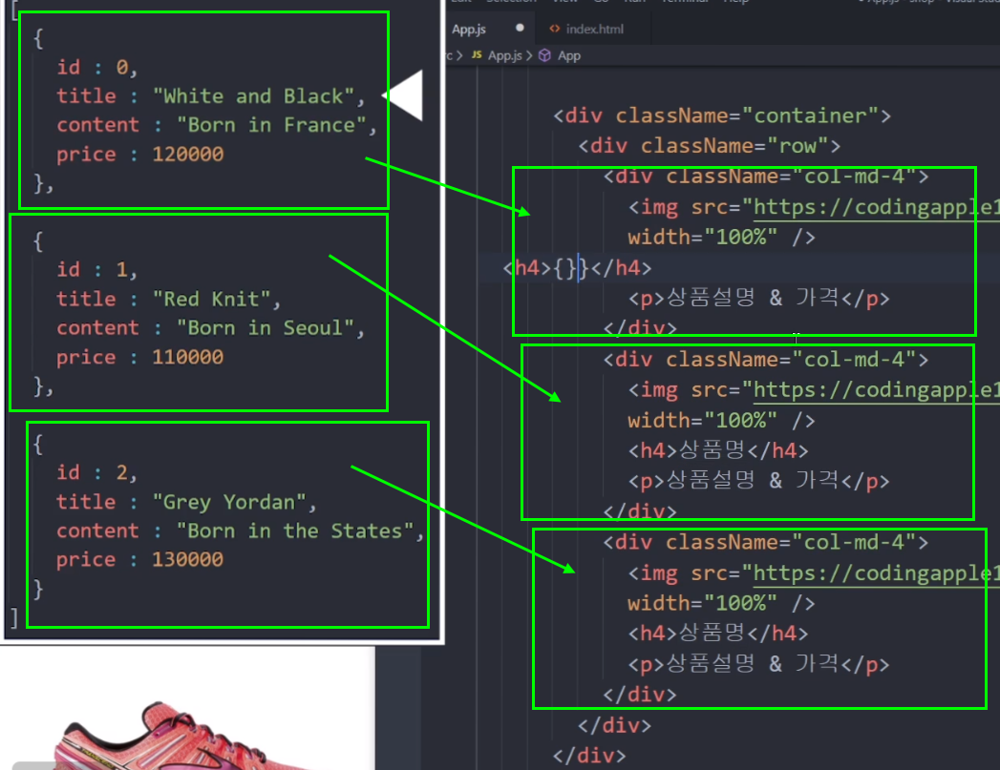
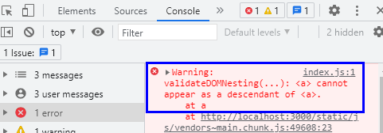
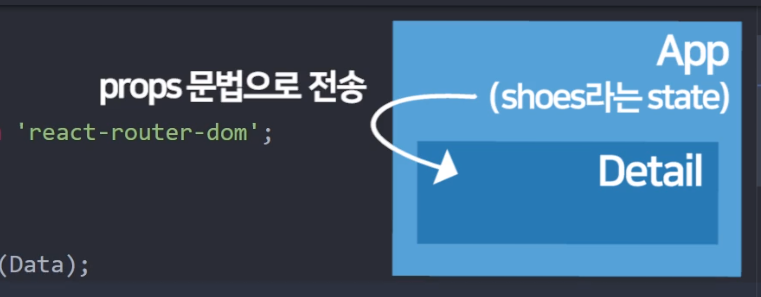
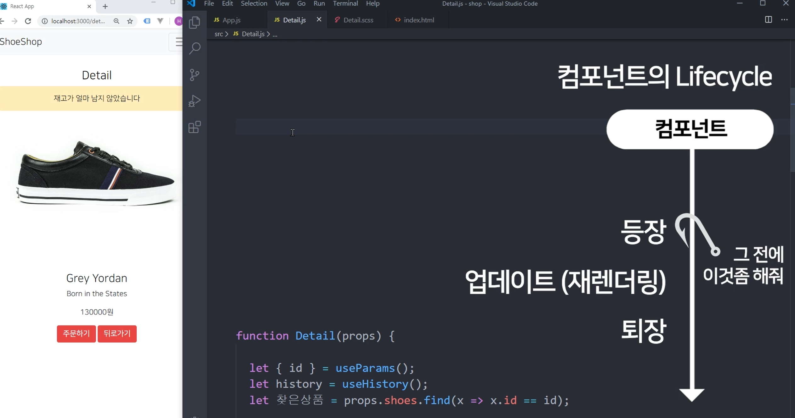
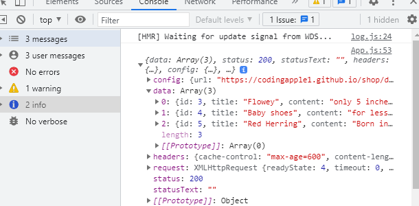
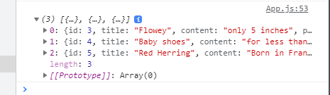
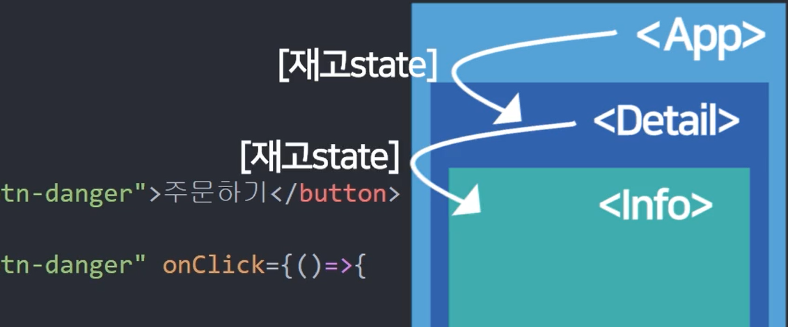

# Part2. 쇼핑몰 프로젝트

## 1. setting up new project
쇼핑몰 프로젝트 : 프로젝트 생성 & 부트스트랩 설치


1. yarn 이용하기<br />npm 대신에 쓸 수 있는 명령어를 제공하는 소프트웨어. npm, npx보다 훨씬 빠르다.<br />yarn 1.22 버전을 쓰는 게 좋다. 2.0 버전 이상은 오류가 많다고 한다.<br/>[yarn 1.22 설치하기](https://classic.yarnpkg.com/en/docs/install#windows-stable)

2. 프로젝트 생성 후 로컬서버 실행할 땐,<br />`npm run start`<br />`yarn start`<br />2개의 명령어 중 하나를 선택하여 실행한다. yarn 명령어는 yarn을 다운로드 해야 사용할 수 있다.

3. Bootstrap(부트스트랩)을 이용한다.<br />[리액트 부트스트랩(bootstrap) 바로가기](https://react-bootstrap.github.io/)<br />Get started 버튼을 클릭하여 npm 명령어를 통해 설치한다.<br />`npm install react-bootstrap bootstrap`<br /><br />yarn 설치가 되어 있다면<br />`yarn add react-bootstrap bootstrap`<br />yarn이 좀 더 빠르다.<br />[리액트 부트스트랩 설치화면 바로가기](https://react-bootstrap.github.io/getting-started/introduction)

4. 설치 중 권한이 없어 오류가 나는 경우 `sudo`를 기입하여 설치한다.
  ```
  sudo npm install react-bootstrap bootstrap
  sudo yarn add react-bootstrap bootstrap
  ```

5. **css도 적용해줘야 한다!**<br />**css 경우, cdn 방식보다는 다운받아 설치하는 것을 추천!**<br />index.html 파일에 cdn 방식으로 적용하거나<br />index.js 파일에 import로 불러와도 된다.<br />[import css 참고 바로가기](https://react-bootstrap.github.io/getting-started/introduction#css)
  ```javascript
  {/* The following line can be included in your src/index.js or App.js file*/}
  import 'bootstrap/dist/css/bootstrap.min.css';
  ```
<br />
<br />
<br />

## 2. shop layout design
평화로운 쇼핑몰 레이아웃 디자인 시간<br /><br />

1. 부트스트랩 템플릿을 이용하여 레이아웃 디자인을 적용해본다.

2. 리액트 부트스트랩 - 컴포넌트를 적용한다.<br />[리액트 부트스트랩 컴포넌트 퍼오기](https://react-bootstrap.github.io/components/alerts)

3. [리액트 부트스트랩 컴포넌트](https://react-bootstrap.github.io/components/alerts) 페이지에서 검색하여 컴포넌트를 퍼올 수도 있다.<br />예시) 'navbars'

4. 예제를 보고 마음에 드는 템플릿으로 불러온다.(복사 & 붙여넣기)

5. 컴포넌트를 불러오기 전에 [getting started](https://react-bootstrap.netlify.app/getting-started/introduction/)에서 컴포넌트를 불러오는 방법을 확인해야 한다.

6. 먼저, 마음에 드는 컴포넌트를 불러와서 `App.js`에 붙여넣기를 한다.
  ```javascript
  function App() {
    return (
      <div className="App">
        <Navbar bg="light" expand="lg">
          <Container>
            <Navbar.Brand href="#home">React-Bootstrap</Navbar.Brand>
            <Navbar.Toggle aria-controls="basic-navbar-nav" />
            <Navbar.Collapse id="basic-navbar-nav">
              <Nav className="me-auto">
                <Nav.Link href="#home">Home</Nav.Link>
                <Nav.Link href="#link">Link</Nav.Link>
                <NavDropdown title="Dropdown" id="basic-nav-dropdown">
                  <NavDropdown.Item href="#action/3.1">Action</NavDropdown.Item>
                  <NavDropdown.Item href="#action/3.2">Another action</NavDropdown.Item>
                  <NavDropdown.Item href="#action/3.3">Something</NavDropdown.Item>
                  <NavDropdown.Divider />
                  <NavDropdown.Item href="#action/3.4">Separated link</NavDropdown.Item>
                </NavDropdown>
              </Nav>
            </Navbar.Collapse>
          </Container>
        </Navbar>
      </div>
    );
  }
  ```

7. 그리고 [getting started - importing components](https://react-bootstrap.netlify.app/getting-started/introduction/#importing-components) 페이지를 참고하여 import 를 `App.js`에 적용시킨다.<br />- 아래 코드처럼 대문자 전부를 import 해와야 사용이 가능하다. `<Navbar></Navbar>`, `<Container></Container>` 등등<br />필요한 부분만 import하면 용량 절약에 좋다.(css 양을 줄일 수 있다.)
  ```javascript
  import { Navbar, Container, Nav, NavDropdown, button } from 'react-bootstrap';

  function App() {
    return (
      <div className="App">
        <Navbar bg="light" expand="lg">
          <Container>
            <Navbar.Brand href="#home">React-Bootstrap</Navbar.Brand>
            <Navbar.Toggle aria-controls="basic-navbar-nav" />
            <Navbar.Collapse id="basic-navbar-nav">
              <Nav className="me-auto">
                <Nav.Link href="#home">Home</Nav.Link>
                <Nav.Link href="#link">Link</Nav.Link>
                <NavDropdown title="Dropdown" id="basic-nav-dropdown">
                  <NavDropdown.Item href="#action/3.1">Action</NavDropdown.Item>
                  <NavDropdown.Item href="#action/3.2">Another action</NavDropdown.Item>
                  <NavDropdown.Item href="#action/3.3">Something</NavDropdown.Item>
                  <NavDropdown.Divider />
                  <NavDropdown.Item href="#action/3.4">Separated link</NavDropdown.Item>
                </NavDropdown>
              </Nav>
            </Navbar.Collapse>
          </Container>
        </Navbar>
      </div>
    );
  }
  ```

8. `/src` 안에 있는 파일은 경로를 무조건 `./`부터 시작한다.<br />`/src` 폴더에 있는 파일은 파일명 변경 및 압축이 된다. 단, `public`에 넣는 파일은 보존되며 풀 경로를 적용해야 한다. (절대경로/파일명.jpg)<br />- src/img 폴더에 이미지를 불러올 경우 `./src/img/ban1.jpg` 처럼 쓰면 된다.

<br />
<br />
<br />

## 3. import/export
코드가 넘나 길어진다면 import/export 사용해보기
<br />
<br />

1. 실제 상품명 데이터를 데이터바인딩을 통해 적용해보려고 한다.

2. 연습용 데이터가 너무 길어 다른 파일로 잘라낸 후 state로 저장하여 데이터바인딩을 하려고 한다.

3. 먼저, App.js에 연습용데이터를 담을 변수 `let [shoes, shoes변경] = useState()`를 만든다.
  - `useState`를 사용할 땐 import 에 반드시 기입을 해야 사용할 수 있다. 안 그러면 에러(오류)가 발생한다.
  ```javascript
  // App.js
  import React, { useState } from 'react';
  function App() {
    let [shoes, shoes변경] = useState();
  }
  ```

4. src 폴더에 data.js 파일을 생성하고 `export default`를 적고 연습용 데이터를 적용한다.
  ```javascript
  // data.js
  export default [
    {
      id : 0,
      title : "White and Black",
      content : "Born in France",
      price : 120000
    },
  
    {
      id : 1,
      title : "Red Knit",
      content : "Born in Seoul",
      price : 110000
    },
  
    {
      id : 2,
      title : "Grey Yordan",
      content : "Born in the States",
      price : 130000
    }
  ] 
  ```

5. **Tip. 파일을 쪼갤 때 활용하는 import/export**
  - 내보내기 : ``export default 변수명``<br />가져오기 : `import 작명 from 경로`
  - 경로의 경우 /src 폴더 기준 ./으로 시작한다. 그리고 data.js 경우 data만 써줘도 된다.
  - 작명할 땐 변수와 동일한 이름으로 지어줘도 된다.
    ```javascript
    // data.js (파일 내보내기)
    var name = 'Kim';
    export default name;

    // App.js (파일 가져오기)
    import name from './data';
    {name}  // Kim
    ```
    <br />

  - `export default 변수` 의 경우 단 한 번만 사용할 수 있다.<br />아래 코드처럼 2번이상 사용할 수 없다!!!
    ```javascript
    export default name;
    export default name2;
    ```
    <br />

  - 내보낼 변수가 많을 때?<br />내보내기 : `export {변수1, 변수2}`<br />가져오기 : `import {변수1, 변수2} from 경로`
  - **다수의 변수를 쓰고 가져올 땐, 작명할 수가 없다. 내보내는 변수명 그대로 적용해줘야 사용할 수 있다.**
    ```javascript
    // data.js (내보내기)
    var name = 'Kim';
    var name2 = 'Park';

    export {name, name2}

    // App.js (가져오기)
    import {name, name2} from './data';
    ```
    <br />

  - `export default [{id:1},{id:2}]`처럼 변수 생성없이 사용할 수도 있다.

6. data.js에 적용한 데이터를 App.js에 보내려면?
  ```javascript
  // App.js
  import Data from './data';
  function App() {
    let [shoes, shoes변경] = useState(Data);
    return {

    }
  }
  ```

7. state에 담긴 Data를 데이터바인딩으로 적용한다.
  ```javascript
  // App.js
  import Data from './data';
  function App() {
    let [shoes, shoes변경] = useState(Data);
    return {

    }
  }
  ```

8. data.js 파일을 보면 크게 3개의 배열로 구분되며, 그 배열안에 id, title, content, price의 정보가 담겨져 있다.<br />
  <br />

  - data.js 파일에서 인덱스 0번의 정보를 불러와야 할 땐, `{state변수명[0].id}` 처럼 작성을 해야 data.js 파일의 데이터를 불러올 수 있다.
    ```javascript
    // App.js
    import Data from './data';
    function App() {
      let [shoes, shoes변경] = useState(Data);
      return {
        {shoes[0].title}    // White and Black
        {shoes[1].content}  // Born in Seoul
      }
    }
    ```

9. 숙제 1. (반복되는 `className="col-md-4"`) component로 만들어 첨부하기<br />숙제 2. component에 데이터바인딩 완료하기<br />숙제 3. component를 반복문 돌리기

<br />
<br />
<br />

## 4. component/props/map
숙제 해설 : 상품목록 Component화 + 반복문

<br />
<br />

1. (반복되는 `className="col-md-4"`) component를 만든다.
  ```javascript
  function Card() {
    return (
      <div className="col-md-4">
        
        <h4>{shoes[0].title}</h4>
        <p>{shoes[0].content} & {shoes[0].price}원</p>
      </div>
    )
  }
  ```
<br />

2. 새로 만든 Card component를 필요한 곳에 적용한다.
  ```javascript
  function App() {
    return (
      <div className="container">
        <div className="row">
          <Card />
        </div>
      </div>
    )
  }
  ```
<br />

3. 위와 같이 코드를 작성하면 에러문구가 발생한다. Card 컴포넌트에서 shoes를 찾을 수 없다고 뜬다.<br />(shoes라는 state는 부모 컴포넌트인 App 컴포넌트가 갖고 있기 때문에 에러가 발생한 것)
<br />

4. 자식 컴포넌트(하위 컴포넌트, Card)에서도 사용하고 싶다면 props 전송법을 사용해야 한다.<br />`<자식컴포넌트 보낼이름={전송할state}>`
  ```javascript
  function App() {
    return (
      <div className="container">
        <div className="row">
          <Card shoes={shoes} />
        </div>
      </div>
    )
  }
  ```
  <br />

5. 자식컴포넌트(하위컴포넌트, Card)에 props를 등록해준다.<br />`function 자식컴포넌트(props) {}`<br />props 내용을 기입할 땐, `props.보낼이름사용`
  ```javascript
  function Card(props) {
    return (
      <div className="col-md-4">
        
        <h4>{props.shoes[0].title}</h4>
        <p>{props.shoes[0].content} & {props.shoes[0].price}원</p>
      </div>
    )
  }
  ```
  <br />

6. Card 마다 각각 다른 제목/정보들을 가져와야 할 땐?<br />각각 컴포넌트 마다 다른 제목/정보를 전달해주면 된다.

7. Component마다 각각 다른 정보를 props로 전송하면 다양한 제목/내용을 가진 component가 생긴다.<br />props 정보를 각각 전달할 떈, `<Card shoes={shoes[인덱스번호]}>`처럼 보낼 수도 있다.
  ```javascript
  function App() {
    rerutn (
      <div className="container">
        <div className="row">
          <Card shoes={shoes[0]} />
          <Card shoes={shoes[1]} />
          <Card shoes={shoes[2]} />
        </div>
      </div>
    )
  }

  function Card(props) {
    return (
      <div className="col-md-4">
        
        <h4>{props.shoes.title}</h4>
        <p>{props.shoes.content} & {props.shoes.price}원</p>
      </div>
    )
  }
  ```
<br />

8. `<Card shoes={shoes[]}>` 코드가 반복되고 있다. 해당 코드를 반복문으로 담아본다.<br />(반복문 map()을 사용한다.)<br />`자료.map(()=>{ return (반복시킬 HTML) })`<br />- map() 함수에는 파라미터가 2개 들어갈 수 있다. 첫번째 파라미터는 각각의 데이터를 담고 있고 두번째 파라미터는 데이터의 인덱스번호(정수)를 뜻한다.<br />- `shoes={value}` 또는 `shoes={shoes[index]}`로 표기하면 된다.
  ```javascript
  function App() {
    return (
      {
        shoes.map((value, index) => {
          return (
            <Card shoes={shoes[index]} />      
          )
        })
      }
    )
  }
  ```
  <br />

9. `img src="~~~1.jpg"`로 되어 있는 부분이 있다. 1 부분이 반복문을 돌 떄마다 1,2,3이 되는 변수를 여기에 쓰려고 한다.<br />이럴 땐, 해당 자리에 변수를 이용하면 된다.
<br />

10. `src=""`에다가 데이터바인딩 하려면?<br />`src={}` 이렇게 하면 변수명, 함수명 넣기가 가능하다.<br />텍스트 중간에 변수를 넣고 싶으면 `'문자' + 변수 + '문자'`<br />부모(App) 컴포넌트가 가지고 있는 state, 변수 이런건 props로 전송해야 쓸 수 있다.<br />부모 컴포넌트(App)에서 `<Card index={index}>`로 props를 자식컴포넌트(Card)에 보내주고 자식컴포넌트에서 `img src={ props.index}`로 사용하면 된다.<br />이미지 파일의 경우 1부터 시작하기 떄문에 변수에 1을 더해주면 된다.`(props.index + 1)`
  ```javascript
  function App() {
    return (
      {
        shoes.map((value, index) => {
          return (
            <Card shoes={shoes[index]} index={index} />
          )
        })
      }
    )
  }

  function Card(porps) {
    return (
      
    )
  }
  ```
<br />

11. 위와 같은 일을 한 이유는?<br />- 서버에서 사이트 구성에 필요한 데이터 받아온 후<br />- HTML로 보여주는 게 프론트엔드 개발자의 역활이기 때문이다.

12. 반복시킨 HTML에는 `key={}` 이게 꼭 필요하다!!!
  ```javascript
  function App() {
    return (
      {
        shoes.map((value, index) => {
          return (
            <Card shoes={shoes[index]} index={index} key={index} />
          )
        })
      }
    )
  }
  ```

<br />
<br />
<br />

## 5. router 1 : setup
React Router 1 : 셋팅과 기본 라우팅

<br />
<br />

1. 페이지 나누기(라우팅)
2. react-router-dom 라이브러리를 설치하여 라우팅(router)을 사용한다.
  ```javascript
  // yarn
  yarn add react-router-dom
  
  // npm
  npm install react-router-dom
  ```
  <br />

3. **router(라우터) 초기 세팅법**
  - `/src/index.js`
    - `react-router-dom` 처럼 ./ 가 없다면 라이브러리로 이해하면 된다.
    - BrowserRouter를 import 한 후에, `<App />` 컴포넌트 태그를 `<BrowserRouter>` 로 감싸준다.
    - router(라우터)는 /abc로 접속하면 A 페이지로 보여주고 /def로 접속하면 B 페이지로 보여줄 수 있다.
    ```javascript
    import { BrowserRouter } from 'react-router-dom';

    ReactDOM.render(
      <React.StrictMode>
        <BrowserRouter>
          <App />
        </BrowserRouter>
      </React.StrictMode>,
      document.getElementById('root')
    );
    ```
    <br />

    - `BrowserRouter` 말고 `HashRouter`도 있다.<br />HashRouter 경우, # 기호가 주소창에 보여진다. `localhost:3000/#/`
    - HashRouter : 라우팅을 안전하게 할 수 있게 도와준다.<br />사이트 주소 뒤에 #이 붙는데, # 뒤에 적는 것은 서버로 전달되지 않는다. 그래서 라우팅은 리액트가 알아서 잘 해줄 수 있다.<br />BrowserRouter : 라우팅을 리액트가 아니라 서버에게 요청할 수 있어서 위험.(서버에서 서버 라우팅 방지하는 API를 작성해둬야 함)
    ```javascript
    import { HashRouter } from 'react-router-dom';

    ReactDOM.render(
      <React.StrictMode>
        <HashRouter>
          <App />
        </HashRouter>
      </React.StrictMode>,
      document.getElementById('root')
    );
    ```
    <br />

4. 메인페이지 / 상품 상세페이지를 만들어 보자.<br />먼저, `import { Link, Route, Switch} from 'react-router-dom';` 작성한다.<br />`<Router path="/경로">HTML 코드 작성</Router>`
  - `/` 로 접속하면 메인페이지, `/detail`로 접속하면 상품상세페이지로 보여진다.<br />(http://localhost:3000/detail 접속하면 디테일페이지에요 문구가 보여진다.)
  ```javascript
  // App.js
  import { Link, Route, Switch } from 'react-router-dom';

  function App() {
    return (
      <Route path="/">
        <div>메인페이지에요</div>
      </Route>
      <Route path="/detail">
        <div>디테일페이지에요</div>
      </Route>
    )
  }
  ```
  <br />

5. **Route 쓰는 다른 방법**
  ```javascript
  <Route path="/modal" component={Modal}></Route>
  ```
  <br />

6. `/detail` 경로로 접속해도 `/`경로 내용이 보여지는 이유?
  - 매칭이 되는 것들은 다 보여준다. 정확히 일치할 때만 보여주고 싶을 땐 `exact`를 추가한다.
  ```javascript
  <Route exact path="/">
    <div>메인페이지에요</div>
  </Route>
  <Route path="/detail">
    <div>디테일페이지에요</div>
  </Route>
  ```
  <br />

7. 작업한 코드를 메인페이지에 적용한다.<br />Route `/` 메인페이지에 적용한 코드를 컴포넌트화해서 적용해도 된다.
  ```javascript
  // App.js
  function App() {
    return (
      <Route exact path="/">
        <div className="background">
          <h1>20% Season Off</h1>
        </div>
        <div className="container">
          <div className="row">
            {
              shoes.map((value, index) => {
                return (
                  <Card shoes={shoes[index]} index={index} key={index} />
                )
              })
            }
          </div>
        </div>
      </Route>
    )
  }
  ```
<br />

9. **React Router 특징**<br />9-1. Router 만들어놓으면 뒤로가기/앞으로가기 작동이 가능해진다.<br />9-2. 페이지마다 다른 HTML 파일이 아니다(index.html 하나만 있음)

<br />
<br />
<br />

## 6. router 2 : Link, Switch, history
React Router 2 : Link, Switch, history 기능

<br />
<br />

### 6.1. Link
- detail (상세) 페이지를 컴포넌트화 해보자.<br />같은 파일이 아닌 다른 파일에 컴포넌트로 만들어서 import/export를 한다.
  - 컴포넌트 파일을 만들 땐, 보통 대문자로 시작한다. ex) Detail.js
  - 컴포넌트 파일을 만들 땐, `import React from 'react';`를 파일 최상단에 꼭! 써줘야 한다.<br />(★리액트 기본문법임★)
  ```javascript
  // Detail.js
  import React from 'react';

  function Detail() {
    return (
      <div className="container">
        <div className="row">
          <div className="col-md-6">
            
          </div>
          <div className="col-md-6 mt-4">
            <h4 className="pt-5">상품명</h4>
            <p>상품설명</p>
            <p>120000원</p>
            <button className="btn btn-danger">주문하기</button> 
          </div>
        </div>
      </div>
    )
  }

  export default Detail;
  ```
<br />

- Detail.js의 Datail 컴포넌트를 import를 하려면?
  ```javascript
  // App.js
  import Detail from './Detail'

  function App() {
    return {
      <Route path="/detail">
        <Detail />
      </Route>
    }
  }
  ```
<br />

### 6.2. history
- **페이지 이동하는 버튼 만들기**
- 일단 `<Navbar></Navbar>` 안의 버튼에 href 지우고 `<Link to="경로">버튼</Link>` 형식으로 써준다.
  ```javascript
  import { Link, Route } from 'react-router-dom';
  function App() {
    return (
      <Link to ="/">Home</Link>
    )
  }
  ```
<br />

- **페이지 이동시키는 다른 방법**
  - Detail 페이지에 뒤로가기 버튼을 만든다.
    ```javascript
    // Detail.js
    function Detail() {
      return (
        <button className="btn btn-danger" onClick={ ()=>{} }>뒤로가기</button> 
      )
    }0
    ```
    <br />

  - 뒤로가기 버튼은 `useHistroy()`를 이용한다. (★★외우기★★)<br />(react v16.3이상, react-router-dom v5이상에서 사용이 가능하다)
    ```javascript
    import { useHistory } from 'react-router-dom';

    function Detail() {
      let history = useHistory();
      return (

      )
    }
    ```
    <br />

  - `useHistory()` = 방문기록 등을 저장해놓는 object<br />goBack() 함수를 이용하면 뒤로가기 완성!! `history.goBack()`
     ```javascript
    import { useHistory } from 'react-router-dom';

    function Detail() {
      let history = useHistory();
      return (
        <button className="btn btn-danger" onClick={ ()=>{ history.goBack() } }>뒤로가기</button>
      )
    }
    ```
    <br />

  - 즉, 뒤로가기 버튼은 useHistory 라는 훅 import<br />useHistory() 훅 사용
  - 특정 경로로 이동시키려면<br />`history.push('/')`
  <br />

### 6.3. Switch 컴포넌트
- `:id` = URL 파라미터, `/모든문자` 라는 경로를 의미.
  ```javascript
  // App.js
  import { Route, Switch} from 'react-router-dom';

  function App() {
    return (
      <Route path="/:id">
        <div>아무거나 적었을 때 이거 보여주셈</div>
      </Route>
    )
  }
  ```
  <br />

- `/detail`로 접속하게 되면 Detail 상품상세페이지 정보와 `:/id`에 적용된 내용이 모두 보여진다.<br />리액트 라우터는 매칭이 되면 다 보여지게 설정되어 있기 때문이다.<br />(왜냐면 리액트 라우터는 그냥 URL 매치되는 것들 전부 다 보여준다)<br />이럴 때, 다 보여주는 것이 아닌 하나만 보여주기를 원할 때 Switch를 이용하면 된다.
<br />

- Switch 안에 담으면 Route 들이 하나씩만 보여진다(중복 매칭 허용하지 않는다.). 위에서 아래 기준으로 제일 위에 있는 1개의 Route만 보여진다.
  ```javascript
  import { Route, Switch} from 'react-router-dom';

  function App() {
    return (
      <Switch>
      <Route exact path="/">
        <div className="background">
          <h1>20% Season Off</h1>
        </div>
        <div className="container">
          <div className="row">
            {
              shoes.map((value, index) => {
                return (
                  <Card shoes={shoes[index]} index={index} key={index} />
                )
              })
            }
          </div>
        </div>
      </Route>
      
      <Route path="/detail">
        <Detail />
      </Route>

      <Route path="/:id">
        <div>아무거나 적었을 때 이거 보여주셈</div>
      </Route>
      </Switch>
    )
  }
  ```
<br />

- 즉, 매치되는 `<Route>` 들을 전부 보여주지 말고 한번에 하나만 보여주세요~ 기능을 만들고 싶을 때 쓴다.<br />(다 감싸면 이제 여러개의 Route가 매칭이 되어도 맨 위의 Route 하나만 보여준다.)

<br />

### 6.4. Link 태그 에러 해결하기
<br />

- 콘솔창에 a태그-Link 에러 (a태그 안에 a태그 에러)
- 부트스트랩 `<Nav.Link>` 태그가 a 태그를 가리키고 라우터 `<Link tp="">` 태그도 a 태그로 표시가 된다.<br />때문에 콘솔창에 a태그 관련 에러 메세지가 보여졌던 것이다.<br />
  <br />

- a태그 안에 a태그로 랜더링 되는 것을 방지하고자 아래와 같이 코드를 수정한다.<br />`as={Link}` == Link 태그처럼 써주세요 라는 뜻이다.
  ```javascript
  // App.js
  return (
    // 원본
    <Nav.Link> <Link to ="/"></Link> </Nav.Link>

    // 수정
    <Nav.Link as={Link} to ="/"> </Nav.Link>
  )
  ```

<br />
<br />
<br />

## 7. router 3 : URL parameter
React Router 3 : URL 파라미터로 상세페이지 100개 만들기

<br />
<br />

1. `<Detail />` 컴포넌트에 상품명 데이터바인딩을 해보자.<br />
  <br />
  <br />
  
  ```javascript
  // App.js
  function App() {
    return (
      <Route path="/detail">
        <Detail shoes={shoes} />
      </Route>
    )
  }

  // Detail.js
  function Detail(props) {
    return (
      <h4 className="pt-5">{props.shoes[0].title}</h4>
    )
  }
  ```
  <br />

2. props로 전달하는 것이 아닌 `let [shoes, shoes변경] = useState()`을 Detail() 컴포넌트에 등록하여 사용하는 방법은 옳지 않다.  **React, Angular, Vue 이런거 쓸 때 항상 염두에 두셔야하는게 데이터는 항상 위에서 아래로 흘러야합니다.**
<br />

3. 그래서 **상위컴포넌트가 중요 데이터를 다 가지고 있어야한다.<br />그리고 하위컴포넌트는 데이터를 항상 props로 받아서 써야한다.**<br />이것이 좋은 관습이다. 왜냐면 안그러면 데이터를 역방향으로 전달시킨다면 props보다 훨씬 귀찮은 문제들이 생길 수 있다.
  - 모든 중요한 데이터는 App 컴포넌트에 보관하거나 redux 파일에 보관한다.
  <br />

4. 3개의 detail 페이지를 만들어보려고 한다.<br />`/detail/0` 접속하면 0번째, 1로 접속하면 1번쨔 상품이 보여지게 하려고 한다.
  - `/detail/:id` = 아무 문자나 받겠다는 URL 작명법. ex) /detail/aaa  - detail/뒤에 아무문자든 간에 Detail 컴포넌트를 보여주겠다는 의미.
  - `:id` = :(클론) 뒤에는 맘대로 작명
  - `/detail/:id1/:id2` 처럼 여러 개로도 사용이 가능하다.
  ```javascript
  <Route path="/detail/:id">
    <Detail shoes={shoes} />
  </Route>
  ```
  <br />

  - `:id` 자리에 있던 숫자에 따라 상품명, 가격 등 정보를 바뀌게 적용하고 싶을 땐?!<br />`/detail/2`로 접속했을 때 `{props.shoes[2].title}`가 보여지게 적용해보자.
    ```javascript
    <h4 className="pt-5">{props.shoes[:id자리에 있던 숫자].title}</h4>
    ```
    <br />

  - `Detail.js` 파일에서 상단에 `import { useParams } from 'react-router-dom';` 적용한다.<br />`useParams`를 import 한다.<br />라우터의 useParams 훅
    - `{id}` == `/:id` 자리에 사용자가 입력한 값
    - `useParams()` 함수를 쓰면 이 자리에 `{}` 자리가 남는다. 즉, 오브젝트 자료형이 남는다는 것이다.<br />`{사용자가 입력한 URL 파라미터들}`<br />그것을 변수로 만들기 위해서 Destructuring(디스트럭처링) 문법을 이용해 변수 `{id}`로 만든 것이다.
    ```javascript
    import { useParams } from 'react-router-dom';
    
    function Detail(props) {
      let { id } = useParams();   // {사용자가 입력한 URL 파라미터들이 저장되어 있다.}

      return (
         <h4 className="pt-5">{props.shoes[id].title}</h4>
      )
    }
    ```
    <br />
    - Destructuring(디스트럭처링) 예시<br />[디스트럭처링 문법에 대해 자세히 알아보기](https://blog.fakecoding.com/archives/js-destructuring/)
      ```javascript
      // case 1
      const website = {
        url: "https://google.com",
        alias: "Google"
      };

      // 일반적인 변수 할당
      var url = website.url;
      var alias = website.alias;

      // 디스트럭처링(destructuring)
      var { url, alias } = website;


      // case 2
      var a = 1;
      var b = 2;

      [a, b] = [b, a];

      console.log(a, b);   // 실행결과: 2 1
      ```
<br />

5. shoes 데이터의 순서가 바뀐다면 상세페이지도 이상해짐. 예를들어 낮은 가격순으로 정리한다고 했을 때.. 이것을 방지하고자 `data.js` 파일을 보면 `{ id : 0}, {id : 1}` 처럼 상품의 영구번호를 활용한다.<br />즉, 전체 자료 중에 영구번호 0을 가진 데이터의 제목을 적용하면 된다.
  ```javascript
  // data.js
  (shoes라는 상품데이터는 이렇게 생김)

  [
    {
      id : 0,
      title : "White and Black",
      content : "Born in France",
      price : 120000
    },

    {둘째상품},

    {셋째상품}
  ] 
  ```
  <br />

  - 현재 shoes라는 상품데이터들 안엔 {id : 0} 이런 영구번호가 있다. <br />그럼 현재 /:id 자리에 입력한 값과 영구번호가 같은 {상품데이터}를 찾아서 데이터바인딩해주면 된다.
  ```javascript
  // Detail.js
  import React from 'react';
  import { useHistory, useParams } from 'react-router-dom';

  function Detail(props){

    let { id } = useParams();
    let 찾은상품 = props.shoes.find(function(상품){
      return 상품.id == id
    });

    return (
      <div className="container">
        <div className="row">
          <div className="col-md-6">
            
          </div>
          <div className="col-md-6 mt-4">
            <h4 className="pt-5">{찾은상품.title}</h4>
            <p>{찾은상품.content}</p>
            <p>{찾은상품.price}원</p>
            <button className="btn btn-danger">주문하기</button> 
          </div>
        </div>
    </div>  
    )
  };

  export default Detail 
  ```
  <br />

  - find() 라는 ES6 신문법이 있습니다. Array 안에서 원하는 자료를 찾고싶을 때 사용합니다.<br />filter() 함수, 그냥 반복문 이런거 쓰셔도 전혀상관없습니다.<br />1. find()는 array 뒤에 붙일 수 있으며, 안에 콜백함수가 들어갑니다.<br />2. 콜백함수 내의 파라미터는 (제가 상품이라고 적은거) array 안에 있던 하나하나의 데이터를 의미합니다.<br />3. return 오른쪽엔 조건식을 적을 수 있습니다. 이게 참인 데이터만 새로운 변수에 저장해줍니다.<br />4. 조건식엔 그리고 그걸 현재 URL의 /:id에 적힌 값과 상품의 영구번호 (상품.id)가 같은지 비교하고 있는 겁니다.<br /><br />그래서 /detail/0으로 접속시 찾은상품이라는 변수를 출력해보시면 아마 영구번호가 id : 0인 데이터가 나올겁니다.<br />/detail/1로 접속시 찾은상품이라는 변수는 영구번호가 id : 1인 데이터일겁니다.<br />그래서 찾은상품이라는 변수를 이용해서 상품명, 가격 HTML 부분에 데이터바인딩을 했을 뿐입니다.

  - 지금은 프론트엔드에서 모든 데이터를 다루고 있어서 어려운 + 반복문스러운 find() 함수를 사용한 것이지만 실제 개발할 땐 그냥 서버에 id : 0인 상품데이터를 Ajax로 요청하는 경우가 많을겁니다.<br />그럼 저렇게 find() 어쩌구를 쓰는게 아니라 ajax 요청하는 코드가 들어가있겠고 ajax 요청을 성공하면 {} 중괄호 안에 깔끔하게 상품데이터가 하나만 딱 들어올 것 같군요.

<br />
<br />
<br />

## 8. styling 1 : styled-components
styled-components를 이용한 class없는 CSS스타일링

<br />
<br />

- component가 많아지면 CSS 작성 고민이 많아짐.<br />중복 class를 작성하게 되는 경우도 생기게 된다.<br />그래서 class 선언없이 컴포넌트에 css를 직접 장착 (CSS in JS 라고도 한다)

- CSS를 직접 장착하기 위해 styled-components 라이브러리를 설치해준다<br />`yarn add styled-components`<br />`npm install styled-components`

- styled-components 설치가 완료되었다면, 적용할 파일에 import 해와야 한다.
  ```javascript
  // Detail.js
  import styled from 'styled-components';
  ```
  <br />

- 컴포넌트에 직접 스타일 넣어서 스타일링하기
  - 컴포넌트를 담을 변수 박스를 만들고 CSS 스타일링 값을 넣어준다.
    ```javascript
    // let 박스 = styled.div`css 코드작성`
    let 박스 = styled.div`
      padding: 20px;
    `;
    ```
  - styled-components == CSS를 미리 입혀놓은 컴포넌트를 생성한다는 의미.
  - 원하는 위치에 변수로 만든 박스 컴포넌트 태그를 적용한다.<br />(className 작명이 필요없다.)
    ```javascript
    // Detail.js
    let 박스 = styled.div`
      padding: 20px;
    `;
    let 제목 = styled.h4`
      font-size: 25px;
    `;

    function Detail(props) {
      return (
        <div className="container">
          <박스>
            <제목>상세페이지</제목>
          </박스>
        </div>
      )
    }
    ```
    <br />

  - styled-components는 설치해서 쓸지는 선택사항이다.<br />상황에 따라 사용이 용이하거나 불편할 수도 있음.
  <br />

- **styled-components 유용한 문법**
  - 같은 컴포넌트에서 색상(컬러)만 다를 때<br />`문자${변수명}문자`
    ```javascript
    let 제목 = styled.h4`
      font-size: 25px;
      color: ${ props => props.색상 };
    `;

    function Detail(props) {
      return (
        <제목 색상 = {'red'}>Detail</제목>
      )
    }
    ```
  - **props 문법**<br />1. 보낼이름 = { 변수명 }<br />2. 보낼이름 = "일반문자" `색상 = "red"`
  <br />

- styled-components의 가장 큰 장점 :<br />컴포넌트가 많아지면 class 겹칠 일이 줄어들음<br />(하지만 CSS 모듈화 해놓으면 해결될 일)
- styled-component의 극강의 장점은 CSS 막짜도 된다는 것.<br />1. 스타일넣을 때 다른 파일이랑 컴포넌트 명이 겹쳐도 전혀 CSS적으로 문제가 생기지 않는다.<br />2. 그리고 나중에 컴포넌트 스타일 수정을 원할 때 CSS가 아니라 컴포넌트 파일을 찾으면 되니 수정이 편리하다.<br /><br />개인적으로 내가 CSS 아키텍쳐 잘하면 CSS + SASS로 작성한 뒤 **원하는 css 파일만 import 쓰는게 전체적 스타일 관리하는데 편리할 것**

<br />
<br />
<br />

## 9. styling 2 : SASS
아니면 CSS대신 SASS를 쓰자

<br />
<br />

- SASS를 사용하려면 SASS를 설치해야 한다.<br />`yarn add node-sass`<br />`npm install node-sass`
<br />

- SASS란? 프로그래밍 언어스럽게 작성 가능한 preprocessor (전처리)<br />CSS에서 변수, 연산자, 함수, extend, import 등 사용이 가능<br />브라우저는 SASS 문법 해석이 어려워 **SASS로 작성한 파일을 다시 CSS로 컴파일**해야 한다.

- (Detail.js 스타일용) src 폴더에 Detail.scss 파일 생성<br />Detail.js 파일에서 생성한 Detail.scss 파일을 import 한다.
  ```javascript
  // Detail.js
  import './Detail.scss';
  ```
  <br />

- 생성한 scss 파일에 작성하면 자동으로 컴파일해준다.

### SASS 문법
[※ 참고(SASS 정리)](https://github.com/eunhye8767/learn_sass)

<br />
<br />

- 변수에 데이터를 저장해서 쓰자.<br />`$변수명 : 변수에넣을값`
  ```css
  $메인칼라 : #ff0000;
  .red {
    color : $메인칼라;
  }
  ```
  <br />

- `@import 파일경로`<br />css reset 등(모든 페이지에 필요한 CSS 코드) 적용할 때
  ```css
  @import  './reset.scss';
  ```
  <br />

- Nesting(네스팅) - 트리구조<br />셀렉터 대신 쓰는 nesting<br />(div.container 안에 있는 UI 라고 이해할 수 있음)
  ```css
  div.container {
    /*div.container h4*/
    h4 {
      color: blue;
    }
    p {
      color: green;
    }
  }
  ```
  <br />

- 복붙하지 말고 `@extend`<br />(동일한 UI 스타일링 구조에서 색상 등이 다를 때)
  ```css
  .my-alert {
    background: #eee;
    padding: 20px;
    border-radius: 5px;
    width: 100%;
    max-width: 500px;
    margin: auto;
  }

  .my-alert2 {
    @extend .my-alert;  /*my-alert 코드 그대로 복사 -> 붙여넣기*/
    background: ##ffe591;
  }
  ```
  <br />

- 함수는 `@mixin/@include`<br />`@mixin`을 상단에 써야 한다.
  ```css
  @mixin myAlert() {
    background: #eee;
    padding: 20px;
    border-radius: 5px;
    width: 100%;
    max-width: 500px;
    margin: auto;
  }

  .my-alert {
    @include myAlert();
  }
  ```

### node-sass 설치는 되는데 미리보기 띄울 때 에러가 난다면?
node-sass는 세계 최고로 에러 잘나는 라이브러리기 때문에 **에러나면 참고**합시다.
<details>
<summary>node-sass 에러, 해결법 자세히보기</summary>
<div markdown="1">
nodejs 14버전을 쓴다면 node-sass 지웠다가 4.14버전으로 설치하면 끝입니다.<br />지우는건 `npm uninstall node-sass` 혹은 `yarn remove node-sass` 입니다.<br />설치는 `npm install node-sass@4.14.1` 이렇게 하면 될듯요<br /><br />
nodejs 16버전 이상을 쓴다면<br />1. npm install node-sass 혹은 yarn add node-sass로 6버전 설치해주시고<br />2. node_modules 폴더랑 yarn.lock 혹은 package-lock.json 보이는걸 다 삭제하시고<br />3. 터미널에서 yarn install 혹은 npm install로 node_modules 폴더 재설치 해주시면 잘 되는듯요<br /><br />실은 지금은 Sass 쓰시려면 nodejs 지우고 14버전 설치를 추천드립니다.<br /><br />node-sass 만든사람에게 따지려면 https://github.com/sass/node-sass/issues/3103
</div>
</details>

<br />
<br />
<br />

## 10. lifecycle Hooks
Lifecycle Hook (옛날사람) useEffect (요즘사람)

<br />
<br />

- 컴포넌트의 Lifecycle(ex. 인생주기)

- **★★ Hook으로 컴포넌트의 인생 중간중간에 뭔가 명령을 줄 수 있다 ★★**
  - e.g)`<Detail>` 등장 전에 이것 좀 해주세요</Detail><br />
  
  <br />

- **Lifecycle Hook**
  - 1) 원래는 class 컴포넌트들만 사용이 가능했다.
    ```javascript
    class Detail2 extends React.Component {
      componentDidMount() {
        // Detail2 컴포넌트가 Mount(등장) 되었을 때 실행할 코드 
        // Ajax 같은 것도 이런 곳에 자주 사용
      }

      componentWillUnmount() {
        // Detail2 컴포넌트가 Unmount(빠이빠이) 되기 직전에 실행할 코드 
      }
    }
    ```
    <br />

  - 2) **useEffect 훅 1** 
    - 해당 컴포넌트에 `useEffect();`를 입력하면 자동으로 상단 `import React` 쪽에 useState 처럼 `{useEffect}`가 추가가 되는데, 자동 추가가 안 될 경우 직접 기입을 해줘야 한다.
      ```javascript
      import React, { useEffect } from 'react';

      function Detail(props) {
        useEffect( ()=>{
          
        } );
      }
      ```
    - **useEffect 훅**<br />1. 컴포넌트가 mount(등장, 보일 때) 되었을 때<br />2. 컴포넌트가 update 될 때 특정 코드를 실행할 수 있음.
    <br />

  - 3) **useEffect 훅 2**
    - 컴포넌트가 사라질 때 코드를 실행시킬 수도 있다.
    - 여기에서의 return은 "이것을 실행해주세요" 를 의미한다.
    ```javascript
    import React, { useEffect } from 'react';

    function Detail(props) {
      useEffect( ()=>{
        // return function 함수명() {};
        return () => {
          // 사라질 때(Unmount) 실행할 코드 작성
        }
      } );
    }
    ```
    <br />
  
  - 4) **useEffect 훅 3**
    - 여러개를 사용하고 싶을 때는 아래와 같이 써주면 되는데, 위에서부터 순차적으로 실행이 된다.
    ```javascript
    import React, { useEffect } from 'react';

    function Detail(props) {
      useEffect( ()=>{ } );
      useEffect( ()=>{ } );
      useEffect( ()=>{ } );
    }
    ```


### 10.1. `useEffect()` 훅을 이용해 alert 사라지게 해보기
- Detail 페이지 방문 후 alert 창이 2초 후에 사라지게?
  - setTimeout 는 보통 변수에 담아 실행을 하는데, 그 이유는 나중에 setTimeout을  삭제할 수도  있기 때문이다.
  ```javascript
  // Detail.js
  import React, {useEffect} from 'react';

  function Detail(props) {
    useEffect( () => {
      // 2초후에 alert 창을 안 보이게 해주는 코드 작성
      let 타이머 = setTimeout( ()=> { 
        //실행할 코드  
      }, 2000 );  // 초는 밀리세컨드 단위로 작성 2000 = 2초
    })
  }
  ```
  <br />

- 이전 강의에서 배웠던 [UI만드는 법](https://github.com/eunhye8767/react/tree/master/part1_blog#6-%ED%81%B4%EB%A6%AD%ED%95%98%EB%A9%B4-%EB%8F%99%EC%9E%91%ED%95%98%EB%8A%94-ui%EB%AA%A8%EB%8B%AC%EC%B0%BD-%EB%A7%8C%EB%93%9C%EB%8A%94-%EB%B2%95)을 참고(기억) 해본다.

- UI 보이고/안보이고 상태를 state로 저장<br />state 기본값을 true로 적용했다.
  ```javascript
  // Detail.js
  import React, { useState, useEffect } from 'react';
  
  function Detail(props) {
    let [alert, alert변경] = useState(true);

    return (

    );
  }
  ```
  <br />

- if문 등을 이용해 state가 true일 떄만 보여줌.<br />if문을 사용할 수 없기 때문에 삼항연산자를 이용해 적용한다.
  ```javascript
  // Detail.js
  import React, { useState, useEffect } from 'react';
  
  function Detail(props) {
    let [alert, alert변경] = useState(true);

    return (
      <div className="container">
        {
          alert === true
          ? (<div className="my-alert2">
              <p>재고가 얼마 남지 않았습니다.</p>
            </div>)
          : null
        }
      </div>
    );
  }
  ```
  <br />

- **FAQ 1. 모든 UI는 이렇게 만듭니까?**<br />항상 보이는 UI가 아니라면 이렇게(위와같이 state를 이용하여 스위치처럼) 만든다.
<br />

- 이제, Detail 페이지 접속 후 2초후에 alert 박스를 사라지게 한다.<br />setTimeout 함수를 이용한다.
  - alert 라는 state를 flase로 만들면 UI 안보임. `alert변경(false)`
  ```javascript
  // Detail.js
  import React, { useState, useEffect } from 'react';
  
  function Detail(props) {
    let [alert, alert변경] = useState(true);

    useEffect( () => {
      let 타이머 = setTimeout( ()=> {
        alert변경(false);
      }, 2000);
    })

    return (
      <div className="container">
        {
          alert === true
          ? (<div className="my-alert2">
              <p>재고가 얼마 남지 않았습니다.</p>
            </div>)
          : null
        }
      </div>
    );
  }
  ```
<br />

- 위와 같이 코드를 작성하면 Detail 페이지 접속 시 alert 창이 사라지는 것을 확인할 수 있다.
- **useEffect는 컴포넌트 등장/업데이트 시 실행이 된다.**<br />그래서 의도하지 않은 버그들이 발생할 수 있는데, 위의 코드의 경우 업데이트 시에도 실행이 될 수 있다.
  - 버그 예시) input 입력을 할 때 컴포넌트 업데이트 현상
    - (1) `<input />`에 입력한 데이터를 state에 저장하려고 한다.
    - (2) `<input />`에 입력한 데이터를 inputdata에 저장하려고 한다.<br />`e.target.calue` == input에 입력된 값
    - (3) `<input />`에 입력된 값을 `{inputdata}`로 화면에 출력한다.
    - input에 뭔가 입력하면 Detail 페이지는 재렌더링(=업데이트)이 일어난다. 따라서 useEffect에 입력된 `let 타이머` 함수가 계속 실행이 된다.<br />**즉, input에 뭔가 입력하면 useEffect()도 계속 실행이 된다는 의미.**
    - (4) useEffect에 `console.log('안녕');`를 입력하고 input에 메세지를 입력하면 콘솔로그에 안녕이란 메시지가 보여지는 것을 확인할 수 있다. 즉 재렌더링이 되고 있다는 것을 알 수 있다.
    ```javascript
    // Detail.js
    import React, { useState, useEffect } from 'react';
    
    function Detail(props) {
      let [alert, alert변경] = useState(true);
      let [inputdata, inputdata변경] = useState('');    // (1)

      useEffect( () => {
        let 타이머 = setTimeout( ()=> {
          alert변경(false);
        }, 2000);
        console.log('안녕');
      })

      return (
        <div className="container">
          {inputdata}   // (3)
          <input onChange={(e) => { inputdata변경(e.target.value) }} />  // (2)

          {
            alert === true
            ? (<div className="my-alert2">
                <p>재고가 얼마 남지 않았습니다.</p>
              </div>)
            : null
          }
        </div>
      );
    }
    ```
  <br />

- 위 코드처럼 쓰게 되면 불필요한 useEffect가 실행되기 때문에, 위와 같이 작성하는 것은 옳지 않다.
- **특정 state가 변경될 때에만 실행해야할 땐, 아래와 같이 useEffect를 작성해야 한다.**
  - `[ 실행조건 ]` 을 써준다.
  - `[alert]` state를 써주면 alert 라는 state가 변경이 될 때에만 실행이 된다는 의미.<br />`let [alert, alert변수] = useState(true)`처럼 `useEffect()` 위에 있어야 사용할 수 있다.<br />(▼코드 순서 참고)
  ```javascript
  let [alert, alert변경] = useState(true);

  useEffect( () => {
    let 타이머 = setTimeout( ()=> {
      alert변경(false);
    }, 2000);
  }, [ alert ])  // [] 안에 실행조건을 써준다.
  ```
  - `[]` 조건 부분에 `[alert, inputdata]` 처럼 여러개를 넣을 수도 있다.
  <br />

  - `[]`처럼 빈칸으로 적용했을 땐?<br />`[]` 가 변경이 될 때에만 useEffect가 실행이 된다.<br />따라서, 빈칸일 경우에는 컴포넌트가 **업데이트가 되도 맞는 조건이 없기 때문에 실행이 되지 않는다.<br />빈 칸의 경우, 일종의 트릭으로 컴포넌트 등장 시 딱, 한 번만 실행하고 끝난다.**

- **setTimeout 이런 거 쓸 때 주의점**<br />Detail 페이지를 방문했는데, 2초가 되지 않은 상태에서 뒤로가기를 눌렀을 때 보여지는 화면에서는 문제가 없지만 버그가 발생할 수 있다.<br />때문에 타이머 해제 스킬이 필요하다.
  - `return <Detail>이 사라질 때 실행할 코드 작성`
  - 즉, Detail 페이지가 사라질 때 타이머 제거를 실행해주는 코드를 작성한다.
  - `clearTimeout(타이머)`처럼 써주면 Detail 컴포넌트가 사라질 때, `let 타이머`를 제거해주기 때문에 버그 부분을 염두해서 쓸 수가 있다.
  ```javascript
  useEffect( () => {
    let 타이머 = setTimeout( ()=> {
      alert변경(false);
    }, 2000);
    return () => { clearTimeout(타이머) }
  }, [ alert ])  // [] 안에 실행조건을 써준다.
  ```
  <br />
  <br />
  <br />

## 11. Ajax in React 1
리액트에서의 Ajax 요청방법 & Ajax는 무엇인가

<br />
<br />

### 11.1. Ajax
- **Ajax는 서버에 새로고침없이 요청을 할 수 있게 도와주는 일종의 자바스크립트 코드**
- **서버와 요청이는 무엇일 까?**
  - **서버**는 누군가 요청을 하면 데이터를 갖다주는 프로그램일 뿐이다.<br />네이버 서버는 naver.com으로 요청하면 네이버 메인페이지 갖다주는 프로그래밍일 뿐이고<br />넷플릭스 서버는 netflix.com으로 요청하면 넷플릭스 메인페이지 갖다주는 프로그램일 뿐이다.
  - **요청**은 그냥 서버에 요청하는 방법을 뜻한다.<br />GET, POST 이런 요청방법이 있다.<br />1. GET : 데이터, 웹페이지 같은걸 읽고싶을 때 하는 요청(특정페이지 / 자료 읽기)<br />2. POST : 데이터를 서버로 보내고 싶을 때 하는 요청(로그인할 때 아이디와 비밀번호)
  <br />
- GET요청은 쉽게 해볼 수 있는데 브라우저 주소창이 바로 GET 요청하는 공간이다.<br />브라우저 주소창에 naver.com 입력하면 그게 GET 요청이다.<br />네이버의 특정 페이지를 갖다달라는 GET 요청을 한 것.<br />이렇듯 웹탐색, 로그인, 검색 이런 모든 것들을 우리는 GET, POST 이런 요청을 통해 진행하고 있는 것이다.<br />
  <br />

- 그럼 Ajax는 뭐냐면 GET,POST 이런걸 새로고침 없이 할 수 있게 도와주는 코드.<br />원래 GET, POST 요청을 하시면 새로고침이 된다. **근데 새로고침 없이 할 수 있게 도와주는게 바로 Ajax**이다.
<br />

#### Ajax 쓰는 방법
- jQuery 설치해서 `$.ajax()` 쓰는 방법
- (VUE, React) axios 설치해서 axios.get() 쓰는 방법
- (최신문법)쌩자바스크립트 fetch() 쓰는 방법
- 리액트 개발환경에선 axios 혹은 fetch()를 많이 사용한다. 본 강의에서는 호환성이 더 좋고 참고할 문서도 많은 axios를 설치해서 이용한다.

<br />
<br />

### 11.2. Ajax를 이용한 더보기 버튼
- React에서는 Ajax를 사용할 땐, axios 라이브러리를 설치하여 사용한다.
- Ajax를 사용하기 위해 **axios 라이브러리를 설치**한다.<br />`yarn add axios`<br />`npm install axios`
  <br />

- axios 라이브러리 설치가 완료되었으면 import axios를 한다.`import axios from 'axios';`
  <br />

- 이제, 상품 정보를 불러오는 더보기 버튼을 생성한다.<br />더보기 버튼을 클릭하면 서버에 ajax 요청을 해서 상품 데이터 3개를 더 가져오려고 한다.
  ```javascript
  // App.js
  function App() {
    return (
      <div className="container">
        <div className="row">
          {
            shoes.map((value, index) => {
              return (
                <Card shoes={shoes[index]} index={index} key={index} />
              )
            })
          }
        </div>
        <button className="btn btn-primary">더보기</button>  // 버튼 생성
      </div>
    )
  }
  ```
  <br />

- 버튼을 누르면 ajax 요청을 해야 하니, 더보기 버튼에 onClick 이벤트를 적용한다.
  - 버튼을 누르면 `axios.get(데이터 요청할 URL);` == 서버에 get요청을 하는 것.<br />(서버 관리자에게 요청할 URL을 문의하거나 API 문서 확인하기)
  - https://codingapple1.github.io/shop/data2.json == (선생님이 만든)상품 3개 보내주는 서버 URL<br />브라우저 주소창은 GET 요청하는 곳으로 ~~.json 주소를 입력하면 서버에서 불러온 정보를 확인할 수 있다.
  ```javascript
  <button className="btn btn-primary" onClick={ ()=>{ 
    axios.get('https://codingapple1.github.io/shop/data2.json');
  } }>더보기</button>
  ```
  <br />

- 더보기 버튼 클릭 시, 새로고침없이 데이터를 가져온다<br />
  
  <br />

- Ajax가 성공했을 때와 실패했을 때에 실행할 코드를 작성하기 위해 `then()`, `catch()`를 쓴다.<br />성공 = then<br />실패 = catch
  ```javascript
  <button className="btn btn-primary" onClick={ ()=>{ 
    axios.get('https://codingapple1.github.io/shop/data2.json')
    .then( () => { } )      // 성공했을 때 실행
    .catch( () => { } );    // 실패했을 때 실행
  } }>더보기</button>
  ```
  <br />

#### ajax로 가져온 자료 출력하는 법
- 성공했을 때, 파라미터 `result` 를 넣어 콘솔창에 출력해본다.<br />`.then( (가져온자료) => {} )`
  ```javascript
  <button className="btn btn-primary" onClick={ ()=>{ 
    axios.get('https://codingapple1.github.io/shop/data2.json')
    .then( (result) => { console.log(result) } )      // 성공했을 때 실행
    .catch( () => { } );    // 실패했을 때 실행
  } }>더보기</button>
  ```
  - 더보기 버튼 클릭 시, `axios.get('https://codingapple1.github.io/shop/data2.json')`의 정보가 불러와지는 것을 확인할 수 있다.<br />
  
  <br />

  - 받아온 데이터만 출력하고 싶을 땐, `result.data`로 작성한다.
    ```javascript
    <button className="btn btn-primary" onClick={ ()=>{ 
      axios.get('https://codingapple1.github.io/shop/data2.json')
      .then( (result) => { console.log(result.data) } )      // 받아온 데이터
      .catch( () => { } );
    } }>더보기</button>
    ```
    
    <br />

  - fetch를 이용해도 사용법이 거의 똑같음.
  - 여기서 요청한 자료는 따옴표가 있는 JSON(Object 자료형이 아니다.)<br />근데 (콘솔 창에) 출력해보면 Object로 나온다.<br />**axios를 쓰면 JSON을 Object로 알아서 바꿔준다.**
    - fatch를 사용할 경우, JSON 형태 그대로 가져오기 때문에 Object로 바꿔주는 것을 한 번더 진행해야 한다.

- (숙제) 이제, ajax를 이용해 받아온 상품데이터로 상품 3개를 하단에 추가하면 된다.
  ```javascript
  let [newShoes, newShoes변경] = useState([]);

  <button className="btn btn-primary" onClick={ ()=>{ 
    axios.get('https://codingapple1.github.io/shop/data2.json')
    .then( (result)=>{
      let data = result.data;
      newShoes = [...shoes];
      newShoes.push(...data);
      shoes변경(newShoes);
      // console.log(newShoes);
      // console.log(result.data);
    })
    .catch( () => {
      console.log('실패했어요');
    });
  } }>더보기</button>
  ```

<br />
<br />
<br />

## 12. Ajax in React 2
### 12.1. (숙제) ajax를 이용해 받아온 상품데이터로 상품 3개를 하단에 추가
- 내가 작성한 코드
  ```javascript
  let [newShoes, newShoes변경] = useState([]);

  <button className="btn btn-primary" onClick={ ()=>{ 
    axios.get('https://codingapple1.github.io/shop/data2.json')
    .then( (result)=>{
      let data = result.data;
      newShoes = [...shoes];
      newShoes.push(...data);
      shoes변경(newShoes);
      // console.log(newShoes);
      // console.log(result.data);
    })
    .catch( () => {
      console.log('실패했어요');
    });
  } }>더보기</button>
  ```
  <br />

- 선생님 코드
  - shoes 라는 state에 ajax로 받아온 데이터를 추가<br />(state 수정할 땐 카피본을 하나 만들어서 수정하는 습관)
  - `...` 연산자는 대괄호([])를 벗겨 주세요를 의미한다.<br />`([...shoes])` === `({},{},{})`
  - `([...shoes])` = shoes 카피본 만들기
  - **★★state 빨리 빨리 변경하는 일종의 테크닉!!★★**<br />`([...shoes, ...result.data])`<br />shoes = `[{},{},{}]` / result.data = `[{},{},{}]`<br />`({},{},{},{},{},{})`
  - **정리 :**<br />1. 버튼을 누르면 ajax요청으로 데이터 가져옴<br />2. 그걸 shoes 라는 state에 추가
  ```javascript
  <button className="btn btn-primary" onClick={ ()=>{ 
    axios.get('https://codingapple1.github.io/shop/data2.json')
    .then( (result)=>{
      shoes변경([...shoes, ...result.data]);
    })
    .catch( () => {
      console.log('실패했어요');
    });
  } }>더보기</button>
  ```
  <br />

- ex1) 더보기를 2번째 누르면 새로운 URL로 데이터 요청을 하고 싶다면?<br />전역 변수나 state로 누릇 횟수(카운터)를 저장해서 `axios.get('url주소')` - url 주소를 변경해주면 된다.
<br />

- ex2) 더보기 버튼을 누르면 "로딩중입니다~" 표시해주려면?
  ```javascript
  <button className="btn btn-primary" onClick={ ()=>{ 

    // 1. 로딩중이라는 UI 띄움

    axios.get('https://codingapple1.github.io/shop/data2.json')
    .then( (result)=>{
      // 2. 로딩중이라는 UI 안보이게 처리

      shoes변경([...shoes, ...result.data]);
    })
    .catch( () => {
      // 2. 로딩중이라는 UI 안보이게 처리
      console.log('실패했어요');
    });
  } }>더보기</button>
  ```
  <br />

- ex3) 서버에 데이터를 보내고 싶을 때(POST 요청하는 법)
  - 서버URL에 데이터 전달
  - 요청시의 header 설정도 가능
  ```javascript
  axios.post('서버URL', {전달할 데이터});
  axios.post('서버URL', {id: 'condigapple', pw: 1234 });
  ```
  <br />

- ex4) Detail 컴포넌트 로드 시 ajax로 데이터를 가져오고 싶을 때
  - `useEffect()`를 사용한다.<br />useEffect == 컴포넌트 등장 & 업데이트 시 실행할 코드
  - `useEffect()`를 사용하여 첫 로드될 때에만 적용하고 싶을 땐, [] 조건을 빈 공란으로 적용하면 된다.<br />[useEffect 자세히보기](https://github.com/eunhye8767/react/tree/master/part2_shop#10-lifecycle-hooks)
  ```javascript
  // Detail.js
  useEffect( ()=>{
    axios.get();
  }, []);
  ```
  <br />
  <br />
  <br />

## 13. Component in Component
Component를 3개 중첩해서 만들면 state 전달은 어떻게 하죠?

<br />
<br />

### 13.1. 상품 재고를 표시해보자
- 상품 가격 밑에 재고량을 표시하려고 한다.<br />재고량은 App.js에 state로 만든다.<br />(메인 상품 3개에만 재고량을 적용한다.)
- 재고량의 useState는 App.js에 생성한다.<br />**중요한 state 데이터는 상위컴포넌트에 보관하는 것이 중요한다.** 모든 데이터는 상위에서 하위 컴포넌트로 전파되는 것!
  ```javascript
  // App.js
  function App() {
    let [shoes, shoes변경] = useState(Data);
    let [재고, 재고변경] = useState([10,11,12]);
    return (

    )
  }
  ```
  <br />

- App.js에 생성한 재고 state는 Detail 컴포넌트 내 가격 밑에 **컴포넌트로 만들어서** 적용하려고 한다.
- Detail.js 에 `info` 라는 컴포넌트를 생성하여 재고량을 넣을 태그를 작성한다.
  ```javascript
  // Detail.js
  function Detail(props) {
    return (
      <div className="col-md-6 mt-4">
        <h4 className="pt-5">{fid.title}</h4>
        <p>{fid.content}</p>
        <p>{fid.price}원</p>

        <info />
      </div>
    )
  }

  function Info() {
    return (
      <p>재고 : </p>
    )
  }
  ```
  <br />

- Detail.js 내의 `<Info />`에 데이터바인딩을 한다.
  - `<App><Detail><Info></Info></Detail></App>` 구조로 되어있는데,<br />상위 컴포넌트에서 하위 컴포넌트로 데이터를 보낼 땐 props 문법을 이용한다.<br />
    
  - 위와 같은 props 문법외에 useContext, redux를 사용한다.
  <br />

- 원시적인 방법으로 props > props를 이용해서 데이터바인딩을 해본다.
- 제일 먼저, `App 컴포넌트` 에서 `Detail 컴포넌트`로 데이터를 전송한다.
  ```javascript
  // App.js
  function App() {
    let [shoes, shoes변경] = useState(Data);
    let [재고, 재고변경] = useState([10,11,12]);
    return (
      <Route path="/detail/:id">
        <Detail shoes={shoes} 재고={재고}>   // 1. 보낼이름(작명) = {보낼 state데이터}
      </Route>
    )
  }

  function Detail(props) {        // 2. props로 데이터를 받을 수 있다
    return (
      <Info 재고 = {props.재고}>   // 3. props 내용을 기입할 땐, props.보낼이름사용
    )
  }

  function Info(props) {
    return (
      <p>재고 : {props.재고}</p>   // 4. Detail에서 보낸 재고를 props.재고 로 받아서 쓴다.
    )
  }
  ```
  <br />

- **컴포넌트 안의 컴포넌트 안의 컴포넌트도 props로 state를 계속 전달할 수 있다.**<br />(상품별 재고 파악은 패스...)
<br />

### 13.2. 주문하기 버튼을 누르면 재고 state에서 1을 뺀다.
- 주문하기 버튼에 onClick 이벤트를 적용한다.<br />`<button onClick={ ()=>{ 재고변경() } }>주문하기</button>`
  <br />

- `재고변경()` 함수의 경우, App 컴포넌트(부모컴포넌트)가 가지고 있어서 `props.재고변경()`으로 전송해줘야 한다.
  - `function Detail(props) {}` 에서 `function copy() {}` 함수를 만들어서 onClick 이벤트 적용하니 제대로 작동함.(직접 코드작성)
  ```javascript
  // App.js
  <Route path="/detail/:id">
    <Detail shoes={shoes} 재고={재고} 재고변경 = {재고변경} />
  </Route>

  // Detail.js
  <button className="btn btn-danger" onClick={ ()=>{ props.재고변경( ??코드작성?? ) } }>주문하기</button>
  ```
  <br />


- `재고변경()` 함수로 state를 조작하려면<br />1. state의 사본을 만들고<br />2. 사본을 변경한다.<br />3. 사본을 변경함수에 집어 넣는다.
<br />

### 13.3. 오늘의 결론
- 하위 컴포넌트가 몇 개든 데이터를 전송하려면 props를 쓴다.<br />하위 컴포넌트가 많아질 수록 props 지옥이 될 수 도 있다..
- 하위 컴포넌트가 상위 컴포넌트 state 변경하려면 state 변경함수를 쓴다. 그게 상위 컴포넌트에 있으면 props로 전송해서 쓴다.
- 만든 컴포넌트 갯수만큼 앱도 복잡해지고 props 등 추적도 어려워질 수 있다. 이를 해결해주는 Context API 혹은 redux를 배울 예정이다.

<br />
<br />
<br />

## 14. 만든 리액트 사이트 build & Github Pages로 배포해보기
이번시간은 간단한 내용이기 때문에 글로 빠르게 진행합니다. <br />
여러분이 만든 사이트를 배포하려면 그냥 작업하던 App.js 파일 그대로 올리시는게 아니라 <br />
build용 파일을 생성하신 후 그걸 올리셔야합니다. <br />
왜냐고요? 웹브라우저는 HTML CSS JS 이 세개의 언어만 해석할 수 있습니다. 리액트의 이상한 state, JSX 이런거 전혀 못알아듣습니다. <br />
그래서 리액트 프로젝트를 build 라는걸 하시면 브라우저 친화적인 HTML CSS JS 파일로 바꿔줍니다.<br />
그리고 그걸 웹에 올리셔야 사용자들이 여러분의 사이트를 구경할 수 있는겁니다. <br />
<br />
우리도 build를 해본 후 무료로 HTML 파일을 호스팅해주는 Github Pages를 이용해 배포까지 해보도록 합시다. <br />
어서 github.com 들어가셔서 계정을 먼저 하나 생성하시길 바랍니다. 
<br />

<details>
<summary>Q. 웹서버 가지고 있는데 여기에 배포는 어떻게 합니까?</summary>
<div markdown="1">
<br />
서버를 만들줄 아는 똑똑이시군요. <br />
리액트는 HTML 이쁘게 만들어주는 툴일 뿐입니다. <br />
그래서 리액트로 열심히 프로젝트 만드시고 build 하시면 index.html 파일이 생성됩니다.<br />
그리고 "어떤 놈이 codingapple.com 으로 접속하면 build/index.html 파일 전송해라" 라고 서버 API를 작성하면 간단한 배포가 끝납니다
</div>
</details>

<br />
<br />

### 14.1. 배포하기 전 체크할 사항
- **일단 미리보기 띄워보셨을 때 콘솔창, 터미널에 에러만 안나면 됩니다.**<br />warning 메세지는 사이트 구동에 별 영향이 없기 때문에 테스트해보실 땐 개무시하셔도 됩니다. 
- **혹시 사이트를 배포하실 때**<br />http://codingapple.com/ 여기에 배포하시는 경우엔 따로 설정이 필요없이 대충 하셔도 되지만<br />http://codingapple.com/blog/ 이런 하위 경로에 배포하고 싶으시면 프로젝트에 설정이 따로 필요합니다.<br /><br />여러분의 프로젝트 파일 중 package.json 이라는 파일을 오픈하면 큰 object가 하나 있는데<br />`"homepage": "http://codingapple.com/blog",`<br />homepage라는 key값을 추가하신 후<br />여러분이 배포할 사이트 경로를 추가해주시면 됩니다. (혹은 /blog 이렇게 경로 쓰셔도 됩니다)<br /><br />그리고 리액트 라우터가 설치되어있다면 라우터가 제공하는 basename="" 속성을 추가하시는게 라우팅 잘될겁니다.<br />자세한 내용은 https://create-react-app.dev/docs/deployment/#building-for-relative-paths

<br />

### 14.2. 별 문제가 없다면 이제 터미널에 build 명령어를 입력하십시오.
여러분이 작성하신 state, JSX, <컴포넌트>, props 이런 문법들은 브라우저가 해석할 수 없으니 그대로 배포할 수 없습니다.<br />그래서 이런 문법들을 전통적인 CSS, JS, HTML 문법으로 바꿔주는 작업이 필요합니다.<br />이것을 **컴파일 또는 build**라고 합니다.
<br />
<br />

하시려면 여러분의 리액트프로젝트에서 터미널을 켠 후
```
npm run build

yarn build
```

둘 중 하나를 입력하시면 됩니다.<br />그럼 여러분 작업 프로젝트 폴더 내에 build 라는 폴더가 하나 생성됩니다.<br />
<br />

▲ 여기 안에 index.html, css파일, js 파일이 전부 담겨있습니다.<br />여기 안에 있는 내용을 모두 서버에 올리시면 됩니다. <br />그럼 끝

<br />

### 14.3. 근데 우린 무료 호스팅해주는 github pages에 올릴겁니다
- build 폴더 내의 파일을 전부 드래그 앤 드롭하시면 됩니다.<br />
<br />
<br />

(주의) build 폴더를 드래그 앤 드롭하는게 아닙니다. build 폴더 안의 내용물이요.<br />드래그 앤 드롭하시고 초록버튼까지 눌러주시면 배포 끝입니다.
<br />
<br />

#### (흔한 github pages 에러) 왜 사이트 주소로 접속했는데 404 페이지가 뜨죠?
- 10분 더 기다려보십시오.
- ctrl + shift + r 을 이용해 새로고침 해보십시오.
- 혹은 repository 생성하실 때 여러분 아이디를 잘못적으신겁니다. 대소문자 틀리지말고 정확히 적으셔야합니다.<br />정확히 안적었으면 그냥 다시 하나 새로 만드시면 됩니다. 

<br />

#### (추가) github이 좋아졌습니다.
이제 여러 repository를 동시에 호스팅해준다고합니다. 다른 HTML 페이지도 호스팅받고 싶으면<br />0. 위에서 만든 내이름.github.io 라는 repository 잘 있죠? 그거 지우면 안됩니다.<br />1. 남에게 자랑하고픈 새로운 프로젝트를 올릴 repository를 새로 만들어줍니다. 이름은 아무렇게나 하시면 됩니다.<br />2. 그 repository에 아까처럼 드래그앤드롭으로 원하는 HTML CSS JS 파일을 업로드하고 확인까지 누릅니다.<br />3. repository setting 메뉴에 들어가서 Github pages 부분을 찾습니다<br />

<br />
<br />

▲ 4. 저기 source 부분을 None이 아니라 main 이런걸로 바꿔주고 저장하셈<br />5. 그럼 끝입니다. 이제 님아이디.github.io/repository이름/ 으로 들어가시면 아까 업로드했던 HTML파일을 볼 수 있습니다.<br />안보이면 <br />님아이디.github.io/repository이름/html파일명.html<br />이렇게 직접 들어가시면 됩니다. 그리고 첫 업로드 후엔 보통 10~20분넘게 기다려야 반영됩니다.

<br />
<br />

### 14.4. Tip
#### Q1. 첫 페이지 로딩 속도를 빠르게 하려면
원래 리액트, 뷰로 만든 웹앱들은 첫 방문시 필요한 파일을 전부 로드합니다.<br />트래픽을 조금이라도 줄이고 싶으면 컴포넌트들을 lazy하게 로딩하는 방법을 사용할 수도 있습니다.<br />공식 튜토리얼에 있는 lazy 함수 : https://reactjs.org/docs/code-splitting.html#route-based-code-splitting<br />그리고 어짜피 한국에서 github pages는 개느립니다. 서버가 미국에 있어서 이미지 같은거 로드할 때 한세월임 (이건 어쩔 수 없음)

<br />

#### Q2. 업데이트 사항이 생기면 배포 또 어떻게하죠?
build 또 하시고 그 파일 그대로 다시 업로드하시면 됩니다.<br />build 할 때 마다 CSS, JS 파일 명이 무작위로 다시 생성됩니다.<br />그래서 새로 배포할 때마다 사이트 방문자들은 새로운 CSS,JS 파일을 이용할 수 있습니다. 

<br />

#### Q3. build 할 때 압축 시키지말고 남기고 싶은 파일은?
여러분이 ./ 부터 시작하는 경로로 첨부한 이미지, js 파일들은 전부 짜부되고 이름이 변합니다.<br />이름이 변하지 않게 하고 싶으면 public 폴더안에 넣고 build 해보십시오.<br />그럼 build 하고 나서도 그대로 루트경로에 파일이 남아있습니다.<br />(개발시 그런 파일들을 이용하고 싶으면 public 폴더에 보관하시고 ./ 이게 아닌 / 경로로 import 해오시면 됩니다)

<br />

#### Q4. 서버에 올렸는데 왜 접속하면 이상한 페이지가 나오거나 일부 img, css파일이 로드가 안되는 것이죠?
대부분 경로 문제입니다.<br />- build 할 때 에러 안나셨겠죠<br />- 혹시 하위폴더에 배포하신거 아닙니까<br />- 배포한 페이지가 안나오면 크롬개발자도구 열어서 index.html이 쓰고있는 css, js, img 파일들의 경로가 제대로 되어있는지 체크해보도록 합시다. 

<br />

#### Q5. 메인페이지 말고 왜 특정 페이지로 접속하면 404 에러가 뜨나요?
어쩌구.github.io/detail/1 이렇게 세부 페이지 URL을 주소창에 직접 입력하시면<br />찾는 페이지가 없어요~ 이렇게 404 에러가 날 수 있습니다.<br />이건 서버에서 "누군가 어쩌구.github.io/어쩌구 로 접속하면 메인페이지로 안내하세요~"<br />라고 API 개발을 해놓으셔야합니다.<br />아니면 URL에 #기호가 붙는 hashRouter를 리액트 라우터 코드짤 때 쓰시든가요. 

<br />
<br /> 

근데 github은 우리가 서버를 만지고 어찌할 수 있는게 아니고 그냥 HTML 파일 올린것만 샤락 보여주는 곳이기 때문에<br />사이트 메뉴에다가 페이지 이동버튼을 잘 만들어두시면 되겠습니다.


