# Part3. 실무에 필요한 부가내용

## 1. Context API
컴포넌트 많을 때 props 쓰기 싫으면 Context API 쓰셈

<br />
<br />

### 1.1. props 대신 context를 쓰자.
- context = 리액트 내장 문법<br />**하위 컴포넌트들이 props 없이도 부모의 값을 사용 가능.**
- App.js) `let [재고, 재고변경] = useState([10,11,12])`를 이용하여 context를 사용해보려고 한다.

<br />

### 1.2. context 만들기
1. `React.createContext()` 로 범위생성
  - `let 변수명(작명)context = React.createContext();`
  - `React.createContext()` == **같은 변수값을 공유할 범위 생성**
  ```javascript
  // App.js
  let 재고context = React.createContext();
  ```
  <br />

2. 같은 값을 공유할 HTML을 범위로 감싸준다.
  - `<변수명context.Provider value={공유하고싶은 데이터}></변수명context.Provider>`
  - `<Card />` 컴포넌트를 context로 재고 state를 공유하려고 한다.
  ```javascript
  // App.js
  function App() {
    return (
      <재고context.Provider value = {재고}> // value는 작명X, 고정값
      <div className="row">
        {
          shoes.map((value, index) => {
            return (
              <Card shoes={shoes[index]} index={index} key={index} />
            )
          })
        }
      </div>
      </재고context.Provider>
    )
  }
  ```
  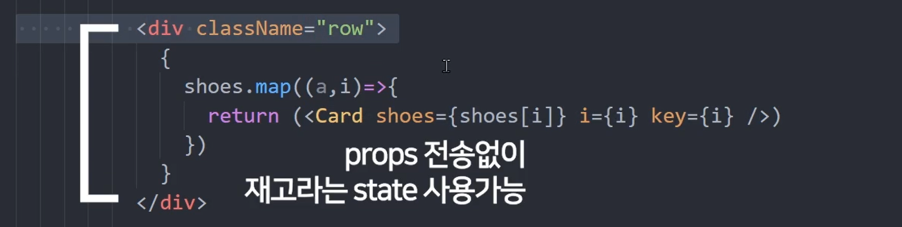
  <br />

3. `<Card />` 컴포넌트는 props 전송없이 재고라는 state 사용이 가능하다.<br />
  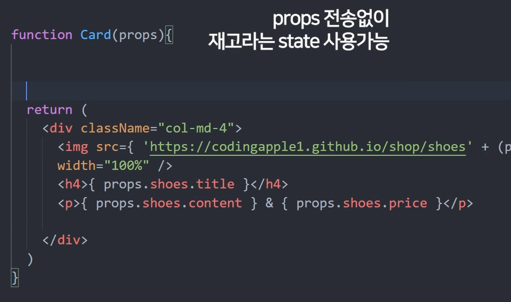
  <br />

4. useContext()로 공유된 값 사용하기
  - `let 변수명 = useContext(범위이름)`
  - 사용하는 파일 상단 `import React, {useContext} from 'react'` 명시.
  - 원하는 위치에 `{변수명}`을 쓰면 **props 없이 재고라는 state 사용이 가능하다.**
  ```javascript
  // App.js
  import React, { useContext, useState } from 'react';

  function Card(props) {
    let 재고 = useContext(재고context);
    return (
      <div className="col-md-4">
        
        <h4>{props.shoes.title}</h4>
        <p>{props.shoes.content} & {props.shoes.price}원</p>
        {재고}
      </div>
    )
  }
  ```
  <br />

5. Context는 상위 컴포넌트 - 하위컴포넌트 - 하위컴포넌트 - 하위컴포넌트.. 에서 props 보다 사용하기에 편리하다.<br />

6. Card 컴포넌트에 Test 컴포넌트를 생성하여 테스트 해보자.<br />
  ```javascript
  // App.js 

  function Card(props) {

    let 재고 = useContext(재고context);

    return (
      <div className="col-md-4">
        
        <h4>{props.shoes.title}</h4>
        <p>{props.shoes.content} & {props.shoes.price}원</p>

        <Test />
      </div>
    )
  }

  function Test() {
    return <p>재고 : ???</p>
  }
  ```
  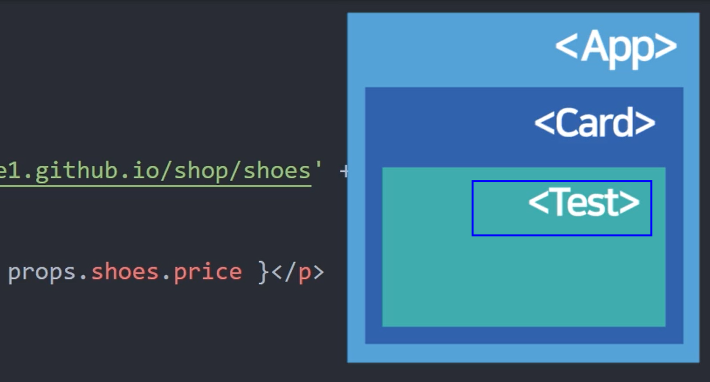<br />
  <br />

7. `<Card />` 컴포넌트 범위 안에 있기 때문에 공유된 값을 사용할 수 있다.
<br />

8. 공유된 값을 사용하기 위해 `let 재고 = useContext(재고context);` 받아온다.<br />그리고 `{재고}`를 원하는 위치에 적용한다.
  ```javascript
  function Card(props) {

    return (
      <div className="col-md-4">
        
        <h4>{props.shoes.title}</h4>
        <p>{props.shoes.content} & {props.shoes.price}원</p>

        <Test />
      </div>
    )
  }

  function Test() {
    let 재고 = useContext(재고context);
    return <p>{재고}</p>
  }
  ```
  <br />

9. 강좌 선생님 경우, 사용법이 불편한 context 사용이 싫을 경우, 컴포넌트를 최소화 시키거나 Redux 라이브러리를 사용한다.<br />*Redux 라이브러리 : 모든 컴포넌트 파일들이 같은 값을 공유할 수 있는 저장공간 생성 가능 + state 데이터 관리 기능
<br />

10. App.js의 `let 재고context = React.createContext();`을 Detail.js에 값을 공유하려고 한다.
  ```javascript
  // App.js
  export let 재고context = React.createContext();

  <Route path="/detail/:id">
    <재고context.Provider value = {재고}>
    <Detail shoes={shoes} 재고={재고} 재고변경 = {재고변경} />
    </재고context.Provider>
  </Route>

  // Detail.js
  import React, { useState, useEffect, useContext } from 'react';
  import {재고context} from './App';

  function Detail(props) {
    let 재고 = useContext(재고context);

     function copy() {
      let index = id - 1;
      let copynew = [...재고];
      // copynew[index] = --copynew[index];
      copynew[index]--; 

      /*
        onClick={ copy } 이렇게 하거나 onClick={ ()=>{copy()} } 이렇게 해야합니다
        이 경우 copy 함수안에 return키워드는 필요없습니다
      */
      props.재고변경(copynew);
    }
  }
  ```
  <br />

11. 선생님 결론 :: 컴포넌트를 많이 만들지 않으면 굳이 필요하지 않는 context 문법.

<br />
<br />
<br />

## 2. Tab UI w/Animation
Tab 만들기와 리액트에서의 애니메이션 (react-transition-group)

<br />
<br />

### 2.1. Tab 기능 만들기
- **Tab UI 만드는 법**<br />1. 몇 번째 버튼 눌렀는 지를 state로 저장해둠.<br />2. state에 따라 UI 보이게 안 보이게<br />

- [React Bootstrap - Tab 컴포넌트](https://react-bootstrap.netlify.app/components/navs/#tabs)를 이용하여 Tab을 만들어준다.
  - eventKey = 버튼들마다 유니크한 eventKey 부여하기 (= 부트스트랩 문법)
  - defaultActiveKey = 기본으로 눌러진 버튼의 eventKey를 써준다.
  ```javascript
  // Datail.js
  import { Nav } from 'react-bootstrap';

  function Detail(props) {
    return (
      <Nav variant="tabs" defaultActiveKey="link-0">
        <Nav.Item>
          <Nav.Link eventKey="link-0">Active</Nav.Link>
        </Nav.Item>
        <Nav.Item>
          <Nav.Link eventKey="link-1">Option 2</Nav.Link>
        </Nav.Item>
      </Nav>
    )
  }
  ```
  <br />

- 탭내용 `<div>` 만들기
  ```javascript
  // Datail.js
  import { Nav } from 'react-bootstrap';

  function Detail(props) {
    return (
      <Nav variant="tabs" defaultActiveKey="link-0">
        <Nav.Item>
          <Nav.Link eventKey="link-0">Active</Nav.Link>
        </Nav.Item>
        <Nav.Item>
          <Nav.Link eventKey="link-1">Option 2</Nav.Link>
        </Nav.Item>
      </Nav>

      <div>000</div>
      <div>111</div>
      <div>222</div>
    )
  }
  ```
  <br />

- 몇번째 버튼을 눌렀는 지 저장할 state 데이터 만들기.
  - 누른탭 state에 지금 누른 버튼 번호를 입력한다.
  ```javascript
  // Detail.js
  function Detail(props) {
    let [누른탭, 누른탭변경] = useState(0);
    return (
    )
  }
  ```
  <br />

- 탭메뉴 버튼을 누르면 **누른탭 state**를 변하게 적용한다.
  ```javascript
  // Datail.js
  import { Nav } from 'react-bootstrap';

  function Detail(props) {
    return (
      <Nav variant="tabs" defaultActiveKey="link-0">
        <Nav.Item>
          <Nav.Link eventKey="link-0" onClick={ () => { 누른탭변경(0)} }>Active</Nav.Link>
        </Nav.Item>
        <Nav.Item>
          <Nav.Link eventKey="link-1" onClick={ () => { 누른탭변경(1)} }>Option 2</Nav.Link>
        </Nav.Item>
      </Nav>

      <div>000</div>
      <div>111</div>
      <div>222</div>
    )
  }
  ```
  <br />

- 3개이상일 떈, 삼항연산자를 적용할 수가 없다.<br />때문에 3개 이상의 if문을 적용해야 할 경우 새 컴포넌트를 만들어서 적용한다.
  ```javascript
  // Detail.js
  function Detail(props) {
    return (
      <TabContent 누른탭 = {누른탭} />
    )
  }

  function TabContent(props) {
    if ( props.누른탭 === 0 ) {
      return <div>0번째 내용입니다.</div>
    } else if ( props.누른탭 === 1 ) {
      return <div>1번째 내용입니다.</div>
    } else if ( props.누른탭 === 2 ) {
      return <div>2번째 내용입니다.</div>
    }
  }
  ```
  <br />

### 2.2. Animation 추가는 ?
- 미리 애니메이션 주는 class 제작해놓고 컴포넌트 등장/업데이트 될 때 className에 부착한다.
- 간단한 라이브러리 등 생각하기 귀찮을 땐 라이브러리를 추가하여 애니메이션을 적용하는 방법도 있다.
  ```
  yarn add react-transition-group

  npm install react-transition-group
  ```
  <br />

- 명령어 입력한 후, 라이브러리 설치가 완료되었다면 애니메이션을 적용할 파일에<br />`import {CSSTransition} from "react-transition-group"` (import 해온다.)
<br />

- **react-transition-group**<br />: 컴포넌트 등장/업데이트 시, transition 쉽게 쉽게 줄 수 있음.<br />
- Detail.js에 적용할 css 파일도 준비한다.<br />`import './Detail.scss';`<br />

- 애니메이션을 적용할 컴포넌트를 `<CSSTransition></CSSTransition>`으로 감싸준다.
  ```javascript
  // Detail.js
  function Detail(props) {
    return (
      <CSSTransition>
      <TabContent 누른탭 = { 누른탭 } />
      </CSSTransition>
    )
  }
  ```
  <br />

- `in={} classNames="" timeout={}` props를 적용한다.
  - **in** = 스위치. true일 때 애니메이션을 적용
  - **classNames** = 어떤 애니메이션을 적용할지 작명해주는 부분
  - **timeout** = 작동시간
  ```javascript
  // Detail.js
  function Detail(props) {
    return (
      <CSSTransition in={true} classNames="wow" timeout={500}>
      <TabContent 누른탭 = { 누른탭 } />
      </CSSTransition>
    )
  }
  ```
  <br />

- `classNames`에 작명한 클래스에 따라 CSS를 작성한다.
  - [`-enter`]. ex) `wow-enter`<br />: 애니메이션 시작 때 적용할 CSS
  - [`-enter-active`]. ex) `wow-enter-active`<br />: 애니메이션 동작 때 적용할 CSS
  - opacity 외에도 회전, 크기 조절 등 애니메이션을 적용할 수 있다.
  ```css
  /* Detail.scss */
  .wow {
    &-enter {
      opacity: 0;
    }
    &-enter-active {
      opacity: 1;
      transition: all 500ms;
    }
  }
  ```
  <br />

- 원할 때 (in)스위치를 켜준다.<br />
  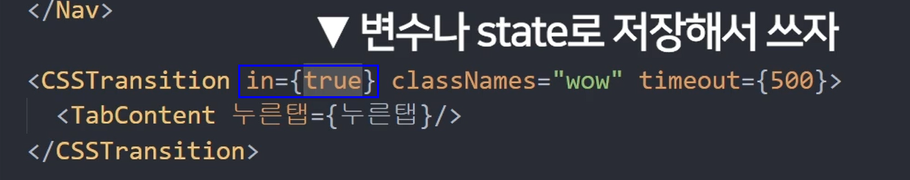
  <br />

- 스위치 값을 저장할 state를 만들고 적용한다.
  - `in={}` 에 스위치 state를 적용한다.
  ```javascript
  // Detail.js
  function Detail(props) {
    let [누른탭, 누른탭변경] = useState(0);
    let [스위치, 스위치변경] = useState(false);

    return (
      <CSSTransition in={스위치} classNames="wow" timeout={500}>
      <TabContent 누른탭 = { 누른탭 } />
      </CSSTransition>
    )
  }
  ```
  <br />

- `<TabContent>` 컴포넌트가 등장하거나 업데이트 될 때 스위치 state 값을 true로 변경시킨다.
  - `useEffect()`를 이용한다.
  - 스위치는 `<TabContent>` 컴포넌트의 상위 컴포넌트에 있으므로 props로 받아 적용한다.
  ```javascript
  // Detail.js
  function Detail(props) {
    let [누른탭, 누른탭변경] = useState(0);
    let [스위치, 스위치변경] = useState(false);

    return (
      <CSSTransition in={스위치} classNames="wow" timeout={500}>
      <TabContent 누른탭 = { 누른탭 } 스위치변경 = {스위치변경} />
      </CSSTransition>
    )
  }

  function TabContent(props) {
    useEffect( () => {
      props.스위치변경(true);
    });
  }
  ```
  <br />

- 원할 때 스위치를 켜기/끄기<br />버튼을 누르면 스위치가 꺼진다.<br />컴포넌트 로드/업데이트 시 스위치가 켜진다.
  ```javascript
  // Detail.js
  function Detail(props) {
    let [누른탭, 누른탭변경] = useState(0);
    let [스위치, 스위치변경] = useState(false);

    return (
      <Nav variant="tabs" defaultActiveKey="link-0">
        <Nav.Item>
          <Nav.Link eventKey="link-0" onClick={ () => { 스위치변경(false); 누른탭변경(0)} }>Active</Nav.Link>
        </Nav.Item>
        <Nav.Item>
          <Nav.Link eventKey="link-1" onClick={ () => { 스위치변경(false); 누른탭변경(1)} }>Option 2</Nav.Link>
        </Nav.Item>
        <Nav.Item>
          <Nav.Link eventKey="link-2" onClick={ () => { 스위치변경(false); 누른탭변경(2)} }>Option 2</Nav.Link>
        </Nav.Item>
      </Nav>

      <CSSTransition in={스위치} classNames="wow" timeout={500}>
      <TabContent 누른탭 = { 누른탭 } 스위치변경 = { 스위치변경 } />
      </CSSTransition>
    )
  }

  function TabContent(props) {

    useEffect(()=>{
      props.스위치변경(true);
    });

    if (props.누른탭 === 0) {
      return <div>0번째 내용입니다.</div>
    } else if (props.누른탭 === 1) {
      return <div>1번째 내용입니다.</div>
    } else if (props.누른탭 === 2) {
      return <div>2번째 내용입니다.</div>
    }
  }
  ```
  <br />

- **enter(등장) 말고도 exit(퇴장) 애니메이션도 가능하다**
<br />

- `<CSSTransition>` 다른 곳에도 써서 다른 컴포넌트에도 부여 가능<br />**페이지 이동시에도 적용이 가능하다.**
<br />

- **★★★★ react-transition-group 라이브러리 사용법 익히기!!!! ★★★★**

<br />
<br />
<br />

## 3. Redux1
세계최고로 쉬운 Redux 1 : props 싫으면 쓰세요

<br />
<br />

### 3.1. 장바구니 Cart 페이지 만들기
- src 폴더 내에 Cart.js 만들기
  - 컴포넌트 페이지가 많아지면 src 폴더 안에 하위폴더를 생성하여 관리하는 것도 좋은 습관!
  - 컴포넌트 js 파일과 scss 파일을 하나의 폴더로 관리하는 습관 굳!!
  ```javascript
  // 기본 구성
  import React from 'react';

  function Cart() {
  return (
      <div>
      </div>
    ) 
  }

  export default Cart;  // 이래야 다른 파일에서 갖다 쓸 수 있다.
  ```
  <br />

- [리액트 부트스트랩을 이용하여 Table 표](https://react-bootstrap.netlify.app/components/table/#table-inverted)를 적용하려고 한다.
  - `import` 할 떄 변수를 `{}` 감싸고 안 감싸고의 차이가 있다.<br />`import {Table}` : Table 이라는 변수/함수 가져오기<br />`import Table` : export default 된 거(`export default Table`) 가져오기
  ```javascript
  import React from 'react';
  import { Table } from 'react-bootstrap';

  function Cart() {
  return (
      <div>
        <Table striped bordered hover>
          <thead>
            <tr>
              <th>#</th>
              <th>First Name</th>
              <th>Last Name</th>
              <th>Username</th>
            </tr>
          </thead>
          <tbody>
            <tr>
              <td>1</td>
              <td>Mark</td>
              <td>Otto</td>
              <td>@mdo</td>
            </tr>
            <tr>
              <td>2</td>
              <td>Jacob</td>
              <td>Thornton</td>
              <td>@fat</td>
            </tr>
            <tr>
              <td>3</td>
              <td colSpan="2">Larry the Bird</td>
              <td>@twitter</td>
            </tr>
          </tbody>
        </Table>
      </div>
    ) 
  }

  export default Cart;
  ```
  <br />

- App.js에 `<Cart>`를 적용한다.<br />`<Route></Route>`를 이용하여 `/cart`로 접속 시 보여지게 설정한다.
  ```javascript
  // App.js
  import Cart from './Cart';

  function App() {
    return (
      <Route path="/cart">
        <Cart />
      </Route>
    )
  }
  ```
  <br />

- Cart.js - Table 꾸미기.<br />상품명과 수량은 데이터바인딩하여 정보를 불러오려고 한다.
  ```javascript
  import React from 'react';
  import { Table } from 'react-bootstrap';

  function Cart() {
  return (
      <div>
        <Table striped bordered hover>
          <thead>
            <tr>
              <th>#</th>
              <th>상품명</th>
              <th>수량</th>
              <th>변경</th>
            </tr>
          </thead>
          <tbody>
            <tr>
              <td>1</td>
              <td></td>
              <td></td>
              <td></td>
            </tr>
          </tbody>
        </Table>
      </div>
    ) 
  }

  export default Cart;
  ```
  <br />


### 3.2. redux 셋팅하기
- App.js에 데이터를 만들어서 `<App>` -> `<Cart>`로 props 전송해야하는데, 이번엔 **redux**를 사용하려고 한다.
 - 명령어를 입력하여 redux 라이브러리를 설치한다.<br />`yarn add redux react-redux`<br />`npm install redux react-redux`
 - 명령어로 설치할 때 중간에 띄어쓰기를 하면 다수를 설치할 수 있다.(ex. redux react-redux)
<br />

- **redux 쓰는 이유, 첫번째**<br />props 없이 모든 컴포넌트가 state를 갖다쓰기 가능
<br />

- index.js 파일을 열고 redux를 세팅한다.
  - 1) `import { Provider }` 하기
  - 2) `<Provider></Provider>`로 `<App>` 감싸기<br />Provide로 감싼 모든 컴포넌트에서 state 공유 사용이 가능
  ```javascript
  // index.js
  import { Provider } from 'react-redux';   // 1)

  ReactDOM.render(
    <React.StrictMode>
      <BrowserRouter>
        <Provider>                          // 2)
          <App />
        </Provider>
      </BrowserRouter>
    </React.StrictMode>,
    document.getElementById('root')
  );
  ```
  <br />

  - 3) createStore()안에 state 저장<br />`let store = createStore(()=>{ return state 초기값 });`
  - 4) `<Provider>`에 props 전송
  ```javascript
  // Index.js 

  // 3)
  import { createStore } from 'redux';
  let store = createStore(()=>{ return [{ id : 0, name : '멋진신발', quan : 2 }] });

  ReactDOM.render(
    <React.StrictMode>
      <BrowserRouter>
        <Provider store = {store}>    // 4)
          <App />
        </Provider>
      </BrowserRouter>
    </React.StrictMode>,
    document.getElementById('root')
  );
  ```
  <br />

### 3.3. 세팅한 redux 데이터를 Cart.js에서 사용해보자.
- 컴포넌트에서 store에 있는 state를 쓰려면<br />1) function을 만든다.<br />functio을 만들고 `export default connect()()`
  ```javascript
  // Cart.js
  import { connect } from 'react-redux';
  function 함수명() {

  }

  export default connect(함수명)(Cart)
  ```
  <br />

  - function에 파라미터 state를 적용하여 store에 담긴 정보를 state로 가져온다.<br />즉, **redux store 데이터 가져와서 props로 변환해주는 함수**.
  ```javascript
  // Cart.js
  import { connect } from 'react-redux';
  function state를props화(state) {
    return {
      상품명 : state.name
    }
  }

  export default connect(state를props화)(Cart)
  ```
  <br />

  - 데이터 별로 `상품명 : state.name` 명시하기 귀찮거나 할 때 `state : state`로 적용해도 된다.
    - `A state : B state` 설명<br />A state == state라는 이름의 props로 바꿔주세요<br />B state == store안에 있던 모든 데이터
    ```javascript
  // Cart.js
  import { connect } from 'react-redux';
  function state를props화(state) {
    return {
      state : state
    }
  }

  export default connect(state를props화)(Cart)
  ```
  <br />

- props로 만들어주었기 떄문에 `props.???` 으로 써줘야 한다.
  ```javascript
  // Cart.js 
  function Cart(props) {   // props로 받고 
  return (
      <div>
        <Table striped bordered hover>
          <thead>
            <tr>
              <th>#</th>
              <th>상품명</th>
              <th>수량</th>
              <th>변경</th>
            </tr>
          </thead>
          <tbody>
            <tr>
              <td>1</td>
              <td>{ props.state[0].name }</td>   // props.?? 으로 적용
              <td></td>
              <td></td>
            </tr>
          </tbody>
        </Table>
      </div>
    ) 
  }
  ```
  <br />

### 3.4. 오늘의 결론 - redux 쓰는 이유 1
#### 깊은 하위컴포넌트들도 props 여러번 전송없이 state를 직접 갖다 쓸 수 있음.

<br />
<br />
<br />

## 4. Redux 2
세계최고로 쉬운 Redux 2 : reducer/dispatch로 데이터 수정하는 법

### 4.1. 복습
- **Redux 쓰는 이유 1.**<br />복잡한 props 전송이 필요없음<br />모든 컴포넌트가 직접 데이터 꺼내 쓸 수 있음.
- **셋팅 :**<br />store에 state 저장하고 `<Provider></Provider>`로 원하는 곳 감싸기<br />(`<Provider>`로 감싸하려면 반드시 `import`가 필요하다.)
  ```javascript
  import { Provider } from 'react-redux';
  import { createStore } from 'redux';

  let store = createStore(()=>{ 
    return [
      { id : 0, name : '멋진신발', quan : 2 },
      { id : 1, name : '이쁜신발', quan : 7 },
      { id : 2, name : '웃긴신발', quan : 5 },
    ] 
  });

  ReactDOM.render(
    <React.StrictMode>
      <BrowserRouter>
        <Provider store = {store}>
          <App />
        </Provider>
      </BrowserRouter>
    </React.StrictMode>,
    document.getElementById('root')
  );
  ```
  <br />

- **redux store 데이터 사용 :**<br />props로 바꿔주는 함수 쓰기<br />`connect(state를props화 시켜주는 함수명)(props화 시켜주는 함수와 엮을 컴포넌트명)`
  ```javascript
  function state를props화(state) {
    return {
      state : state  // store에 있던 모든 데이터
    }
  }

  export default connect(state를props화)(Cart)
  ```
  <br />

### 4.2. 수량 +/- 버튼 만들기
- 버튼 + 만들기
  ```javascript
  // Cart
  <tbody>
    {
      props.state.map( (el, i)=>{
        return (
          <tr key={i}>
            <td>{ el.id }</td>
            <td>{ el.name }</td>
            <td>{ el.quan }</td>
            <td><button onClick={ ()=> { } }>+</button></td>
          </tr>
        )
      })
    }
  </tbody>
  ```
  <br />

### 4.3. Redux 쓰는 이유 2.
#### state 데이터 관리 기능
<br />
<br />

### 4.4. state 데이터의 수정방벙 정의하기
#### redux에선 state 데이터의 수정 방법을 미리 정의해야 한다.
<br />

- `index.js` 파일에서 `reducer` 라는 함수를 만든다.
  - **reducer 함수는 항상! state를 return 해야 한다.**
  - reducer 함수는 별거 아니고 그냥 수정된 state를 퉤 뱉는 함수이다.
  ```javascript
  // index.js
  let 기본state = [
    { id : 0, name : '멋진신발', quan : 2 },
    { id : 1, name : '이쁜신발', quan : 7 },
    { id : 2, name : '웃긴신발', quan : 5 },
  ]

  function reducer(state = 기본state, 액션) {
    return state;
  }

  let store = createStore(reducer);
  ```
  - `state = 기본state` == ES6 신문법. default parameter 문법<br />
    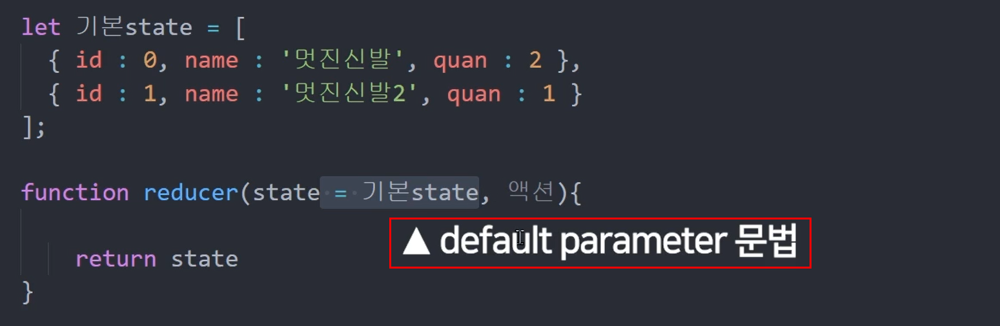<br />
    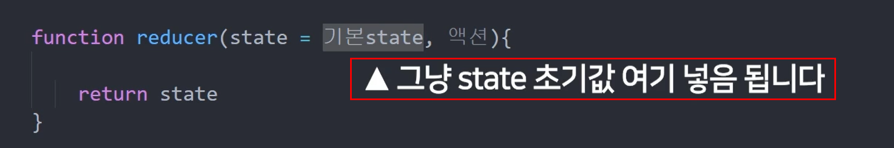
    <br />

  - 변수 `기본state`를 명시적으로 표현한다면 `초기값`으로 이해하면 된다.
    ```javascript
    // index.js
    let 초기값 = [
      { id : 0, name : '멋진신발', quan : 2 },
      { id : 1, name : '이쁜신발', quan : 7 },
      { id : 2, name : '웃긴신발', quan : 5 },
    ]

    function reducer(state = 초기값, 액션) {
      return state;
    }

    let store = createStore(reducer);
    ```
    <br />

- reducer에서 state 데이터의 수정방법을 미리 정의한다.
  - `수량증가`라는 액션을 만들어준다. `수량증가`처럼 액션에 맞는 이름으로 작명
  - `수량증가` 액션이 실행될 때 state를 수정(초기값 state 복사 후 수정)하고 return 수정된 state
  ```javascript
  // index.js
  let 초기값 = [
    { id : 0, name : '멋진신발', quan : 2 },
    { id : 1, name : '이쁜신발', quan : 7 },z
    { id : 2, name : '웃긴신발', quan : 5 },
  ]

  function reducer(state = 초기값, 액션) {
    if ( 액션.type === '수량증가' ) {
      let copy = [...state];
      copy[0].quan++;
      return copy;
      // return 수정된state
    } else {
      return state;
    }
  }

  // store만들 때 만들어둔 reducer를 집어넣으면 끝
  let store = createStore(reducer);
  ```
  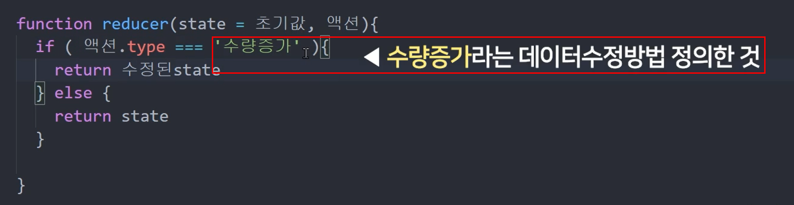
  <br />

- 버튼 +을 누르면 reducer에 만들어둔 **수량증가** 요청을 해본다.
  -데이터 수정요청을 할 땐 `props.dispatch({ type: ???})`
  ```javascript
  // Cart.js
  {
    props.state.map( (el, i)=>{
      return (
        <tr key={i}>
          <td>{ el.id }</td>
          <td>{ el.name }</td>
          <td>{ el.quan }</td>
          <td><button onClick={ ()=> { props.dispatch({ type: '수량증가'}) } }>+</button></td>
        </tr>
      )
    })
  }
  ```
  <br />

- 대규모 사이트는 state가 100만개 있고 1000만곳에서 state를 수정함.<br />근데 갑자기 state가 이상해지면? 버그가 발견이 되면?<br />(1000만개의 컴포넌트를 뒤져야함..)<br />redux를 하게 되면 데이터가 오류 난 부분만 찾으면 된다.(state, dispatch 등)<br /><br />**즉, redux 쓰는 이유 2. state 데이터 관리가 용이하다(일명 상태관리)**

<br />
<br />
<br />

## 5. Redux 3
세계최고로 쉬운 Redux 3 : state와 reducer가 더 필요하면

<br />
<br />

### 5.1. 복습
- reducer 넘 길면 다른 js 파일로 export/import해서 쓴다.
- **redux에서의 state 만드는 법 :**
  - 변수로 초기값 만들고 reducer 안에 넣는다.
  - 그리고 state 수정하는 법도 작성
  - **reducer에는 초기값, 데이터 수정방벙을 반드시! 꼭! 정의해야 한다.**
  - **그리고 항상 state를 return 해줘야 한다.**
  - 마지막으로 `let store = createStore(reducer)`<br />변수 store에 reducer를 담아줘야 완성이 된다.<br />`let store` == state 보관통(store)
  ```javascript
  // index.js
  let 초기값 = [
    { id : 0, name : '멋진신발', quan : 2 },
    { id : 1, name : '이쁜신발', quan : 7 },
    { id : 2, name : '웃긴신발', quan : 5 },
  ]
  function reducer(state = 초기값, 액션) {
    // if문을 이용한 수정하는 법 작성
    if ( 액션.type === '수량증가' ) {
      let copy = [...state];
      copy[0].quan++;
      return copy;
    } else if (액션.type === '수량감소') {
      let copy = [...state];
      if (copy[0].quan > 0) copy[0].quan--;
      return copy;
    } else {
      return state;
    }
  }

  let store = createStore(reducer);

  ReactDOM.render(
    <React.StrictMode>
      <BrowserRouter>
        <Provider store = {store}>
          <App />
        </Provider>
      </BrowserRouter>
    </React.StrictMode>,
    document.getElementById('root')
  );
  ```
  <br />

- 컴포넌트 파일 하단에 props 등록하면 store에 있는 state 사용 가능
  ```javascript
  // Cart.js
  function state를props화(state) {
    return {
      state : state
    }
  }

  export default connect(state를props화)(Cart)
  ```
  <br />

### 5.2. 다른 데이터도 state로 만들어서 저장하고 싶을 때
- Cart.js에 알림창 UI를 만든다.
  - 닫기 버튼을 누르면 state에 열기/닫기 상태를 저장하여 액션 적용
  ```javascript
  // Cart.js
  <div className="my-alert2">
    <p>지금 구매하시면 신규할인 20%</p>
    <button>닫기</button>
  </div>
  ```
  <br />

- 알럿창의 state를 redux store에 저장한다.
- 추가로 state 저장하고 싶으면 reducer를 하나 더 만든다.<br />(state는 종류별로 모아두는 것이 수정방법 정의에도 좋다.)
<br />

- 알림창(alert창) 상태를 저장하는 state + reducer 하나 더 만든다.
  - reducer를 더 만들었으면 `createStore(reducer)` 안에 넣어야 한다.<br />**2개이상일 땐 `createStore(combineReducers({reducer,reducer2})` 로 써줘야 한다.**<br /><br />`combineReducers`을 쓸 땐, 상단에 `import` 해와야 한다.
  ```javascript
  // index.js
  import { combineReducers, createStore } from 'redux';

  let store = createStore(combineReducers({reducer,reducer2}));
  ```
  <br />

- **reducer 몇 개 합치면 store 데이터 뽑아쓸 때도 주의해야 한다.**<br />
  <br />
  <br />

- store 데이터 생김새<br />`{ reducer: ?, reducer2 : ?}`
  ```javascript
  // Cart.js
  function state를props화(state) {
    return {
      state : state.reducer,
      alert열렸니 : state.reducer2
    }
  }

  export default connect(state를props화)(Cart)
  ```
  <br />

- reducer2에 있던 데이터가 true 일 때만 alert UI 보여주기
  ```javascript
  // Cart.js
  {
    props.alert열렸니 === true
    ? (
    <div className="my-alert2">
      <p>지금 구매하시면 신규할인 20%</p>
      <button>닫기</button>
    </div>
    )
    : null
  }
  ```
  <br />

- 닫기 버튼을 누르면 alert 창이 닫혀야 함.
  ```javascript
  // Index.js
  let alert초기값 = true;

  // alert초기값 변수를 만들지 않고 state 작성할 땐
  // function reducer2( state = true, 액션) {
  function reducer2( state = alert초기값, 액션) {
    if (액션.type === '닫기') {
      state = false;
      return state;
      //return !state;
    } else {
      return state;
    }
  }

  // Cart.js
  {
    props.alert열렸니 === true
    ? (
    <div className="my-alert2">
      <p>지금 구매하시면 신규할인 20%</p>
      <button onClick = { ()=> { props.dispatch( {type: '닫기'} ) } }>닫기</button>
    </div>
    )
    : null
  }
  ```
  <br />

### 5.3. 여기서 배워보는 잘못된 코딩방식
- cart.js에 만든 alert창. 다른 컴포넌트에서도 쓸까?<br />여기에서도 닫힌 알림창, 다른 컴포넌트에서도 닫힐 이유가 있을 까?(아닐 확률이 높다..)
- 독립적인 Cart.js 안에서만 사용될 컴포넌트이다.
- 즉, 컴포넌트 하나에서만 쓰는 건 굳이 redux에 저장할 필요가 없다.<br />(useState()를 이용하는 것을 추천)
- **redux store에 온갖 데이터 저장은 절대 금물!! ㄴㄴ!!**
  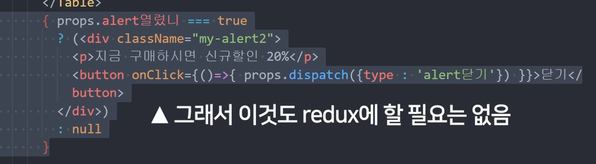<br />
  <br />

### 5.4. 오늘의 결론
- state가 여러개 필요하면 reducer를 더 만든다.
- reducer 안엔 state 초기값 + 수정하는 법
- 그리고 reducer 합치려면 `combineReducers({})`

<br />
<br />
<br />

## 6. Redux 4
세계최고로 쉬운 Redux 4 : dispatch할 때 데이터 실어보낼 수 있음

<br />
<br />

### 6.1. dispatch()로 수정요청할 때 데이터를 보낼 수 있다.
- `dispatch({type: 어쩌구, payload : 보낼데이터})`<br />payload 또는 data 등으로 네이밍할 수 있다.<br />
  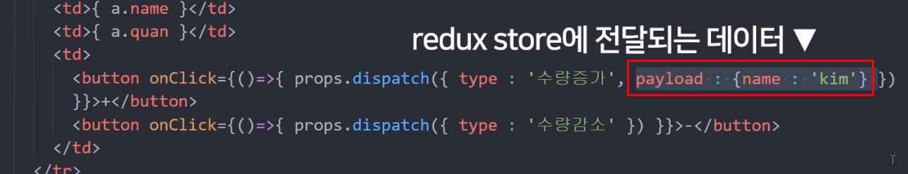<br />

- payload로 보낸 자료는 **액션 파라미터**에 저장이 된다.<br />
  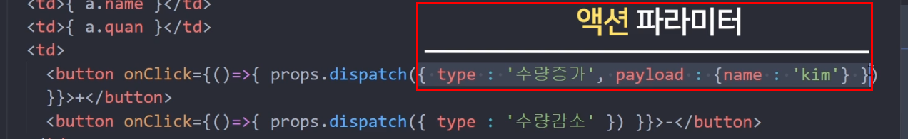<br />

- 받아온 자료를 `액션.payload`로 사용하면 된다.
  <br />

### 6.2. 장바구니 추가 버튼 제작
- 주문하기 버튼을 클릭하면 장바구니에 추가되도록 기능을 개발한다.
- 먼저, 데이터 수정되는 방법 정의하기.<br />(if문 외에 스위치문을 이용해도 좋다.)
  - `push()`에는 `dispatch()`로 받아온 정보를 적용할 예정이다.
  ```javascript
  // index.js
  function reducer(state = 초기값, 액션) {
    if ( 액션.type === '항목추가') {
      let copy = [...state];
      copy.push(); 
      return copy;
    }
  }
  ```
  <br />

- 버튼을 누르면 dispatch()하기
  - state를 props화 해주는 걸 써줘야 dispatch도 가능하다.<br />(connect 함수도 import 해와야 한다.)
  ```javascript
  // Detail.js
  import { connect } from 'react-redux';

  function Detail(props) {
    return (
      <button className="btn btn-danger" onClick={ ()=>{ 
        copy();
        props.dispatch({type: '항목추가'});
      } }>주문하기</button>
    )
  }

  function state를props화(state) {
    return {
      state : state.reducer,
      alert열렸니 : state.reducer2
    }
  }

  export default connect(state를props화)(Detail)
  ```
  <br />

- dispatch할 때 데이터 함께 전송해주기
  ```javascript
  // Detail.js
  function Detail(props) {
    return (
      <button className="btn btn-danger" onClick={ ()=>{ 
        copy();
        props.dispatch({type: '항목추가', payload: {id:2, name: '새로운상품', quan: 1}});
      } }>주문하기</button>
    )
  }
  ```
  <br />

- 전송한 데이터를 `액션.payload`로 사용하기
  - `액션 파라미터` == reducer의 액션 파라미터는 `dispatch()`할 때 보낸 object이다.
  ```javascript
  // index.js
  function reducer(state = 초기값, 액션) {
    if ( 액션.type === '항목추가') {
      let copy = [...state];
      copy.push(액션.payload); 
      return copy;
    }
  }
  ```
  - `Detail.js` 페이지에서 `<button>`의 빨간 테두리 영역이 `액션 파라미터`로 **보낼 데이터** 이다.
  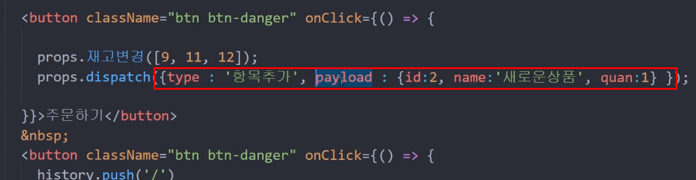
  <br />

- 이제 기능 개발 완성. /cart 페이지에서 보면 추가가 되어 있지 않았다.<br />왜냐하면, 개발환경에서 새로고침하면 redux도 초기화되기 때문이다.<br />

- 개발환경에서 페이지 이동 시, 강제 새로고침 안되게 하려면<br />`history.push('/cart')` (페이지 강제이동)
  ```javascript
  // Detail.js
  function Detail(props) {
    return (
      <button className="btn btn-danger" onClick={ ()=>{ 
        copy();
        props.dispatch({type: '항목추가', payload: {id:2, name: '새로운상품', quan: 1}});
        history.push('/cart');
      } }>주문하기</button>
    )
  }
  ```
  <br />

- 여기까지 했다면 `dispatch()` 기능 개발 완성!<br />(리듀서는 수정 뿐만 아니라 출력 요청 처리도 된다.)
- 번외로 같은 상품이 있으면 새로 추가가 아닌 수량만 증가 시키는 기능과<br />임시상품명이 아닌 실제 상품명데이터를 redux에 저장해보자.
  - **example (구글 검색)** :<br />특정값으로 배열 내 객체에서 답을 찾고 그 답을 갖고 있는 index 찾기.<br />(내가 작업한 것과 다른 코드 방식.)
    ```javascript
    var array = [
      {name:"홍길동", age:"20"},
      {name:"희동이", age:"25"},
      {name:"희동이", age:"30"}
    ];

    var index1 = array.findIndex(obj => obj.name == "희동이"); //하나의 경우
    var index2 = array.findIndex(obj => obj.name == "희동이" && obj.age == "30"); 

    console.log(index1);  // 1
    console.log(index2);  // 2
    ```
  - 위 코드를 참고하여 Index.js - `액션.항목추가` 적용해도 됨.
    ```javascript
    // 내가 짰던 코드
    if ( 액션.type === '항목추가') {
      let copy = [...state];
      let index;
      
      copy.map( (el)=> {
        if ( el.id === 액션.payload.id) {
          index = copy.indexOf(el);
        }
      });

      if ( index ) {
        copy[index].quan++;
      } else {
        copy.push(액션.payload);
      }
      
      return copy;
    }
    ```
    - 위의 코드를 수정한 코드<br />index 값을 구하는 코드가 간결해졌다.
    ```javascript
    // Index.js
    if ( 액션.type === '항목추가') {
      let copy = [...state];
      let index = copy.findIndex( obj => obj.id === 액션.payload.id );
      
      if ( index > 0 ) {
        copy[index].quan++;
      } else {
        copy.push(액션.payload);
      }
      
      return copy;
    } 
    ```

<br />
<br />
<br />

## 7.  Redux 5
세계최고로 쉬운 Redux 5 : useSelector, useDispatch

<br />
<br />

### 7.1. (복습) redux 쓰는 이유?
- 모든 컴포넌트가 props 없이 state 직접 사용 가능<br />
  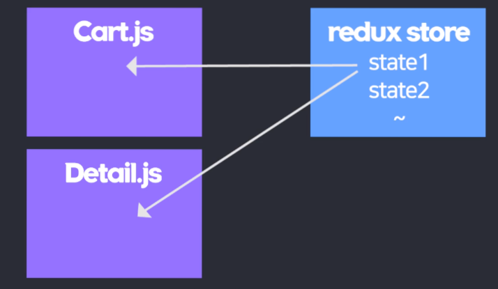<br />

- stste 에러 추적 용이<br />
  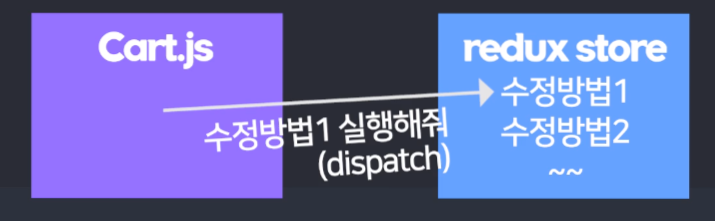<br />
  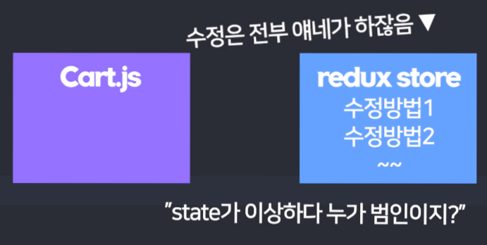<br />
  <br />

### 7.2. state 꺼내쓰는 더 쉬운 방법 (useSelector())
- 기존에 쓰던 state를props화 해주는 함수 보다 **쉽게 사용하는 방법(신문법)**이다.
  ```javascript
  // Cart.js
  function state를props화(state) {
    return {
      state : state.reducer,
      alert열렸니 : state.reducer2
    }
  }

  export default connect(state를props화)(Cart)
  ```
  <br />

- `useSelector()` 훅을 사용한다.
  ```javascript
  // Cart.js
  import { useSelector } from 'react-redux';

  function Cart(props) {
    let state = useSelector((state) => state);
    return ();
  }
  ```
  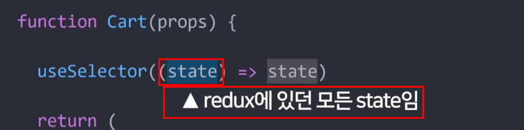<br />
  <br />

- `useSelector()`을 사용하면 `props.state`로 쓸 필요가 없다.
  ```javascript
  // Cart.js
  {
    props.state.map( (el, i)=>{
      return (
        <tr key={i}>
          <td>{ el.id }</td>
          <td>{ el.name }</td>
          <td>{ el.quan }</td>
          <td>
            <button onClick={ ()=> { props.dispatch({ type: '수량증가', payload:i}) } }>+</button>
            <button onClick={ ()=> { props.dispatch({ type: '수량감소', payload:i}) } }>-</button>
          </td>
        </tr>
      )
    })
  }
  ```
  - **위의 코드를 아래와 같이 수정한다.**
  ```javascript
  // Cart.js
  {
    state.reducer.map( (el, i)=>{
      return (
        <tr key={i}>
          <td>{ el.id }</td>
          <td>{ el.name }</td>
          <td>{ el.quan }</td>
          <td>
            <button onClick={ ()=> { props.dispatch({ type: '수량증가', payload:i}) } }>+</button>
            <button onClick={ ()=> { props.dispatch({ type: '수량감소', payload:i}) } }>-</button>
          </td>
        </tr>
      )
    })
  }
  ```
  - state에서 reducer, reducer2 등이 저장되어 있다.<br />이 때 reducer의 내용만 state로 갖고 오고 싶을 땐,<br />`let state = useSelector((state) => state.reducer);` 으로 쓰면 된다.
  <br />

### 7.3. dispatch 하는 더 쉬운 방법 (useDispatch())
- `useDispatch()` 훅을 사용한다.
  - `props.dispatch`로 적용했던 부분을 `dispatch`로 적용하면 된다.
  ```javascript
  // Cart.js
  import { useDispatch, useSelector } from 'react-redux';

  function Cart(props) {

    let state = useSelector((state) => state);
    let dispatch = useDispatch();
    
    return (
      {
        state.reducer.map( (el, i)=>{
          return (
            <tr key={i}>
              <td>{ el.id }</td>
              <td>{ el.name }</td>
              <td>{ el.quan }</td>
              <td>
                <button onClick={ ()=> {dispatch({ type: '수량증가', payload:i}) } }>+</button>
                <button onClick={ ()=> {dispatch({ type: '수량감소', payload:i}) } }>-</button>
              </td>
            </tr>
          )
        })
      }
    )
  }
  ```
  <br />
  <br />
  <br />

## 8. 장바구니 기능 완성하기 가이드
새로운 리액트 내용은 없다. Javascript 문법 시간!

<br />
<br />

### 8.1. 메인페이지, 상품 클릭 시 해당 상세페이지로 이동
1. 메인페이지 상품을 누르면 각각 상세페이지로 이둉해야 함.
2. `<Card></Card>` **컴포넌트 태그에 `onClick` 적용하면 안 된다.**<br />(컴포넌트 태그는 HTML이 아니다. HTML로 렌더링 되는 것일 뿐..!!)

3. `<Card />` 컴포넌트 태그에 적용하는 것이 아닌 `Card 컴포넌트` 안에다가 적용해야한다.
  ```javascript
  function Card(props) {
    return (
      <div className="col-md-4" onClick={()=>{}}>
        
        <h4>{props.shoes.title}</h4>
        <p>{props.shoes.content} & {props.shoes.price}원</p>
        {/* {재고[props.index]} */}

        <Test num = {props.index} />
      </div>
    )
  }
  ```
<br />

4. 페이지 이동은 `history.push()`
  - 정렬를 수정할 수 있으니, `props.index`가 아닌 상품의 고유 ID를 적용하는 것이 좋다. `props.shoes.id`
  ```javascript
  // App.js 
  import { Link, Route, Switch, useHistory} from 'react-router-dom';

  function Card(props) {
    let history = useHistory();

    return (
      <div className="col-md-4" onClick={ ()=>{ history.push('/detail/'+props.shoes.id)} }>
        
        <h4>{props.shoes.title}</h4>
        <p>{props.shoes.content} & {props.shoes.price}원</p>
        {/* {재고[props.index]} */}

        <Test num = {props.index} />
      </div>
    )
  }
  ```
<br />

### 8.2. 장바구니 +/- 버튼 완성하기
1. Cart.js 페이지에서 버튼을 클릭하면 해당 아이디값을 payload로 값을 넘겨준다.<br />(index 번호를 넘겨주면 정렬 등을 했을 때 상품 고유의 ID 값과 일치하지 않을 수 있다.)
  ```
  <button onClick={ ()=> {dispatch({ type: '수량증가', payload: el.id}) } }>+</button>
  ```
<br />

2. +/- 버튼 클릭 시, 해당 상품을 증가/감소 시켜준다.
  ```javascript
  // Index.js
  if ( 액션.type === '수량증가' ) {
    let copy = [...state];
    let index = copy.findIndex( obj => obj.id === 액션.payload );
    copy[index].quan++;
    return copy;
  } else if (액션.type === '수량감소') {
    let copy = [...state];
    let index = copy.findIndex( obj => obj.id === 액션.payload );
    // copy[0].quan--;
    if (copy[index].quan > 0) copy[index].quan--;
    return copy;
  }
  ```
  <br />

### 8.3. 주문하기 누르면 진짜 페이지 내의 상품을 추가해보자.
1. 클릭한 상품의 id, name, quan의 정보를 장바구니에 보내준다.<br />`payload: {id:fid.id, name: fid.title, quan: props.재고[id - 1]}`
  ```javascript
  function Detail(props) {
    return (
      <div className="row">
        <div className="col-md-6">
          
        </div>
        <div className="col-md-6 mt-4">
          <h4 className="pt-5">{fid.title}</h4>
          <p>{fid.content}</p>
          <p>{fid.price}원</p>

          <Info 재고 = { props.재고 } id = {id} />

          <button className="btn btn-danger" onClick={ ()=>{ 
            copy();
            props.dispatch({type: '항목추가', payload: {id:fid.id, name: fid.title, quan: props.재고[id - 1]}});
            history.push('/cart')
          } }>주문하기</button>&nbsp;   
          <button className="btn btn-danger" onClick={ ()=>{ history.goBack() } }>뒤로가기</button> 
        </div>
      </div>
    )
  }
  ```
  <br />

2. 같은 상품을 계속 주문하면 항목 추가X, 수량 증가O<br />id가 같은 상품이 state에 있으면 push()하지 말고 id가 같은 상품의 quan을 1증가
  ```javascript
  // Index.js
  if ( 액션.type === '항목추가') {
    let copy = [...state];
    let index = copy.findIndex( obj => obj.id === 액션.payload.id );
    
    if ( index >= 0 ) {
      copy[index].quan++;
    } else {
      copy.push(액션.payload);
    }
    
    return copy;
  } 
  ```
  - findIndex() : array 안에서 원하는 데이터 찾아주는 함수
    - 조건식(`a === ??`)이 맞으면 몇 번째 있는 지를 알려준다.
    - 파라미터 a는 array에 있는 하나하나의 데이터를 의미한다.
    ```javascript
    state.findIndex( (a)=>{ return a === ?? } );
    ```
    <br />
    <br />
    <br />

## 9. 리액트에서 자주쓰는 if문 작성패턴 5개
### 9.1. 컴포넌트 안에서 쓰는 if/else
- 컴포넌트에서 JSX를 조건부로 보여주고 싶을 때 
  - `return ()` 안의 JSX 내에서는 if문 사용이 불가능하다.
  - `<div> if () {}</div>` 이렇게 사용할 수 없다.
  ```javascript
  function Component() {
    if ( true ) {
      return <p>참이면 보여줄 HTML</p>;
    } else {
      return null;
    }
  } 
  ```
- **(참고) 근데 위와 같이 쓰면 else 생략이 가능하다.**
  - `else {}` 를 없애도 위 코드와 똑같은 기능을 한다.
  - **왜냐면 자바스크립트 function 안에선 return 이라는 키워드를 만나면 return 밑에 있는 코드는 더이상 실행되지 않는다.**<br />그래서 else가 필요없는 경우가 발생할 땐 깔끔한 코드를 위해 생략하는 것도 좋다.
  ```javascript
  function Component() {
    if ( true ) {
      return <p>참이면 보여줄 HTML</p>;
    }
    return null;
  } 
  ```
  <br />

### 9.2. JSX안에서 쓰는 삼항연산자
- 삼항연산자는 ternary operator 이라고도 한다.
- `조건문 ? 조건문 참일 때 실행할 코드 : 거짓일때 실행할코드`<br />위 코드 형식에 맞춰서 작성하면 된다.
- **JSX 내에서 if/else 대신 쓸 수 있다는 장점이 있다.**
  ```javascript
  function Component() {
    return (
      <div>
        {
          1 === 1
          ? <p>참이면 보여줄 HTML</p>
          : null
        }
      </div>
    )
  } 
  ```
- 삼항연산자는 중첩 사용도 된다.
  - 중첩 사용도 되지만 *나중에 읽었을 때 혹은 다른 사람이 읽었을 때 보기싫은 코드는 좋지 않다.*
  ```javascript
  function Component() {
    return (
      <div>
        {
          1 === 1
          ? <p>참이면 보여줄 HTML</p>
          : ( 2 === 2 
              ? <p>안녕</p> 
              : <p>반갑</p> 
            )
        }
      </div>
    )
  } 
  ```
  <br />

### 9.3. && 연산자로 if 역할 대신하기
<details><summary>(문법) 자바스크립트에선 &&연산자라는게 있다</summary>
<br />

#### &&연산자
- "왼쪽 오른쪽 둘 다 true 이면 전체를 true 로 바꿔주세요." 라고 쓰고 싶을 때 사용한다.
  ```javascript
  true && false;  // false
  true && true;   // true
  ```
  <br />

#### (자바스크립트의 특이점) && 기호를 비교할 때 true 와 false를 넣는 것이 아니라 자료형을 넣으면
```javascript
// 1
true && '안녕';

// 2
false && '안녕';
```
- 1) '안녕' 이라는 게 자리에 남고<br />2) false 라는게 남는다.
- **&& 기호를 중첩해서 여러개 쓰면 && 사이에서 처음 등장하는 falsy(거짓같은 값) 값을 찾아주고 그게 아니면 마지막 값을 남겨준다고 생각하면 된다.**
- 이걸 리액트에서 약간 exploit 하면 if문을 조금 더 간략하게 쓸 수 있다.

</details>
<br />

- if문을 쓸 때 이런 경우가 많다.<br />"만약에 이 변수가 참이면 `<p></p>` 를 이 자리에 뱉고 참이 아니면 `null`를 뱉고"<br />UI만들 때 이런 패턴의 if문을 쓰는 경우가 90%이다.<br />이걸 조금 더 쉽게 축약할 수 있는데 && 연산자를 사용하면 된다.
  ```javascript
  function Component() {
    return (
      <div>
        {
          1 === 1
          ? <p>참이면 보여줄 HTML</p>
          : null
        }
      </div>
    )
  } 

  function Component() {
    return (
      <div>
        {
          1 === 1 && <p>참이면 보여줄 HTML</p>
        }
      </div>
    )
  }
  ```
  <br />

### 9.4. switch / case 조건문
- if문으로 작성한 코드를 switch 문법을 이용하여 쓸 수도 있다.
  ```javascript
  // if문을 이용한 코드
  function reducer(state, 액션){
    
    if (액션.type === '수량증가'){
      return 수량증가된state
    } else if (액션.type === '수량감소'){
      return 수량감소된state
    } else {
      return state
    }
  }

  // switch문을 이용한 코드
  function reducer(state, 액션){
    
    switch (액션.type) {
      case '수량증가' :
        return 수량증가된state;
      case '수량감소' : 
        return 수량감소된state;
      default : 
        return state
    }

  }
  ```
- **switch 문법 쓰는 방법**<br />1. switch (검사할변수명){} 이거부터 작성하고<br />2. 그 안에 case 검사할변수명이 이거랑 일치하냐 : 를 넣어준다.(이게 if문)<br />3. 그래서 이게 일치하면 case : 밑에 있는 코드를 실행한다.<br />4. default : 는 그냥 맨 마지막에 쓰는 else문과 동일하다.<br />장점은 if문 연달아쓸 때 코드와 괄호가 줄어든다.
<br />

### 9.5. 오브젝트 자료형을 응용한 enum
**경우에 따라서 다른 HTML을 보여주고 싶을 때**<br />if문 여러 개 혹은 삼항연산자 여러개를 작성하여 적용할 수 있지만 아래와 같이 작성할 수도 있다.
<br />
<br />

#### 예를 들어, 쇼핑몰에서 상품설명 부분을 탭으로 만들 때
경우에 따라 상품정보/배송정보/환불약관 내용을 보여줘야 할 때<br />`현재 state가 info면 <p>상품정보</p>`<br />`현재 state가 shipping이면 <p>배송정보</p>`<br />`현재 state가 refund면 <p>환불약관</p>`<br />이렇게 보여줘야 한다.<br />state를 만들어놓고 if문으로 state를 검사하는 문법을 써야할 것 같지만 if문이 아닌 **자바스크립트 오브젝트 자료형**에  내가 보여주고 싶을 HTML을 담으면 된다.

```javascript
function Component() {
  var 현재상태 = 'info';
  return (
    <div>
      {
        { 
           info : <p>상품정보</p>,
           shipping : <p>배송관련</p>,
           refund : <p>환불약관</p>
        }[현재상태]
      }

    </div>
  )
} 
```
▲ 원래 JSX는 저렇게 오브젝트에 담든, 어레이에 담든 아무 상관이 없다.<br />암튼 이렇게 object 자료형으로 HTML을 다 정리해서 담은 다음<br />마지막에 `object{}` 뒤에 `[]` 대괄호를 붙여서 "key값이 현재상태인 자료를 뽑겠습니다" 라고 써놓d으면 된다.<br />그럼 이제 현재상태라는 변수의 값에 따라서 원하는 HTML을 보여줄 수 있다.<br />만약에 var 현재상태가 'info'면 info 항목에 저장된 <p>태그가 보여질 것이고 만약에 var 현재상태가 'refund'면 refund 항목에 저장된 <p>태그가 보여진다.

<br />
<br />

**혹은 더욱 간지나게 오브젝트를 변수로 저장해놓고 쓰셔도 무방합니다.**
```javascript
var 탭UI = { 
  info : <p>상품정보</p>,
  shipping : <p>배송관련</p>,
  refund : <p>환불약관</p>
}

function Component() {
  var 현재상태 = 'info';
  return (
    <div>
      {
        탭UI[현재상태]
      }
    </div>
  )
} 
```
▲ 뭔가 매우 깔끔해졌다.
<br />
<br />
<br />

## 10. state 변경함수 사용할 때 주의점 : async
### 10.1. 자바스크립트의 sync / async 관련 상식
자바스크립트는 일반적인 코드를 작성하면 synchronous(동기방식) 하게 처리된다.<br />뭔소리냐면 코드 적은 순서대로 윗줄부터 차례로 코드가 실행된다는 뜻이다.<br />실은 거의 모든 프로그래밍 언어들은 무조건 위에서 부터 한줄한줄 실행된다.<br /><br />

```javascript
console.log(1+1);  // 2
console.log(1+2);  // 3
console.log(1+3);  // 4
```

이런 코드는 위에서부터 한 줄 한 줄 실행된다. 콘솔창에 2, 3, 4 순으로 출련된다는 소리이다.<br /><br />

자바스크립트는 이상한 함수들을 사용하면 asynchronous(비동기적) 하게 코드실행이 가능하다.<br />ajax, 이벤트리스너, setTimeout 이런 함수들을 쓸 때 그런 현상이 일어난다.<br />이런 함수들은 처리시간이 오래걸린다.<br />ajax를 예로 들면 인터넷 상황이 안 좋으면 코드 실행이 오래 걸린다. 10초이상 걸릴 수도 있다.<br />그래서 **ajax 요청하는 코드들은 순차적으로 실행되지 않고 완료되면 실행된다.**<br /><br />

```javascript
console.log(1+1); // 2
axios로 get요청하고나서 console.log(1+2) 실행 // 3
console.log(1+3)  // 4
```

이런 코드는 2가 출력되고 4가 출력되고 그 다음에 3이 출력된다. 3을 출력하는 코드가 asynchronous(비동기) 처리를 지원하는 코드라서 그렇다.<br />3을 출력할 때 오래걸리면 완료될 때 까지 잠깐 보류했다가 다른 코드를 먼저 실행시킨다는 소리이다.<br /><br />심지어 ajax요청이 0.00초 걸려도 4가 먼저, 그 다음 3이 출력된다. 물리적으로 잠깐 처리가 보류되어서 그렇다.<br />자바스크립트라는 언어의 특징이자 장점이라고 볼 수 있다.<br />(asynchronous 처리를 지원하는 함수들을 써야 이런 식으로 동작한다.)

<br /><br />

### 10.2. 리액트의 setState 함수 특징
리액트 state 만들 땐 이렇게 한다.
```javascript
function App(){
  let [name, setName] = useState('kim')
}
```
그리고 이제 setName을 사용하면 name이라는 state를 자유롭게 변경 가능하다.<br />setName('park') 이런 식으로 하면 변경된다는 것.<br />근데 문제는 setName() 같은 **state 변경함수들은 전부 asynchronous (비동기적) 으로 처리된다.**<br />그니까 setName()이 오래걸리면 이거 제껴두고 다른 밑에 있는 코드들부터 실행한다는 거다.<br />그래서 뭔가 예상치 못한 문제가 생길 수 있다.


<br />

### 10.3. 예제 : 버튼을 누르면 2개 기능을 순차적으로 실행하고 싶을 때
```javascript
function App(){
  let [count, setCount] = useState(0);
  let [age, setAge] = useState(20);

  return (
    <div>
      <div>안녕하십니까 전 {age}</div>
      <button>누르면한살먹기</button>
    </div>
  )

}
```
<br />

버튼을 누를 때마다<br />(1) count라는 state를 +1 해야합니다. (버튼누른 횟수 기록용)<br />(2) age라는 state도 +1 해야합니다. <br />(3) 근데 count 가 3 이상이면 더 이상 age라는 state를 1 더하지 말도록 코드를 짜십시오.<br />버튼 3번 이상 누르면 (count가 3 이상이면) 나이를 그만더하라는 기능입니다. 그니까 22살에서 멈춰야합니다.<br />이거 코드 어떻게 짜면 되죠? 

<br /><br />

아래 코드를 살펴보면<br />1. 버튼을 누르면 count를 +1 해준다. (버튼누른 횟수 기록용)<br />2. 그리고 만약에 count라는게 3회보다 적으면 age를 +1 해준다.<br />끝. 그러면 아마 count라는게 2일 때 까지 실행해주니까 age는 20에서 22가 되면 더이상 증가하지 않고 멈출 것이다.
```javascript
function App(){
  let [count, setCount] = useState(0);
  let [age, setAge] = useState(20);

  return (
    <div>
      <div>안녕하십니까 전 {age}</div>
      <button onClick={ ()=>{
        setCount(count++);
        if ( count < 3 ) {
          setAge(age++);
        }
      }}>누르면한살먹기</button>
    </div>
  )

}
```
<br /><br />

근데 23까지 증가한다. 뭔가 이상하다.<br />분명 count가 2일 때까지만 age를 +1 해주라고 했다.<br /><br />count가 1일 때 age +1<br />count가 2일 때 age +1<br />count가 3이면 age +1 하지마 이런 코드인데..<br />근데 지금은 count가 3일 때도 age +1를 해주고 있는 듯 하다.<br /><br />**왜 그럴 까?**<br /><br />

**이유는 위에서 말한 async라는 특징 때문에 그렇다.**<br />state 변경함수는 async 하게 처리되는 함수기 때문에 완료되기까지 시간이 오래걸리면 제쳐두고 다음 코드를 실행해준다.<br /><br />그래서 코드를 해석해보자면 <br />① 버튼을 세번째 누르면 setCount(count+1); 이걸 실행해서 count를 3을 만들어준다.<br />② 근데 count를 3으로 만드는건 오래걸리니까 제껴두고 if ( count > 3 ) {} 이걸 실행한다.<br />③ 이 때 count는 아직 2라서 if문 안의 setAge(age+1)이 잘 동작하고 있는 것이다.<br /><br />

#### 이 모든 문제는 setCount()가 async 함수라서 그렇다.
async함수는 오래걸리면 제껴두고 다음 줄 코드부터 실행하니까 그렇다.

<br /><br />


그래서 저렇게 state1 변경하고나서 state2를 변경하는 코드를 작성할 땐 가끔 문제가 생긴다.<br />이걸 정확히 **sync스럽게, 순차적으로 실행하고 싶을 때 해결책은 useEffect**이다.<br />useEffect를 잘 작성하면 특정 state가 변경될 때 useEffect를 실행할 수 있다.

<br /><br />

#### 선생님 코드
App 컴포넌트안에 useEffect를 만들어 본다.
```javascript
useEffect(()=>{
    
}, [count]) 
```
useEffect는 컴포넌트가 렌더링/재렌더링될 때 실행되는 함수이다.<br />근데 뒤에다가 [] 대괄호안에 state를 집어넣으면 "state가 변경되면 이 코드 실행해주세요~" 라는 뜻으로도 사용가능하다.<br />그래서 이거 쓰면 아까 말했던 문제를 해결할 수 있다.<br /><br />1. count라는 state가 변경되고나서<br />2. age도 변경해주세요~ 이런 식으로 순차적으로 코드를 실행할 수 있다는 것이다.<br /><br />

① 그래서 일단 버튼을 이렇게 변경했다. count라는 것만 +1 되게 바꿨다.
```javascript
<button onClick={()=>{
  setCount(count+1);
}}>누르면한살먹기</button> 
```
<br />

② 그 다음에 나머지 age를 +1 하는 코드는 useEffect안에 개발했다.<br />그러면 useEffect는 count라는 state가 변경되고나서 실행이 되며 그럼 if문으로 count라는 state값을 제대로 의도대로 측정해볼 수 있는 것이다.
```javascript
useEffect(()=>{
  if ( count < 3 ) {
    setAge(age+1)
  }
}, [count]) 
```
<br />

③ 근데 문제는 useEffect 저렇게 써도 처음 페이지 로드될 때도 한번 실행이 되기 때문에 의도치 않은 버그가 발생할 수 있다.<br />그래서 처음 페이지 로드시 useEffect 실행을 막는 코드를 알아서 검색해서 적용하셔도 되고 아니면 count라는 state를 또 활용해도 된다.<br />count가 0일 때는 (페이지 처음 로드되었을 때는) 내부 코드를 동작시키지 않으면 될 듯하다.<br />즉, count가 0이 아닐 때만 실행하라고 조건을 추가했다. 이제 버튼 누르면 22살까지만 잘 증가한다.
```javascript
useEffect(()=>{
  if ( count != 0 && count < 3 ) {
    setAge(age+1)
  }
}, [count]) 
```

<br /><br />

번외로
- 혹은 count와 age를 동시에 한 곳의 state에 array/object자료형으로 집어넣어놓아도 해결가능할 것 같고
- 하나는 굳이 state로 만들지 않고 일반 var 변수로 만드는 것도 쉽게 해결할 수 있을듯요? 
<br />

모든걸 state로 만들 필요 없습니다.<br />바뀌면 HTML 재렌더링이 필요한 변수들은 state로 만들라고 했었다. 쓸데없는건 var 변수로 만든다.

<br />
<br />
<br />

## 11. 성능잡기1. lazy loading / React devtools
### 11.1. 함수나 오브젝트는 선언해서 쓴다. 
- 함수, 오브젝트로 선언하는 이유는 메모리 공간(메모리 할당량)을 아낄 수 있는 JS코딩 관습이다.
  - ▼ 이름없는 콜백함수나 오브젝트를 대충 써넣지 않는다.
    ```javascript
    function Cart(){
      return (
        // style 예시
        <div style={ {color : 'red'} } ></div>
      )
    }
    ```
    <br />

  - ▼ 이렇게 컴포넌트 바깥에 있는 변수에 저장해서 쓴다. 함수도 마찬가지이다.<br />(강의에선 function Cart 안에 넣는데 그거 아니고 바깥에 넣는다.)<br />**왜냐면 컴포넌트가 재렌더링될 때 변수에 저장되지 않은 이름없는 object, function 류의 자료형들은 매번 새로운 메모리 영역을 할당해줘야하기 때문에 컴퓨터가 바빠질 수 있다.**<br />그걸 방지하기 위해 컴포넌트 바깥에 저렇게 마련해두면 된다. class로 만든 컴포넌트는 class 안에 함수 집어넣는 공간 있으니 거기다 사용하시면 된다.
    ```javascript
    var 스타일 = {color : 'red'};

    function Cart(){
      return (
        <div style={ 스타일 } ></div>
      )
    }
    ```
  <br />

### 11.2. 애니메이션은 필요한 곳에만 적용한다.
- **margin, width, padding 와 같은 레이아웃 잡는 속성들을 변경하면 렌더링 시간이 오래 걸린다.<br />transform, opacity 같은 속성을 사용하는 것을 권장한다.**<br />
  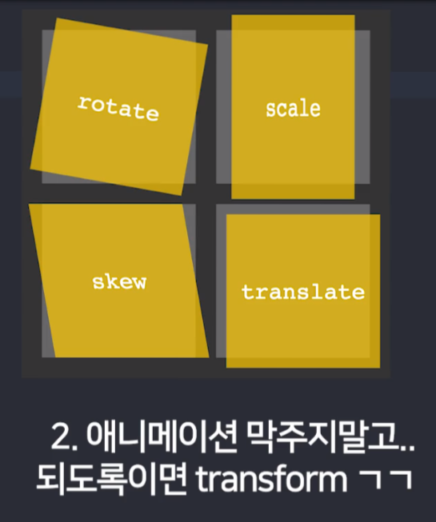<br />
  <br />

### 11.3. 컴포넌트 import할 때 lazy loading하자.
- 자바스크립트 특성상, 위에서부터 순차적으로 로드 시킨다.<br />App.js 방문 시 Detail, Cart 다 미리 로드하게 되면 부담될 수 있다.<br />
  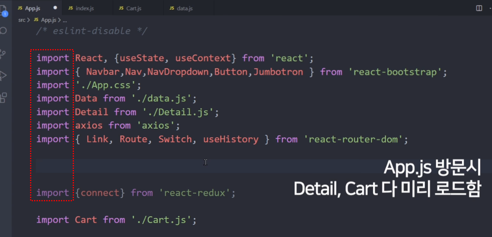<br />
  <br />
- `import Cart from './Cart.js';` 경우 /cart로 방문했을 때 Cart가 필요할 때 import 해주면 된다.
<br />

#### lazy loading 사용하는 방법
1. `lazy, Suspense`를 import 해온다.
  ```javascript
  // App.js
  import React, { lazy, Supense } from 'react';
  ```
  <br />

2. `import Detail from './Detail';`를 다음과 같이 수정한다.<br />`let Detail = lazy(() => { return import(파일경로) });` 처럼 Detail 변수를 만들고 lazy 안에 콜백함수를 만든다.
  - `<Detail>`을 보여줄 때만 `import Detail.js` 해온다.
  - 1줄로만 작성할 경우 `lazy(()=> import(파일경로) )` 로 작성해도 된다.<br />(중괄호({})와 return 생략이 가능.)
  ```javascript
  // App.js
  import React, { lazy, Supense } from 'react';

  // import Detail from './Detail';
  let Detail = lazy( ()=>{ return import('./Detail.js') } );
  ```
  <br />

3. lazy는 대부분 `<Suspense>`와 같이 쓴다.<br />`<Detail>` 컴포넌트를 `<Suspense></Suspense>`로 감싸줘야 한다.
  ```javascript
  // App.js
  import React, { lazy, Supense } from 'react';

  // import Detail from './Detail';
  let Detail = lazy( ()=>{ import('./Detail.js') } );

  function App() {
    return (
      <Route path="/detail/:id">
        <재고context.Provider value = {재고}>
          <Suspense fallback={<div>로딩중이에요</div>}>
            <Detail shoes={shoes} 재고={재고} 재고변경 = {재고변경} />
          </Suspense>
        </재고context.Provider>
      </Route>
    )
  }
  ```
  - `fallback={}` 안에 `<div></div>` 외에 컴포넌트 태그를 적용해도 된다.<br />
    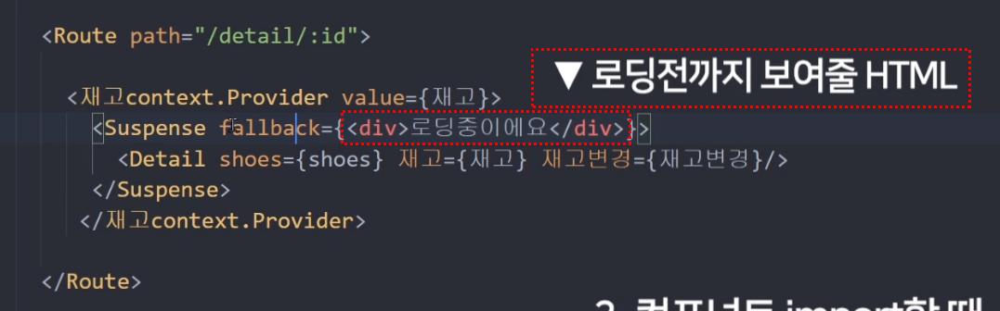<br />
    <br />
  
4. React Dev Tools 크롬 확장 프로그램을 설치하여 Detail 페이지에서 확인해본다.
<br />

### 11.4. React Dev Tools 간략 사용법
- Components 탭에서 컴포넌트 검사가 가능하다<br />
  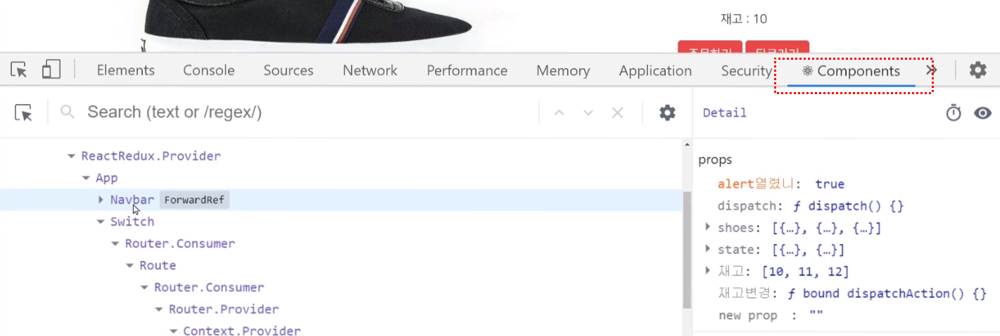<br />
  <br />

- 컴포넌트가 전달받은 props 외에도 hooks - State 등 확인이 가능하다.<br />(수정하게 되면 바로바로 반영이 되는 것도 확인할 수 있다.)<br />
  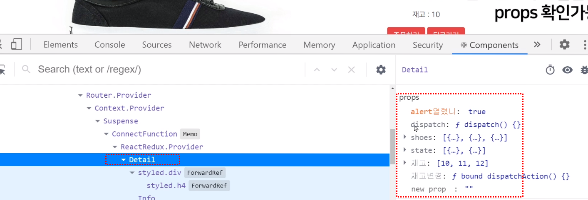<br />
  <br />

- 시계 아이콘을 클릭하여 렌더링을 잠깐 멈출 수 있다.<br />Detail 페이지에서 시계 버튼을 클릭하면 **로딩중이에요**가 제대로 불러와 지는 지 확인해볼 수도 있다.<br />
  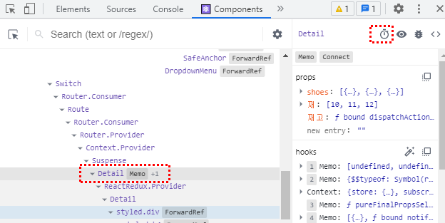<br />
  <br />
  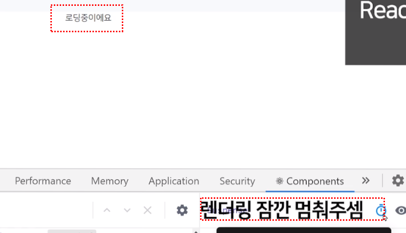<br />
  <br />

- Profiler 탭은 컴포넌트 렌더링 속도 + 단계를 녹화해준다.<br />
  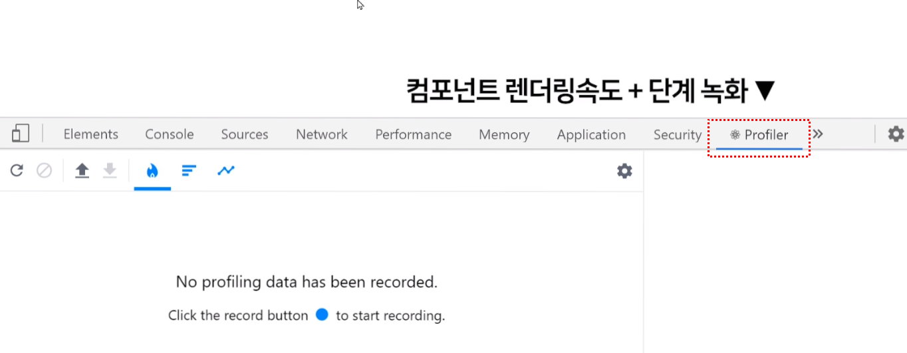<br />
  <br />

  - 파란색 버튼을 누르고 페이지 이동하고 다시 정지를 누른다.<br />
  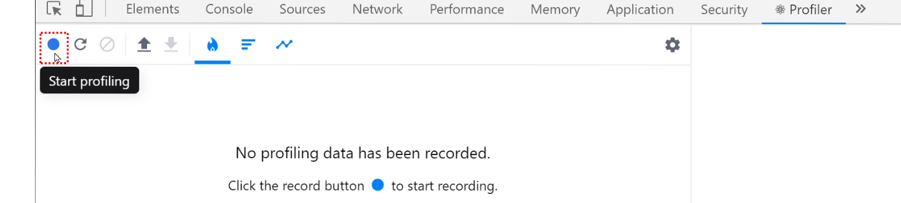<br />
  <br />

  - 페이지 이동했을 때 방금 렌더링된 컴포넌트를 다 표시해준다.<br />보면서 어떤 컴포넌트가 렌더링이 오래 걸리는 지 등을 확인할 수 있다.<br />
    <br />
    <br />

  - profiler - 설정에서 Record ~~ 부분을 체크하여 쓸데없이 재렌더링 되는 컴포넌트 찾기도 가능하다.<br />
    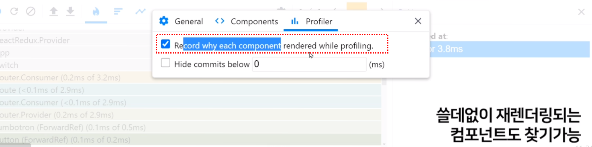<br />
    <br />
    <br />
    <br />

## 12. 성능잡기2. 쓸데없는 재렌더링을 막는 memo
### 12.1. 컴포넌트 재렌더링은 흔한 일
- 예시용 컴포넌트 3개를 만든다.
  ```javascript
  // Cart.js
  import React, {useEffect} from 'react';

  function Cart(props) {
    return (
      <div>
        <Parent></Parent>
      </div>
    )
  }

  function Parent(){
    return (
      <div>
        <Child1/>
        <Child2/> 
      </div>
    )
  }
  function Child1(){
    useEffect( ()=>{ console.log('렌더링됨1') } );
    return <div>1111</div>
  }
  function Child2(){
    useEffect( ()=>{ console.log('렌더링됨2') } );
    return <div>2222</div>
  }
  ```
  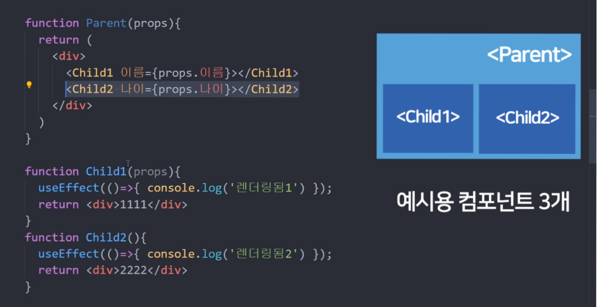<br />
  <br />

- `<Parent>` 내에 props 2개를 전달한다.
  - `<Parent 이름="존박" 나이="20"></Parent>`처럼 {}를 필히 쓰는 것은 아니다.<br />변수명 또는 함수명을 적용할 때 `이름={변수명}`만 쓰면 된다.
  ```javascript
  // Cart.js
  import React, {useEffect} from 'react';

  function Cart(props) {
    return (
      <div>
        <Parent 이름="존박" 나이="20"></Parent>
      </div>
    )
  }

  function Parent(){
    return (
      <div>
        <Child1/>
        <Child2/> 
      </div>
    )
  }
  function Child1(){
    useEffect( ()=>{ console.log('렌더링됨1') } );
    return <div>1111</div>
  }
  function Child2(){
    useEffect( ()=>{ console.log('렌더링됨2') } );
    return <div>2222</div>
  }
  ```
  <br />

- props를 `<Child>`에 전달한다.
  ```javascript
  // Cart.js
  import React, {useEffect} from 'react';

  function Cart(props) {
    return (
      <div>
        <Parent 이름="존박" 나이="20"></Parent>
      </div>
    )
  }

  function Parent(){
    return (
      <div>
        <Child1 이름 = {props.이름}/>
        <Child2 나이 = {props.나이}/> 
      </div>
    )
  }
  function Child1(){
    useEffect( ()=>{ console.log('렌더링됨1') } );
    return <div>1111</div>
  }
  function Child2(){
    useEffect( ()=>{ console.log('렌더링됨2') } );
    return <div>2222</div>
  }
  ```
  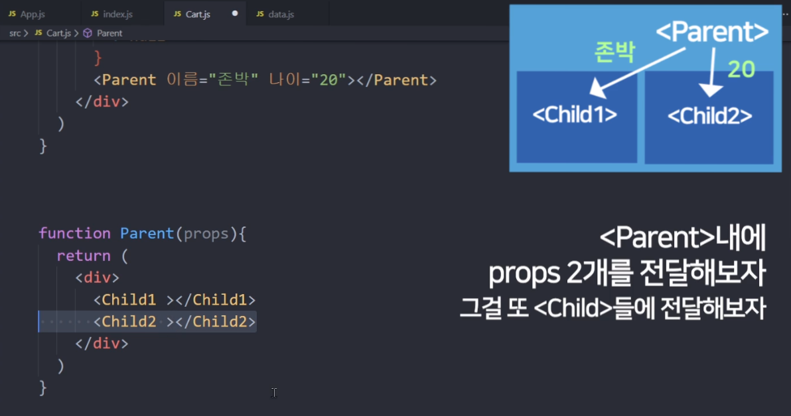<br />
  <br />

- 여기서 잠깐,<br />`<Child>` 컴포넌트에 적용된 **useEffect는 로딩/재렌더링시 실행할 코드**
  <br />

- 리액트는 컴포넌트에 있는 props나 state가 변경되면 그거 쓰는 HTML 전부 재렌더링 된다.
  <br />

- 크롬 브라우저, 리액트 개발자모드 - Components 패널 탭에서 Parnet 클릭하여 props - 이름을 변경해보고 콘솔 로그창을 보면 이름 뿐 아니라 나이가 적용된 컴포넌트 까지 재렌더링된 것을 확인할 수 있다.<br />
  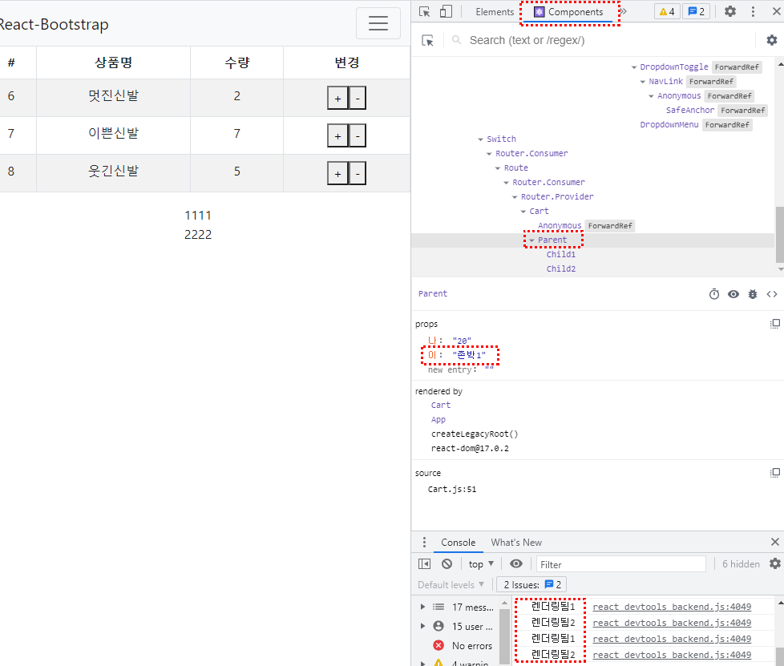<br />
  <br />

- 신문법인 `memo()`를 사용하면 불필요한 재렌더링 막기가 가능하다.<br />
  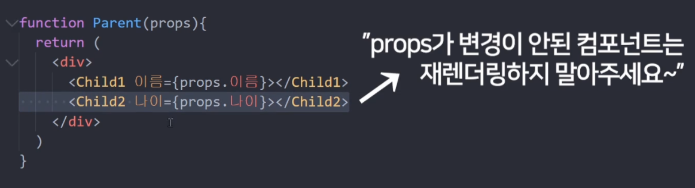<br />
  <br />

### 12.2. 불필요한 재렌더링을 막아주는 memo() 사용법
- 먼저, memo를 import 해온다.<br />`import React, { memo } from 'react';`
  <br />

- `memo()`로 컴포넌트를 감싼다.
  ```javascript
  // Cart.js
  import React, {useEffect, memo} from 'react';

  function Cart(props) {
    return (
      <div>
        <Parent 이름="존박" 나이="20"></Parent>
      </div>
    )
  }

  function Parent(){
    return (
      <div>
        <Child1 이름 = {props.이름}/>
        <Child2 나이 = {props.나이}/> 
      </div>
    )
  }
  function Child1(){
    useEffect( ()=>{ console.log('렌더링됨1') } );
    return <div>1111</div>
  }
  let Child2 = memo(function(){
    useEffect( ()=>{ console.log('렌더링됨2') } );
    return <div>2222</div>
  });
  ```
  <br />

- `memo()`로 감싼 컴포넌트는 props가 변경이 될 때에만 재렌더링 된다.<br />
  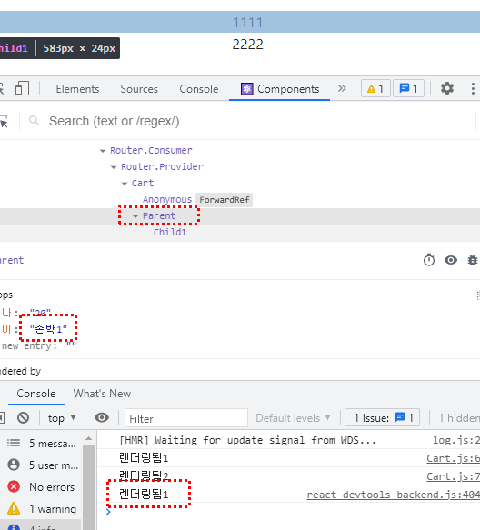<br />
  <br />

### 12.3. memo()의 단점
- 기존 props vs 바뀐 props 비교연산 후 컴포넌트 업데이트 할지? 말지?를 결정함.<br />(이 경우, props의 양이 많아지게 되면 이것도 사이트가 느려질 수 있다.)

<br />
<br />
<br />

## 13. PWA 셋팅해서 앱으로 발행하기 (모바일앱인척하기)
### 13.1. PWA(Progressive Web App)
- **웹사이트를 안드로이드/iOS 모바일 앱처럼 사용할 수 있게 만드는 일종의 웹개발 기술**
- iOS, Android 앱으로 발행하는게 아니라 웹사이트 자체를 스마트폰 홈화면에 설치한다. 이게 바로 PWA이다.<br />
  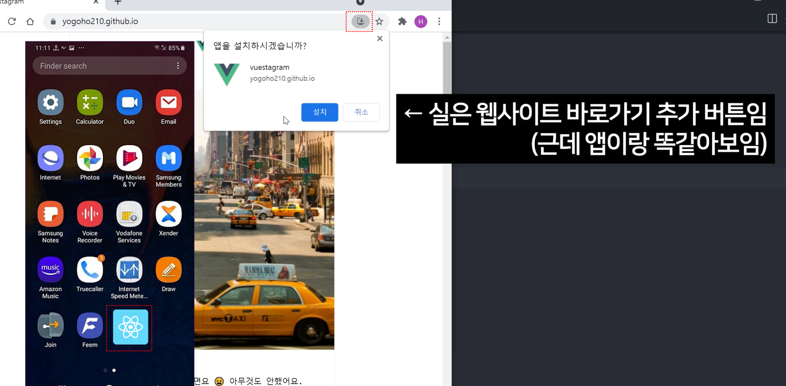<br />
  <br />

### 13.2. PWA 장점 (모바일 웹과 다른 점)
- **스마트폰, 태블릿 바탕화면에 여러분 웹사이트를 설치 가능**하다.<br />(저거 설치된 앱 누르면 상단 URL바가 제거된 크롬 브라우저가 뜬다. 일반 사용자는 앱이랑 구분을 못함)
- **오프라인에서도 동작**할 수 있다.<br />service-worker.js 라는 파일과 브라우저의 Cache storage 덕분에 그렇다.<br />(자바스크립트로 게임만들 때 유용함)
- **설치 유도 비용이 매우 적다.** (= 설치 마케팅 비용 적음)<br />앱설치를 유도하는 마케팅 비용이 적게들어 좋다. 구글플레이 스토어 방문해서 앱 설치하고 다운받게 하는건 항상 매우 높은 마케팅비용이 든다.<br />근데 PWA라면 웹사이트 방문자들에게 간단한 팝업을 띄워서 설치유도할 수 있으니 훨씬 적은 마케팅 비용이 든다. 그래서 미국에선 PWA를 적극 이용하고 있는 쇼핑몰들이 많다.
- html, css, js 만으로 앱까지 가능하다.
- 푸시알림, 센서 등 기능이 가능하다.

### 13.3. PWA 세팅하기
- PWA가 셋팅된 리액트 프로젝트 생성하기<br />터미널 창에 아래와 같이 명령어를 입력한다.
  ```javascript
  // npx create-react-app 프로젝트명 --template cra-template-pwa
  npx create-react-app my-app --template cra-template-pwa
  ```
  <br />

- **Q. 기존 프로젝트를 PWA로 만들려면?**<br />새로운 PWA 프로젝트를 만들고 기존코드를 복붙한다. (src 폴더 복붙하고 필요한 라이브러리는 재설치.)

- **PWA의 조건**<br />1. manifest.json 과 service-worket.js 파일을 생성해야 한다.
- 따로 생성할 필욘 없다. 위의 명령어로 파일이 자동으로 생성되었다.<br />
  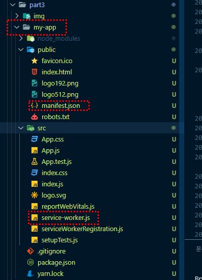<br />
  <br />

- **manifest.json**(앱 설정 파일)<br />
  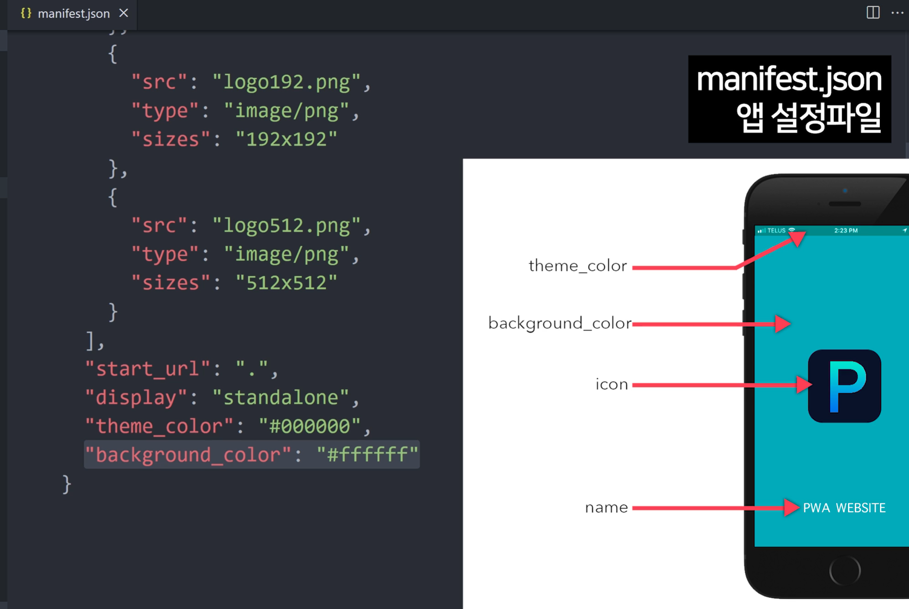<br />
  <br />

  ```javascript
  {
    "version" : "여러분앱의 버전.. 예를 들면 1.12 이런거",
    "short_name" : "설치후 앱런처나 바탕화면에 표시할 짧은 12자 이름",
    "name" : "기본이름",
    "icons" : { 여러가지 사이즈별 아이콘 이미지 경로 },
    "start_url" : "앱아이콘 눌렀을 시 보여줄 메인페이지 경로",
    "display" : "standalone 아니면 fullscreen",
    "background_color" : "앱 처음 실행시 잠깐 뜨는 splashscreen의 배경색",
    "theme_color" : "상단 탭색상 등 원하는 테마색상",
  }
  ```

  - 본 파일은 웹앱에서 사용하는 모든 html 안에 아래와 같이 적용해야 하는데,<br />`<link rel="manifest" href="/manifest.webmanifest">`<br />리액트가 자동으로 해주기 때문에 따로 할 필욘없다.
  <br />

- **service-worker.js**
  - 먼저 `/src/index.js` 파일을 아래와 같이 수정한다.<br />(service-worker.js 만들려면 index.js에서 아래와 같이 바꿔주고 빌드하면 자동으로 생성이 된다.)
    ```javascript
    // index.js
    // serviceWorkerRegistration.unregister();
    // ▼▼▼▼▼ unregister를 register로 수정한다.
    serviceWorkerRegistration.register();
    ```
  <br />

  - service-worker.js 파일은 카카오톡 앱같은거 설치할 때 구글플레이 스토어 가서 설치를 한다. 그럼 카톡 구동에 필요한 이미지, 데이터들이 전부 하드에 설치된다. 그리고 카톡을 켜면 카톡 로고 같은 데이터를 카톡 서버에 요청하는게 아니라 하드에 이미 설치되어 있는걸 그대로 가져와서 쓴다.<br />이걸 흉내내도록 도와주는 파일이다.<br />**즉, 오프라인에서도 사이트를 열 수 있게 도와준다는 것.**<br />
  <br />
  <br />

  - 이 파일에 설정을 잘 해주면 이제 여러분의 웹앱을 설치했을 때 어떤 CSS, JS, HTML, 이미지 파일이 하드에 설치될지 결정할 수 있다. 그럼 이제 다음에 앱을 켤 때마다 서버에 CSS,JS,HTML 파일을 요청하는게 아니라 Cache Storage에 저장되어있던 CSS,JS,HTML 파일을 사용하게 된다.<br />(그럼 이제 오프라인에서도 사용이 가능해진다)

  - 근데 설정은 이미되어 있다.<br />모든 HTML CSS JS 파일을 cache storage에 저장하도록 기본 셋팅이 되어있는데, 간혹 저장해두기 싫은, 자주 변하는 파일들이 간혹 있을 수 있다.
  <br />

  - **Q. 특정 파일들은 캐싱 안되게? 설정하려면?**
    - `node_modules/react-scripts/config/webpack.config.js` 파일을 찾는다.
    - `InjectManifest` 검색한다.
    - 정규식으로 파일명을 입력한다. 예를 들어 `index.html` 파일은 캐싱 목록에서 제외할 때 `exclude: [/index\.html/,]` 처럼 적용하면 된다.
    - 여기의 exclude라는 항목이 어떤 파일을 캐싱하지 않을건지 결정하는 부분이다. 정규식으로 작성하는데 정규식과 일치하는 파일명을 제외한다. 그래서 원하는 HTML 파일을 여기 등록하면 끝!!
      ```javascript
      // 구버전
      new WorkboxWebpackPlugin.GenerateSW({
          clientsClaim: true,
          exclude: [/\.map$/, /asset-manifest\.json$/],
      }) 

      // 신버전
      new WorkboxWebpackPlugin.InjectManifest({
        swSrc,
        dontCacheBustURLsMatching: /\.[0-9a-f]{8}\./,
        exclude: [/\.map$/, /asset-manifest\.json$/, /LICENSE/], 
      ```
    - 이거 말고도 "모든 .css로 끝나는 파일"  "a라는 글자로 시작하는 파일" 이런 식으로 정규식으로 작성할 수도 있는데 그것은 정규식 문법을 잘 찾아보시면 된다. 근데 여러분 사이트가 페이스북, 인스타, 유튜브처럼 입장과 동시에 Ajax로 초기데이터들을 전부 받아오는 사이트라면 굳이 HTML 파일을 저렇게 할 필요는 없다ㅋㅋ
    <br />

  - 그냥 쌩으로 service worker 파일을 만들고 싶다면 구글 공식 튜토리얼이나 크롬브라우저 권장 튜토리얼을 참고<br />[공식 튜토리얼](https://developers.google.com/web/fundamentals/primers/service-workers)<br />[샘플](https://googlechrome.github.io/samples/service-worker/basic/)
    <br />

- `npm run build` 하면 build 폴더가 생기고 앱설정에 필요한 manifest.json, service-worker.js(코드가 축약되어있음) 파일이 생긴다.<br />
  <br />
  <br />

- `/build/asset-manifest.json` = 캐싱할 파일 목록<br />(이 파일들은 오프라인에서도 구동이 가능해진다)<br />
  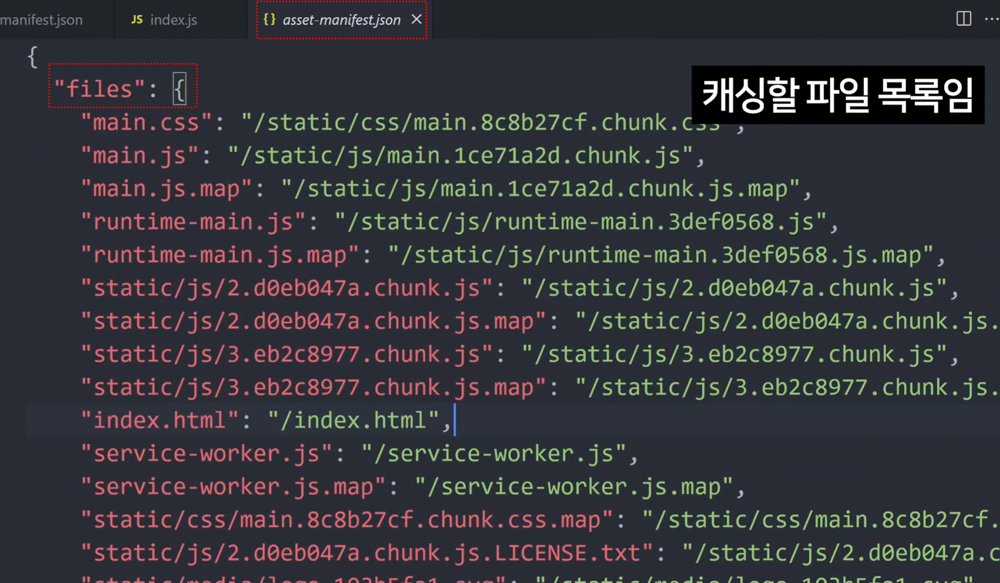<br />
  <br />

- PWA 잘 되나 확인하려면 build된걸 어디간에 호스팅하거나 라이브 서버를 이용해 `/build/index.html` 열어본다.<br />vs코드에서 폴더열기로 build를 연 후, index.html 파일을 라이브 서버로 연다.<br />
  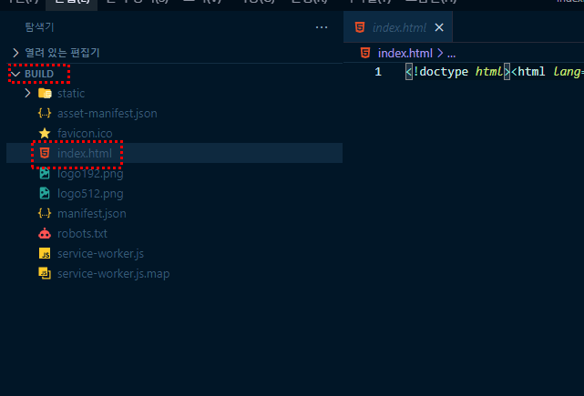<br />
  <br />

- 브라우저에서 열었을 때 다운로드 아이콘이 보여지면 제대로 작업한 것이다.<br />(설치버튼 강제로 띄우기도 가능한데 이 부분은 구글 검색으로...)<br />
  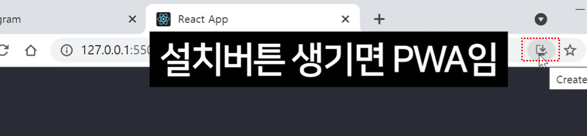<br />
  <br />

### 13.4. 개발자도구로 PWA 디버깅하기
- 크롬 개발자도구를 켜시면 Application 이라는 탭이 있다. 여기 들어가면 PWA와 관련된 모든걸 살펴볼 수 있다.<br />
  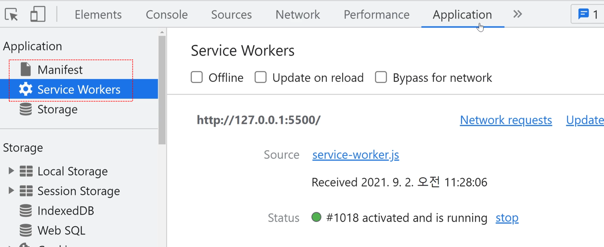<br />
  <br />

- Application - Manifest 에서 아이콘 등을 확인할 수 있다.<br />
  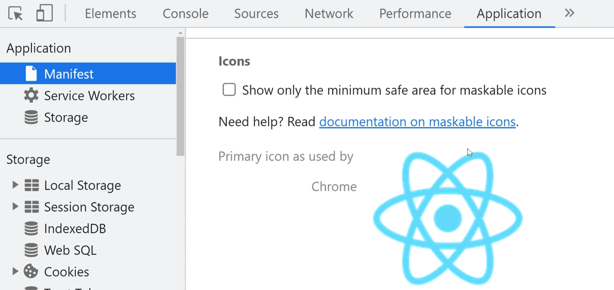<br />
  <br />

- Application - Service Workers 에서 실제 파일이 어디에 있는 지, 잘 동작하는 지 등을 확인할 수 있다.<br />
  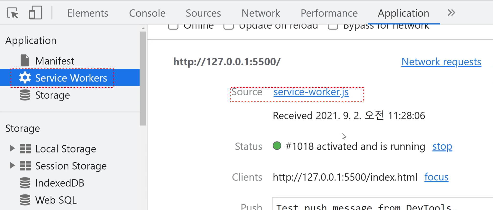<br />
  <br />

- Application - Cache - Cache Storage 에서 실제 어떤 파일들을 캐싱하고 있는 지 확인할 수 있다.<br />(Cache Storage 메뉴에선 service-worker 덕분에 하드에 설치된 CSS, JS, HTML 파일들을 확인할 수 있고, 캐시된 파일 제거도 가능하다.)<br />
  <br />
  <br />
  <br />
  <br />

## 14. localStorage
DB없이 데이터 저장하고싶으면 localStorage

### 14.1. state 데이터를 기억하게 하자
장바구니에 추가해도 새로고침/재접속하면 초기화가 된다.<br />이럴 때 state 데이터를 기억하게 하려면 어떻게 해야 할 까?
<br />
<br />

- 영구저장. 서버로 보내서 DB에 저장하는 방법
- 브라우저 임시 저장공간을 활용한다. 그 공간이 바로 localStorage 이다.<br />Local Storage 에는 Key(자료이름) / Value(자료값)을 저장할 수 있다.<br />
  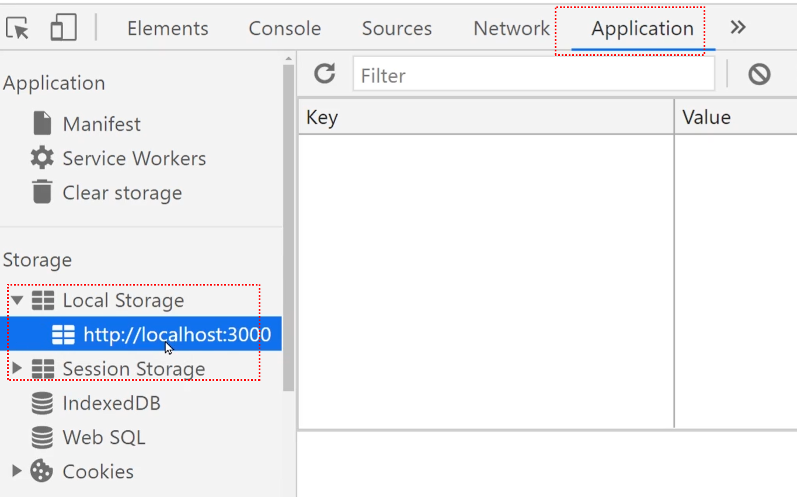<br />
  - Session Storage = 브라우저를 끄면 정보가 날라간다. (휘발성)<br />Local Storage = 브라우저 청소를 하지 않는 이상 정보가 남아있다. (텍스트 5MB까지 보관 가능)

<br />

### 14.2. localStorage 문법 3개
- **자료 저장**<br />`localStorage.setItem('keyname','keyValue')`
  ```javascript
  localStorage.setItem('name','kim')
  ```
  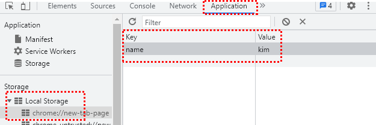<br />
  <br />

- **자료 출력**<br />`localStorage.getItem('keyname')`
  ```javascript
  localStorage.getItem('name')
  ```
  <br />
  <br />

- **자료 삭제**<br />`localStorage.removeItem('keyname')`
<br />

- sessionStorage 경우, localStorage 대신 `sessionStorage.setItem()`처럼 사용하면 된다.
<br />

### 14.3. localStorage에 object 자료를 저장하려면?!
- object 자료형을 value에 그대로 쓰게 되면 오류가 발생한다.
  ```javascript
  localStorage.setItem('obj',{name: 'kim'})
  ```
  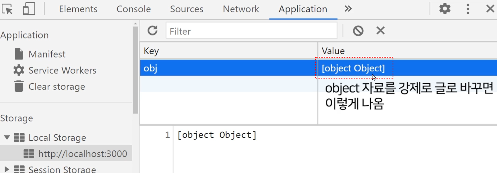<br />
  <br />

- arr 배열 형태를 value에 그대로 쓰게 되면 오류가 발생한다.
  ```javascript
  localStorage.setItem('arr',[1,2,3])
  ```
  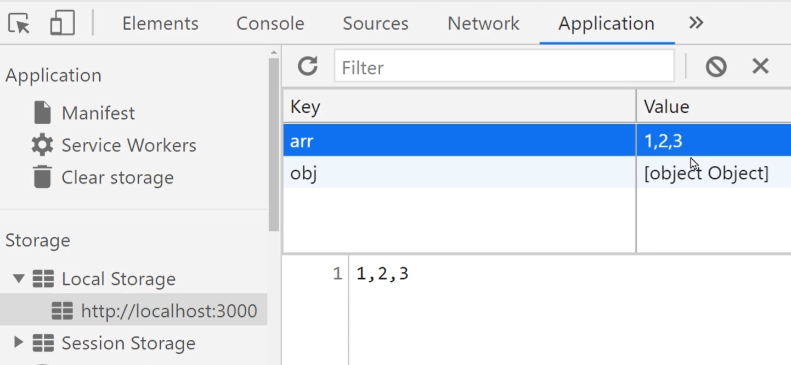<br />
  <br />
  - value에 값이 들어가긴 하지만 배열 형태가 아닌 '1,2,3' 문자(string) 형태로 적용이 된다.<br />
  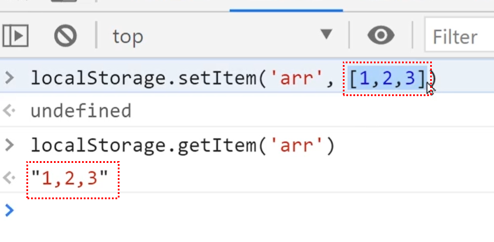<br />
  <br />

- object 자료형이나 배열 형태로 저장을 하려면 JSON 형태로 바꿔줘야 한다.<br />`JSON.stringify()`
  ```javascript
  localStorage.setItem('obj',JSON.stringify({name:'kim'}))
  ```
  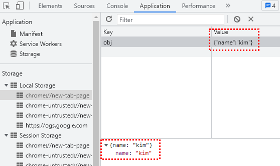<br />
  <br />
  
  ```javascript
  localStorage.setItem('arr',JSON.stringify([1,2,3]))
  ```
  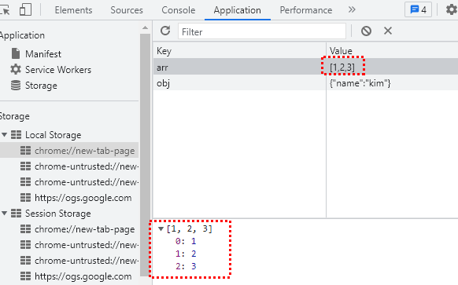<br />
  <br />

### 14.4. JSON.stringify()로 저장한 값을 출력할 땐?!
- 변수에 `getItem()`을 활용하여 저장한 후, `JSON.parse()`를 이용하여 따옴표를 제거해 값을 출력한다.<br />`getItem()`으로 문자형태의 값을 담은 후, `JSON.parse()`를 활용하여 데이터의 형태를 문자형태 -> 배열 또는 오브젝트(object)로 바꿔준다는 뜻이다.
  ```javascript
  var a = localStorage.getItem('obj');
  JSON.parse(a);
  ```
  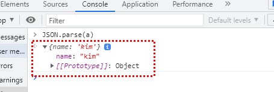<br />
  <br />

### 14.5. localStorage를 이용하여 최근본상품을 만들어보자.
- Detail 페이지 방문 시 localStorage에 정보 저장을 하고 정보를 보여주는 최근본상품 UI를 만들면 된다.<br />
  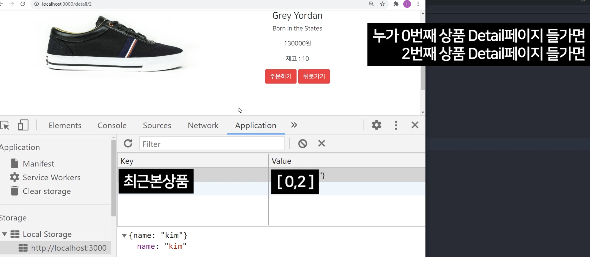<br />
  <br />

- **친절한 한글 가이드**<br />1. 누가 Detail 페이지 들어가면<br />2. localStorage에 있는 항목을 꺼냄<br />3. 경우가 2가지가 있다. null이 나오거나 []가 나오거나<br />(localStorage에 빈 칸일 때 방문한 페이지의 정보가 없어 null이 나오거나 기존에 방문한 페이지를 또 방문하여 [] 데이터 값이 일치하거나)<br />4. []가 나오면 거기에 URL파라미터의 id부분을 push()함 (추가한다)<br />5. 중복 처리하기 (팁: 중복을 허용하지 않는 Set자료형)<br />6. 그러면 [] 를 다시 localStorage에 저장함 (JSON.stringify() 이용)

### 14.6. 한글 가이드 참고하여 코드 작업 진행 (코드 숙제)
- 내가 짠 코드
  ```javascript
  useEffect(()=>{

    let arr = [];
    let storageID = localStorage.getItem('id');
    let currArr = JSON.parse(storageID);
    
    if ( !storageID ) {
      arr.push(id);
      localStorage.setItem('id', JSON.stringify(arr));
    } else if ( !currArr.includes(id) ) {  // 배열에서 특정 값이 있는 지 찾기 includes
      currArr.push(id);
      localStorage.setItem('id', JSON.stringify(currArr));
    } else if ( currArr.includes(id) ) {
      let filterArr = currArr.filter((el) => el !== id );  // filter 배열에서 id 값과 동일하지 않은 배열 추리기
      filterArr.push(id);
      localStorage.setItem('id', JSON.stringify(filterArr));
    }

  }, []);
  ```

<br />
<br />
<br />

## 15. localStorage 2
### 15.1. Detail 페이지 접속하면 어떤 상품을 봤는 지 저장하자(선생님 코드)
1. Detail 페이지 들어가면
2. localStorage 데이터 꺼내기
3. `[]` 나오면
4. `[].push(현재상품id)`
5. 중복제거
  - Set자료형을 이용해 중복 배열을 제거한다.
  - `[1,2,3,4,4,4,4]`에서 중복은 자동으로 제거해 `[1,2,3,4]` 된다.
```javascript
// Detail.js
useEffect( ()=>{
  var arr = localStorage.getItem('watched');

  // arr 꺼냈는데 [] 이게 아니고 null이면 [] 하나 생성해주세요
  if ( arr == null ) { arr = [] } else { arr = JSON.parse(arr); }

  arr.push(id);
  arr = new Set(arr);  // set자료형
  arr = [...arr];      // set자료형으로 만든 {}소괄호를 제거해 id값만 적용한다.

  localStorage.setItem('watched', JSON.stringify(arr) );

}, []);
```


<br />
<br />

### 15.2. 로컬스토리지에 저장된 내용으로 UI 작업
- localStorage 변동이 있으면 value도 바뀌도록 해야 한다.<br />(힌트 : state 바뀌면 HTML은 알아서 바뀜)
