# Express + React
Node+Express 서버와 React 연동하기
<br />
<br />

## 1. 리액트 / 서버 개념 정리
### 1.1 서버가 하는 일
- 서버는 누가 html 파일 요청하면 보내주는 간단한 프로그램
- 누가 codingapple.com 으로 접속하면 index.html 보내주세요<br />/~ 로 접속하면 XX 파일을 보내주세요
<br />

### 1.2. 리액트
- html 파일을 이쁘게 만들어주는 도구(툴)
- html 파일 이쁘게 웹앱/SPA(single-page application, 싱글페이지 애플리케이션)로 만들어주는 도구<br />
  
  
- 리액트로 개발을 마치면(build 하면), index.html 파일이 생성된다.<br />
  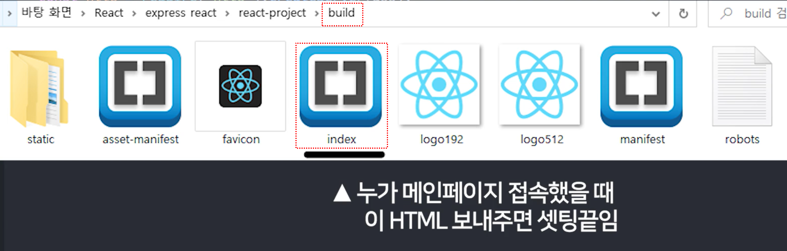

<br />
<br />

### 1.2. 서버 만들기
- 임시 서버를 Node + Express로 만든다.
- 새로운 작업 폴더에 **server.js 만들고 아래 코드를 복사 붙여넣기** 한다.
  ```javascript
  // server.js
  const express = require('express');
  const path = require('path');
  const app = express();

  const http = require('http').createServer(app);
  http.listen(8080, function () {
    console.log('listening on 8080')
  }); 
  ```
<br />

- express 라이브러리 설치하기 전에 터미널에 `npm init` 명령어를 실행한다.<br />`package.json` 파일이 생성된다.
<br />

- `npm install express` 명령어를 실행하여 express 라이브러리를 설치한다.
<br />

- 서버 실행은 터미널에 `node server.js` 명령어를 실행한다.<br />nodemon을 설치했다면 `nodemon server.js` 명령어를 실행한다.<br />(nodemon을 설치하면 새로고침없이 서버 변경사항이 자동으로 반영이 된다.)
<br />

- `http://localhost:8080/`로 접속하면 서버가 실행되는 지 확인할 수 있다.<br />
  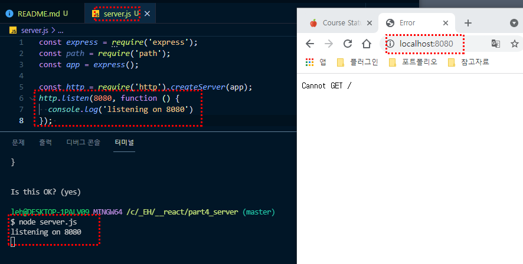

<br />

### 1.3. 서버와 html 파일 연동
- 메인페이지 접속하면 html 파일을 보내려고 한다.<br />`public/main.html`
- `.get()`을 이용하여 특정 경로에 접속했을 때, 보여줄 html 파일을 적용한다.
  ```javascript
  // 기본
  app.get('~~주소', function(요청, 응답) {
    응답.sendFile( path.join(__dirname, '경로')) // 보내줄 파일
  });

  // server.js
  // app.use () == 미들웨어(middleware)
  app.use( express.static( path.join(__dirname, 'public') ) )

  app.get('/', function(요청, 응답) {
    응답.sendFile( path.join(__dirname, 'public/main.html'))
  }); 
  ```
  - `app.get()`을 사용하려면 `app.use()`를 이용하여 html, cssm js 등 static 파일들이 담긴 곳을 명시해야 한다.<br />
    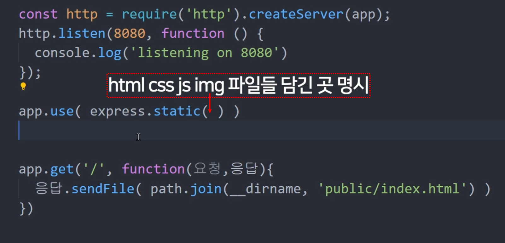<br />
    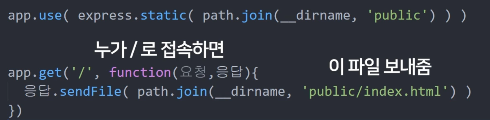<br />
  - nodemon이 없으면 서버를 껐다가 다시 켜야 한다.
  - `app.use()` == 미들웨어(middleware)<br />서버의 요청과 응답 사이에 실행할 코드
  <br />
  <br />

### 1.4. 리액트로 만든 페이지, 서버 연결하기
- 메인페이지에 접속하면 리액트로 만든 페이지로 이동 시킨다.
- 리액트 프로젝트를 생성한다<br />`npx create-react-app 프로젝트명`<br />`npx create-react-app react-project`
- 리액트 프로젝트를 완성했다면(끝났다면) build(빌드) 한다.<br />`npm run build`<br />(build = 리액트로 만든 HTML 최종파일을 생성해줌)
- build 폴더 안에 리액트로 만든 웹앱 HTML이 담겨있음<br />
  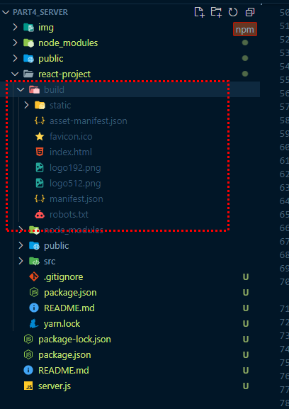<br />
  <br />

- 빌드를 했다면 `server.js` 페이지에서 build한 페이지를 연결한다.<br />(메인페이지 접속을 하면 리액트로 만든 HTML로 보내주기!!)
  ```javascript
  // server.js
  app.use( express.static( path.join(__dirname, 'react-project/build') ) )
  app.get('/', function(요청, 응답) {
    응답.sendFile( path.join(__dirname, 'react-project/build/index.html'))
  }); 
  ```
  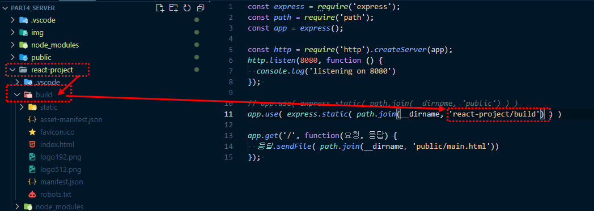<br />
  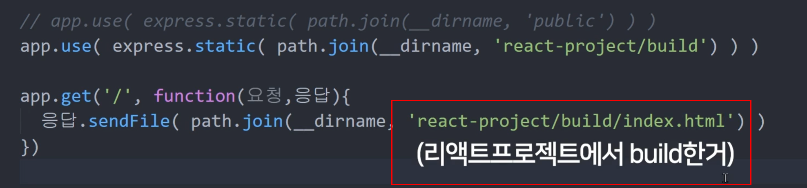<br />
  <br />

- 위와 같이 코드를 작성한 후, 터미널에서 `node server.js` 명령어를 실행하면, 리액트로 작업한 HTML 페이지를 확인할 수 있다.
<br />

### 1.5. 리액트 - 라우터를 사용했을 때
- 리액트 프로젝트에서 ~/로 접속하면 메인페이지, ~/about로 접속하면 about 소개 페이지로 이동되게 하려고 한다.
- 서버의 역할은 라우팅으로 페이지 나누기가 아닌 **DB 입출력**을 해주면 된다.
- **리액트 라우터 문제점 :**<br />~/about 주소를 주소창에 직접 URL을 입력하면 페이지가 없다고 한다.<br />(~/로 접속하여 페이지 이동시엔 ~/about가 보여지지만, ~/about로 직접 연결하면 페이지가 없다고 하는 상황.)
- 리액트 프로젝트 내에서 라우팅하려면 서버에 아래와 같은 코드를 작성해야 한다.
  ```javascript
  app.get('*', function(요청,응답) {
    응답.sendFile( path.join(__dirname, 'react-project/build/index.html'))
  })
  ```
  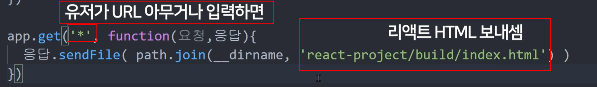<br />
  <br />

- 위와 같이 코드를 작성한 후, ~/about로 접속하면 정상적으로 페이지가 보여지는 것을 확인할 수 있다.<br />
  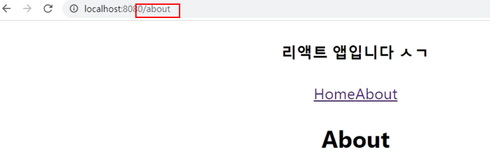<br />
  <br />

### 1.6. /?? 로 접속했을 때 리액트 페이지 보여주는 법
- `app.use()` 미들웨어를 이용한다.<br />/로 접속하면 main.html, /react로 접속하면 리액트로 만든 index.html 페이지가 보여진다.
  ```javascript
  // server.js
  app.use( '/', express.static( path.join(__dirname, 'public') ) )
  app.use( '/react', express.static( path.join(__dirname, 'react-project/build') ) )

  app.get('/', function(요청, 응답) {
    응답.sendFile( path.join(__dirname, 'public/main.html'))
  }); 
  app.get('/react', function(요청, 응답) {
    응답.sendFile( path.join(__dirname, 'react-project/build/index.html'))
  }); 
  ```
  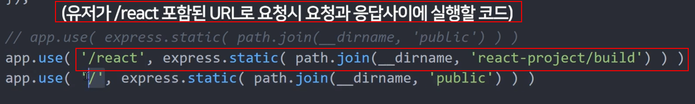<br />
  <br />

- **단, /react 처럼 리액트로 만든 페이지를 특정 키워드(서버 디렉토리)를 입력했을 때 보여지게 하고 싶다면 리액트 프로젝트 내에서도 설정이 필요한다.**

- 리액트 프로젝트 폴더에서 package.json 파일에 `"homepage":"/react",`를 추가한다.<br />
  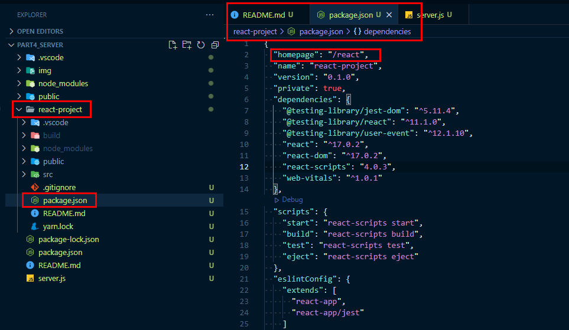<br />
  <br />

- 그리고 다시 빌드시킨다.<br />`npm run build`
- **개발 중간중간 서버 API + 리액트 잘 되는 지 확인하려면 매번 build를 해야되는 것인가?<br />proxy를 검색하면 해결법이 나온다.**
<br />

### 1.7. 개발 패턴
- React : 어떤 사람이 list 접속 시,<br />잠깐 서버로 Ajax 요청하고 데이터를 받아온다. `<list>` 컴포넌트 같은 거 보여주기
- 서버 : Ajax 요청이 오면 DB에 있던 게시물 list 데이터를 보내준다.
<br />