# 따라하며 배우는 리액트 A-Z

<br />
<br />
<br />

## 1. 리액트란
### 1-1. 리액트는 프레임워크가 아닌 라이브러리
> Angular 와 Vue는 프레임워크 vs 리액트 라이브러리
- 프레임워크 : 어떠한 앱을 만들기 위해 필요한 대부분의 것(라이브러리)을 가지고 있는 것.
- 라이브러리 : 어떠한 특정 기능을 모듈화 해놓은 것.

<br />
<br />

> 리액트는 전적으로 UI를 렌더링하는 관여한다
- 화면을 바꾸는 라우팅은 `react-router-dom` 모듈을 사용
- 상태 관리를 위해 `redux, mobx, recoil` 등 여러 모듈을 사용
- 빌드를 위해서는 `webpack, npm` 등
- 테스팅을 위해 `Eslint, Mocha, Jest` 등을 이용

#### 때문에 리액트는 프레임워크가 아닌 라이브러리

<br />
<br />
<br />

### 1-2. 리액트 컴포넌트
> 컴포넌트(Component)
- 리액트로 만들어진 앱을 이루는 최소한의 단위

<br />
<br />

> 리액트 컴포넌트는 두가지 타입이 있다.
- 클래스형 컴포넌트 (Class Components)
  ```javascript
  class App extends Component {
    render() {
      return <h1>안녕하세요</h1>
    }
  }
  ```

- 함수형 컴포넌트 (Functional Components)
  ```javascript
  function App() {
    return <h1>안녕하세요</h1>
  }
  ```

<br />
<br />
<br />

### 1-3. 브라우저가 그려지는 원리와 가상돔
리액트의 주요 특징 중 하나는 가상돔을 사용한다는 것.

> 웹페이지 빌드 과정 (Critical Rendering Path CRP)
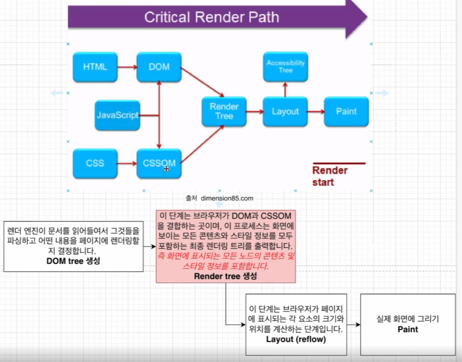
<br />

- 웹 브라우저가 HTML 문서를 읽고 스타일 입히고 뷰포트에 표시하는 과정
- 여기서 문제점은 어떤 인터렉션에 의해 DOM에 변화가 발생하면,<br />그 때마다 Render Tree가 재생성. 즉 모든 요소들의 스타일을 다시 계산<br />Layout, Repaint 과정까지 다시 거치게 된다.<br />
- 많은 변화가 발생하면 성능상 문제 발생 우려
- 불필요한 DOM 조작 비용이 너무 크다는 단점 발생

<br />
<br />

> 가상 돔 Virtual DOM
- 위와 같은 문제점으로 인해 나오게 된 가상 돔 Virtual DOM
- **가상 돔이란, 실제 DOM을 메모리에 복사해준 것**으로 생각하면 된다.
- 데이터가 바뀌면 가상 돔에 렌더링되고 이전에 생긴 가상돔과 비교해서 바뀐 부분만 실제 돔에 적용을 시킨다.
- 바뀐 부분을 찾는 곽정을 `Diffing` 이라고 부르고<br />바뀐 부분만 실제 돔에 적용시켜주는 것을 `재조정(reconciliation)`.<br />
  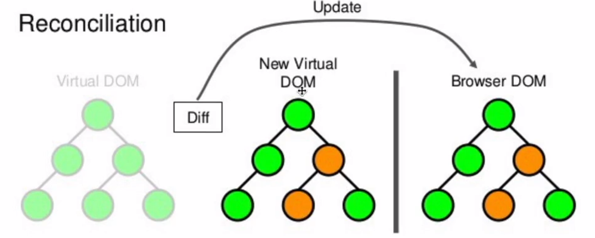
  
<br />
<br />
<br />

#### 1-4. 리액트 설치를 위해 필요한 것들
리액트 프로젝트를 만들기 위해서 `node.js`와 `npm`을 먼저 설치해야 한다.<br />
`node.js`를 받을 때 `npm`도 같이 설치 된다.

> Node.js
- 크롬 V8 자바스크립트 엔진으로 빌드한 자바스크립트 런타임으로서, **웹브라우저 환경이 아닌 곳**에서도 자바스크립트를 사용하여 연산할 수 있다.
- 리액트 웹은 웹 브라우저에서 실행되는 코드로 `node.js`와 직접적인 연관은 없지만<br />프로젝트를 개발하는데 주요 도구들이 `node.js`를 사용하기 때문에 필요하다.<br />이 때 사용하는 개발 도구는 바벨, 모듈화된 코드를 한 파일로 합치고 코드를 수정할 때마다 웹 브라우저를 리로딩하는 등 여러 기능을 지닌 웹팩 등이 있다.
- [(공홈)node.js 다운로드](https://nodejs.org/ko/)
  ```javascript
  // 설치된 node 버전을 알 수 있다.
  node -v
  ```

> Visual Studio Code
- [(공홈) Visual Studio Code 다운로드](https://code.visualstudio.com/download)

<br />
<br />
<br />

### 1-5. Create React App 을 이용해서 리액트 설치하기
> 리액트 앱 설치 방법
- `npx create-react-app 폴더이름` 명령어를 실행하여 설치.
- vscode에서 현재 폴더 기준으로 리액트를 설치하고자 할 땐,<br />`npx create-react-app ./` 명령어를 실행.
- `package.json` 기준, 재설치 등을 해야할 때 `npm install`

<br />
<br />

> `npx`는 무엇인가?
- npx는 노드 패키지 실행을 도와주는 도구.
- `create-react-app` 이란 `npm` 레지스트리에 있는 패키지를 **내가 지정(생성)한 폴더**에서 실행해서 리액트를 설치.

<br />
<br />
<br />

## 2. 간단한 To-Do 앱 만들며 리액트 익히기
- [간단한 To-Do 앱 만들며 리액트 익히기-1.pdf](https://github.com/eunhye8767/study-react/blob/master/inflearn/johnAhn/react__A-Z/%EC%88%98%EC%97%85%EC%9E%90%EB%A3%8C/%EA%B0%95%EC%9D%98%EB%8F%84%ED%91%9C%EC%9E%90%EB%A3%8C-PDF/%232%20%E1%84%80%E1%85%A1%E1%86%AB%E1%84%83%E1%85%A1%E1%86%AB%E1%84%92%E1%85%A1%E1%86%AB%20To-Do%20%E1%84%8B%E1%85%A2%E1%86%B8%20%E1%84%86%E1%85%A1%E1%86%AB%E1%84%83%E1%85%B3%E1%86%AF%E1%84%86%E1%85%A7%20%E1%84%85%E1%85%B5%E1%84%8B%E1%85%A2%E1%86%A8%E1%84%90%E1%85%B3%20%E1%84%8B%E1%85%B5%E1%86%A8%E1%84%92%E1%85%B5%E1%84%80%E1%85%B5-1.pdf)
- [간단한 To-Do 앱 만들며 리액트 익히기-2.pdf](https://github.com/eunhye8767/study-react/blob/master/inflearn/johnAhn/react__A-Z/%EC%88%98%EC%97%85%EC%9E%90%EB%A3%8C/%EA%B0%95%EC%9D%98%EB%8F%84%ED%91%9C%EC%9E%90%EB%A3%8C-PDF/%232%20%E1%84%80%E1%85%A1%E1%86%AB%E1%84%83%E1%85%A1%E1%86%AB%E1%84%92%E1%85%A1%E1%86%AB%20To-Do%20%E1%84%8B%E1%85%A2%E1%86%B8%20%E1%84%86%E1%85%A1%E1%86%AB%E1%84%83%E1%85%B3%E1%86%AF%E1%84%86%E1%85%A7%20%E1%84%85%E1%85%B5%E1%84%8B%E1%85%A2%E1%86%A8%E1%84%90%E1%85%B3%20%E1%84%8B%E1%85%B5%E1%86%A8%E1%84%92%E1%85%B5%E1%84%80%E1%85%B5-2.pdf)
- [간단한 To-Do 앱 만들며 리액트 익히기-3.pdf](https://github.com/eunhye8767/study-react/blob/master/inflearn/johnAhn/react__A-Z/%EC%88%98%EC%97%85%EC%9E%90%EB%A3%8C/%EA%B0%95%EC%9D%98%EB%8F%84%ED%91%9C%EC%9E%90%EB%A3%8C-PDF/%232%20%E1%84%80%E1%85%A1%E1%86%AB%E1%84%83%E1%85%A1%E1%86%AB%E1%84%92%E1%85%A1%E1%86%AB%20To-Do%20%E1%84%8B%E1%85%A2%E1%86%B8%20%E1%84%86%E1%85%A1%E1%86%AB%E1%84%83%E1%85%B3%E1%86%AF%E1%84%86%E1%85%A7%20%E1%84%85%E1%85%B5%E1%84%8B%E1%85%A2%E1%86%A8%E1%84%90%E1%85%B3%20%E1%84%8B%E1%85%B5%E1%86%A8%E1%84%92%E1%85%B5%E1%84%80%E1%85%B5-3.pdf)

<br />
<br />
<br />

## 3. To-Do 앱 최적화 하기
- [To-Do 앱 최적화 하기-1.pdf](https://github.com/eunhye8767/study-react/blob/master/inflearn/johnAhn/react__A-Z/%EC%88%98%EC%97%85%EC%9E%90%EB%A3%8C/%EA%B0%95%EC%9D%98%EB%8F%84%ED%91%9C%EC%9E%90%EB%A3%8C-PDF/%233%20To-Do%20%E1%84%8B%E1%85%A2%E1%86%B8%20%E1%84%8E%E1%85%AC%E1%84%8C%E1%85%A5%E1%86%A8%E1%84%92%E1%85%AA%20%E1%84%92%E1%85%A1%E1%84%80%E1%85%B5-1.pdf)
- [To-Do 앱 최적화 하기-2.pdf](https://github.com/eunhye8767/study-react/blob/master/inflearn/johnAhn/react__A-Z/%EC%88%98%EC%97%85%EC%9E%90%EB%A3%8C/%EA%B0%95%EC%9D%98%EB%8F%84%ED%91%9C%EC%9E%90%EB%A3%8C-PDF/%233%20To-Do%20%E1%84%8B%E1%85%A2%E1%86%B8%20%E1%84%8E%E1%85%AC%E1%84%8C%E1%85%A5%E1%86%A8%E1%84%92%E1%85%AA%20%E1%84%92%E1%85%A1%E1%84%80%E1%85%B5-2.pdf)

<br />

#### 3-1. [참조] 리액트 모듈 설치 시 나는 종속성(dependency) 에러 해결 방법
리액트18 버전에서 라이브러리들을 설치할 때<br />
종속성에 관한 에러가 날 때가 많이 있습니다. 


```javascript
npm ERR! code ERESOLVE
npm ERR! ERESOLVE unable to resolve dependency tree
npm ERR! Found: react@18.1.0
npm ERR! node_modules/react
npm ERR!  react@"^18.1.0" from the root project
npm ERR! Could not resolve dependency:
npm ERR! peer react@"^17.0.1" from react-dnd...
```

#### 원인
`unable to resolve dependency tree`<br />
리액트 18 버전 라이브러리와 설치하려는 해당 라이브러리의 종속성이 안 맞기 때문입니다.

#### 해결 방법
이럴 때는 여러 가지 해결방법이 있는데 <br />
첫 번째는 리액트 버전을 17로 낮추는 것인데 별로 좋은 방법은 아닙니다. <br />
<br />

다른 방법은 npm 대신에 **yarn을 이용해서 yarn install로 종속성을 설치**해주는 방법입니다. <br />
만약 yarn으로 설치해도 안된다면 <br />
npm의 강제 설치 옵션으로 설치해주시면 됩니다.

```javascript
//  기존 버전 다 무시하고 일단 설치.
--legacy-peer-deps 

// package-lock.json에 몇가지의 다른 의존 버전들을 추가하면서 설치.
--force
```

<br />
<br />

#### 3-2. tailwind CSS 사용
- vscode 경우, `tailwind CSS IntelliSense`를 설치한다.
- [Tailwind CSS 공홈 바로가기](https://tailwindcss.com/)
- [CRA에 TailWindCSS 적용하기](https://tailwindcss.com/docs/guides/create-react-app)
  - Install Tailwind CSS
    ```javascript
    // tailwind 모듈 설치
    npm install -D tailwindcss postcss autoprefixer

    // tailwind.config.js 파일 생성
    npx tailwindcss init -p
    ```

  - tailwind.config.js
    ```javascript
    // 아래와 같이 적용

    /** @type {import('tailwindcss').Config} */
    module.exports = {
      content: [
        "./src/**/*.{js,jsx,ts,tsx}",
      ],
      theme: {
        extend: {},
      },
      plugins: [],
    }
    ```

  - `index.css` : 메인 css파일에 추가
    ```css
    /* 아래 문구 추가 */
    @tailwind base;
    @tailwind components;
    @tailwind utilities;
    ```

  - 제대로 설치 및 적용이 완료되었는 지 확인하기<br />(**설치 후 재실행 필수**)
    ```html
    <h1 className="text-3xl font-bold underline">할 일 목록</h1>
    ```

<br />
<br />

#### 3-4. HTML 드래그 앤 드롭 
- [MDN, Drag and Drop API 자세히 보기](https://developer.mozilla.org/ko/docs/Web/API/HTML_Drag_and_Drop_API)
- HTML 드래그 앤 드롭 API를 사용하여 원하는 목록을 드래그 가능하게 만든다.
<br />

> react-beautiful-dnd 라이브러리
- 사용자가 드래그를 할 때 적절한 애니메이션을 준다.<br />사용자가 드래그를 멈췄는 지 확인하고 여기에서도 애니메이션을 준다.<br />클라이언트가 목록을 재정렬한 경우 항목의 위치를 새 항목으로 업데이트 한다.<br /><br />**이것을 쉽게 구현할 수 있게 도와주는 모듈.**

- 모듈 설치 : `npm install react-beautiful-dnd --save`
- [npm js - react-beautiful-dnd 자세히보기](https://www.npmjs.com/package/react-beautiful-dnd)<br />
  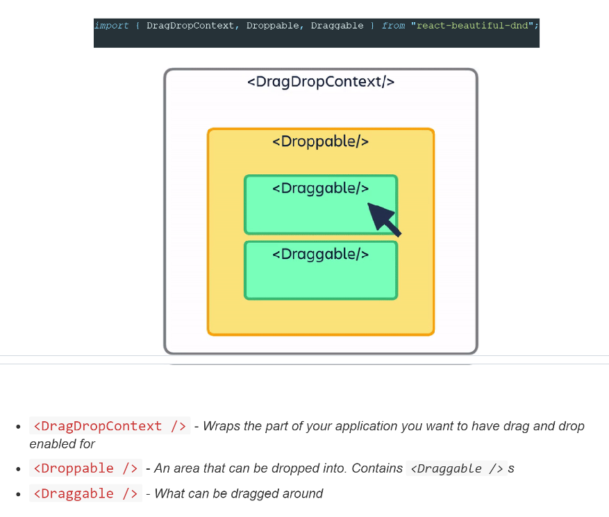<br />

<br />
<br />

> (1) API를 이용한 틀 만들어주기
```javascript
// Lists.js
import { DragDropContext, Droppable, Draggable } from 'react-beautiful-dnd';

<div>
  <DragDropContext>
    <Droppable>
      {todoData.map(data => (
        <Draggable>
          <div key={data.id}>
            <div className="flex items-center justify-between w-full px-4 py-1 my-2 text-gray-600 bg-gray-100 border rounded">
              <div className="items-center">
                <input 
                  type="checkbox" 
                  id={`ck-${data.id}`}
                  onChange={ () => { handleCompleChange(data.id) } }
                  defaultChecked={false}
                />

                <label htmlFor={`ck-${data.id}`} className={`pl-2 ${data.completed && 'line-through'}`}>{data.title}</label>
              </div>
              <div className="items-center">
                <button onClick={ () => handleClick(data.id) }>x</button>
              </div>
            </div>
          </div>
        </Draggable>
      ))}
    </Droppable>
  </DragDropContext>
</div>
```
- `DragDropContext` : 드래그(drag) & 드랍(drop)을 원하는 부분을 감싸준다.
- `Droppable` : 드랍(drop)할 수 있는 부분을 감싸준다.
- `Draggable` : 드래그(drag)할 수 있는 부분을 감싸준다.

<br />
<br />

> (2) provided object를 적용
```javascript
// Lists.js
import { DragDropContext, Droppable, Draggable } from 'react-beautiful-dnd';

<div>
  <DragDropContext>
    <Droppable droppableId="to-dos">
      {(provided) => (
        // provided 정보와 ref를 적용한다.
        <div {...provided.droppableProps} ref={provided.innerRef}>
          {todoData.map((data, index) => (
            /**
             *  map 이기 때문에 Draggable 태그에 key 값을 적용한다.
             *  draggableId와 index 값을 적용한다.
             */
            <Draggable
              key={data.id}
              draggableId={data.id.toString()}
              index={index}
            >
              {(provided, snapshot) => (
                /**
                 *  map 이기 때문에 key 값을 적용한다.
                 *  provided의 props를 적용한다 (정보가 있어야 드래그 앤 드롭이 가능하다.)
                 *    ㄴ draggableProps, dragHandleProps
                 * 
                 *  snapshot.isDragging을 기준으로 
                 *  드래그 할 때, 하지 않았을 때 클래스 값을 적용한다.
                 */
                <div 
                  key={data.id}
                  {...provided.draggableProps}
                  ref={provided.innerRef}
                  {...provided.dragHandleProps}
                  className={
                    snapshot.isDragging ? "selected" : "not-selected"
                  }>
                  <div className="flex items-center justify-between w-full px-4 py-1 my-2 text-gray-600 bg-gray-100 border rounded">
                    <div className="items-center">
                      <input 
                        type="checkbox" 
                        id={`ck-${data.id}`}
                        onChange={ () => { handleCompleChange(data.id) } }
                        defaultChecked={false}
                      />

                      <label htmlFor={`ck-${data.id}`} className={`pl-2 ${data.completed && 'line-through'}`}>{data.title}</label>
                    </div>
                    <div className="items-center">
                      <button onClick={ () => handleClick(data.id) }>x</button>
                    </div>
                  </div>
                </div>
              )}
            </Draggable>
          ))}
          {provided.placeholder}
        </div>
      )}
    </Droppable>
  </DragDropContext>
</div>
```
- `<Droppable droppableId="to-dos">` : `droppableId`로 아이디 값을 적용한다.
- `provided object` : 스타일 지정 및 조회를 위한 속성이 포함되어 있다.
- 사용자가 요소를 드래그한 경우, `className` 속성을 `selected`로 변경한다. 나중에 스타일을 적용하는데 사용할 것이다.
- `placeholder` 속성은 목록에 빈 공간을 만든다.<br />이렇게 하면 드래그 작업이 자연스럽게 느껴진다.<br />(적용했을 때, 적용하지 않았을 때 차이를 확인할 것!)
- 현재까지 작업했을 때, 드래그 & 드랍 기능은 작동하나 데이터가 변경되진 않는다.

<br />
<br />

> react 18 버전에서 나는 에러 해결 방법
리액트 18버전을 사용할 때 드래그 앤 드랍 기능을 사용하면 이러한 에러가 나옵니다.<br />
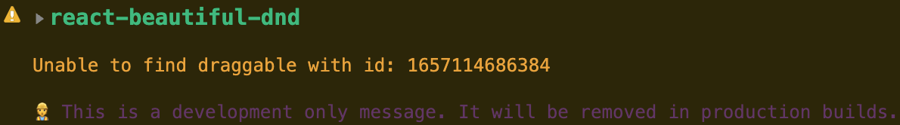<br />
<br />

그럴 때는 리액트의 StricMode를 제거해주시면 됩니다.<br />
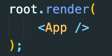<br />
<br />

```javascript
// index.js
const root = ReactDOM.createRoot(document.getElementById('root'));
root.render(
  // <React.StrictMode>
    <App />
  // </React.StrictMode>
);
```

<br />
<br />

> Dragging 하는 요소의 스타일링 변경
- 수정전
```javascript
<div 
  key={data.id}
  {...provided.draggableProps}
  ref={provided.innerRef}
  {...provided.dragHandleProps}
  className={ snapshot.isDragging ? "selected" : "not-selected" }
  >
  <div className="flex items-center justify-between w-full px-4 py-1 my-2 text-gray-600 bg-gray-100 border rounded">
```
<br />

- 수정후 : 드래그 할 때 배경색 변경.
- 의미없는 `div` 태그가 `<div><div></div></div>` 중복되어 있어서 하나로 합쳤다.
```javascript
<div 
  key={data.id}
  {...provided.draggableProps}
  ref={provided.innerRef}
  {...provided.dragHandleProps}
  className={`
    ${snapshot.isDragging ? "bg-gray-400" : "bg-gray-100"}
    flex items-center justify-between w-full px-4 py-1 my-2 text-gray-600 border rounded
  `}>
```

<br />
<br />

> splice 메서드 알아보기
- [MDN, splice 메서드 자세히 보기](https://developer.mozilla.org/ko/docs/Web/JavaScript/Reference/Global_Objects/Array/splice)
- `splice() 메서드` : 배열의 기존 요소를 삭제 또는 교체하거나 새 요소를 추가하여 배열의 내용을 변경.
- (예제) 3번 인덱스에서 한 개 요소 제거
  ```javascript
  var myFish = ['angel', 'clown', 'drum', 'mandarin', 'sturgeon'];
  var removed = myFish.splice(3, 1);

  // removed is ["mandarin"]
  // myFish is ["angel", "clown", "drum", "sturgeon"]
  ```

- (예제) 2번 인덱스에서 한 개 요소 제거하고 "trumpet" 추가
  ```javascript
  var myFish = ['angel', 'clown', 'drum', 'sturgeon'];
  var removed = myFish.splice(2, 1, 'trumpet');

  // myFish is ["angel", "clown", "trumpet", "sturgeon"]
  // removed is ["drum"]
  ```

- (예제) 하나도 제거하지 않고, 2번 인덱스에 "drum" 추가
  ```javascript
  var myFish = ['angel', 'clown', 'mandarin', 'sturgeon'];
  var removed = myFish.splice(2, 0, 'drum');

  // myFish is ["angel", "clown", "drum", "mandarin", "sturgeon"]
  // removed is [], no elements removed
  ```

<br />
<br />

> Dragging 한 후 데이터 순서 적용(persistence)
- `<DragDropContext onDragEnd={handleEnd}>` : `DragDropContext`에 드래그가 끝나는 이벤트 적용.
- `handleEnd` 이벤트 생성.<br />`console.log(result)`를 콘솔 로그로 출력하면 관련 정보를 확인할 수 있다.
  - `destination` : 어디로 이동 했는 지에 대한 정보 확인.<br />
    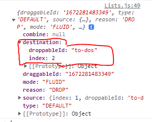<br />
    <br />

  - `source` : 기존 어디에 있었는 지에 대한 정보 확인.<br />
    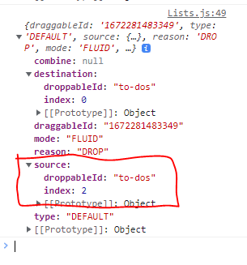<br />
    <br />
  
  ```javascript
  const handleEnd = (result) => {
    /**
     *  result 매개변수에는 source 항목 및 대상 위치와 같은 
     *  드래그 이벤트에 대한 정보가 포함된다.
     */
    console.log(result)

    // 목적지가 없으면(이벤트 취소) 이 함수를 종료한다.
    if (!result.destination) return;

    // 리액트 불변성을 지켜주기 위해 새로운 todoData 생성
    const newTodoData = todoData;

    /**
     *  1. 변경시키는 아이템을 배열에서 지워준다
     *  2. return 값으로 지워진 아이템을 잡아준다.
     */
    const [reorderedItem] = newTodoData.splice(result.source.index, 1);

    // 원하는 자리에 reorderedItem을 insert 해준다.
    newTodoData.splice(result.destination.index, 0, reorderedItem);
    setTodoData(newTodoData);
  }
  ```

<br />
<br />
<br />

#### 3-5. React.memo를 이용한 컴포넌트 렌더링 최적화
- 모든 컴포넌트에 `console.log("?? is Rendering")`으로 보여지게 적용.<br />
  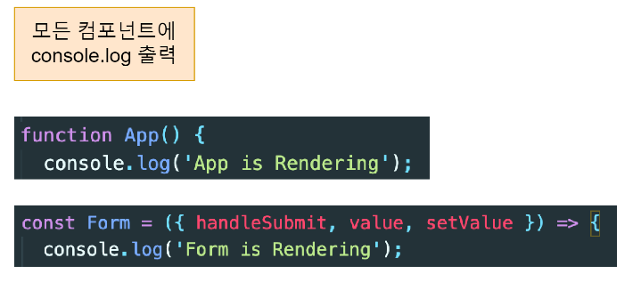<br />
  <br />
  
- 한 글자 입력 시마다 `props`가 바뀌지 않아서 렌더링을 하지 않아도 되는 `Lists` 컴포넌트와 `List` 컴포넌트까지 다시 렌더링 되는 것을 볼 수 있다.<br />
  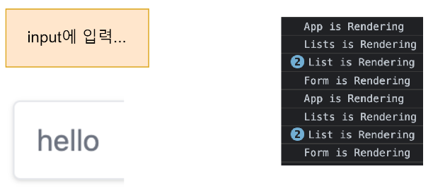<br />
  <br />

> React.memo 적용으로 문제를 해결
- `React.mome` 적용은 간단하게 원하는 컴포넌트를 React.memo로 감싸주면 된다.
  ```javascript
  const Lists = React.memo(({ todoData, setTodoData}) => {

  })

  export default Lists;
  ```

<br />
<br />
<br />

#### 3-6. useCallback을 이용한 함수 최적화
원래 컴포넌트가 렌더링 될 때 그 안에 있는 함수도 다시 만들게 된다.<br />
하지만 똑같은 함수를 컴포넌트가 리렌더링 된다 해서 **계속 만드는 것은 좋은 현상이 아니다**.<br />
그리고 이렇게 컴포넌트가 리렌더링 될 때마다 함수를 계속 다시 만든다고 하면<br />
만약 이 함수가 자식 컴포넌트에 `props`로 내려준다면 <br />
함수를 포함하고 있는 컴포넌트가 리렌더링 될 때마다 <br />
**자식 컴포넌트도 함수가 새롭게 만들어지니 계속 리렌더링**하게 된다.<br />
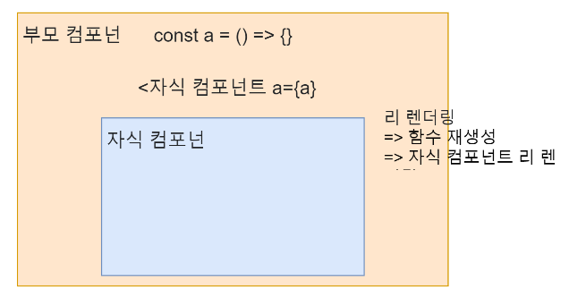<br />
<br />

> 삭제 버튼 함수 App 컴포넌트로 이동
```javascript
// useCallback 적용 전

// App.js
const handleClick = (id) => {
  let newTodoData = todoData.filter(data => data.id !== id);
  setTodoData(newTodoData);
}
```
- `React.memo()`을 사용하여 컴포넌트 최적화한 부분이 다시 리렌더링 되는 것으로 확인.
- 이 경우, `useCallback()`을 사용하여 최적화 한다.

<br />

```javascript
// useCallback 적용 후

// App.js
const handleClick = useCallback((id) => {
  let newTodoData = todoData.filter(data => data.id !== id);
  setTodoData(newTodoData);
}, [todoData])
```
- `useCallback()` 적용은 `useCallback` 안에 콜백함수와 의존성 배열을 순서대로 넣어주면 된다.
- 함수 내에서 참조하는 `state, props`가 있다면 의존성 배열에 추가해주면 된다.
- `useCallback`으로 인해 todoData가 변하지 않는 다면 함수는 새로 생성되지 않는다.
- **의존성 배열에 아무것도 없다면 컴포넌트가 최초 렌더링 시에만 함수가 생성되며, <br />그 이후에는 동일한 참조 값을 사용하는 함수가 된다.**

<br />
<br />
<br />

#### 3-7. useMemo를 이용한 결과 값 최적화
> Memoization 이란?

메모이제이션은 비용이 많이 드는 함수 호출의 결과를 저장하고 <br />
동일한 입력이 다시 발생할 때 **캐시된 결과를 반환하여 컴퓨터의 프로그램의 속도를 높이는데**<br />
**주로 사용되는 최적화 기술**이다.<br />
<br />
<br />

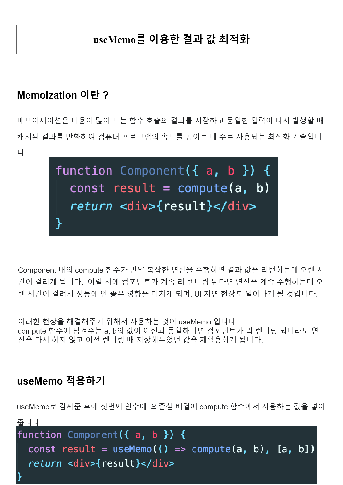<br />

- `Component` 내의 `compute 함수`가 만약 복잡한 연산을 수행하면<br />결과 값을 리턴하는데 오랜 시간이 걸리게 된다.<br />이럴 시에 컴포넌트가 계속 리렌더링 된다면 연산을 계속 수행하는데 오랜 시간이 걸려서<br />성능에 안 좋은 영향을 미치게 되며 UI 지연 현상도 일어나게 된다.

- 이러한 현상을 해결해주기 위해 사용하는 것이 `useMemo` 이다.
- `compute 함수`에 넘겨주는 a, b의 값이 이전과 동일하다면 컴포넌트가 리렌더링 되더라도<br />연산을 다시 하지 않고 이전 렌더링 때 저장해 두었던 값을 재활용하게 된다.

<br />
<br />

> useMemo 적용하기

- `useMemo`로 감싸준 후에 첫번째 인수에 의존성 배열에 `compute 함수`에서 사용하는 값을 넣어준다.<br />
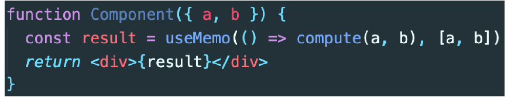<br />
<br />
<br />
<br />


#### 3-8. 리액트 확장 프로그램 추가
- [크롬, React Developer Tools 다운로드 받기](https://chrome.google.com/webstore/detail/react-developer-tools/fmkadmapgofadopljbjfkapdkoienihi?hl=ko&)

<br />

> 익스텐션을 이용해서 렌더링 되는 부분 표시하기

- `components 탭`에서 `Highligh updates` 부분을 **체크**해주면 쉽게 컴포넌트가 렌더링 되는 것을 볼 수 있다.<br />
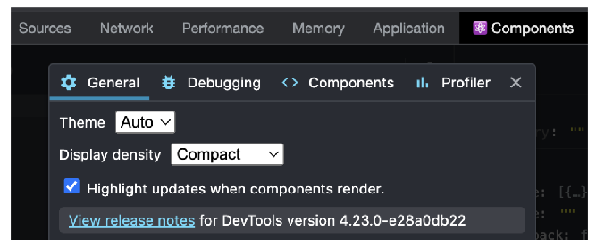<br />
<br />
<br />
<br />

#### 3-9. 할 일 리스트 모두 지우기 버튼 생성
```javascript
// App.js 

// 할일 리스트 모두 지우기
const handleRemoveClick = () => {
  setTodoData([]);
}

<div className="flex justify-between mb-3">
  <h1>할 일 목록</h1>
  <button onClick={handleRemoveClick}>Delete All</button>
</div>
```

<br />
<br />
<br />

#### 3-10. 할 일 목록을 수정하는 기능 추가하기

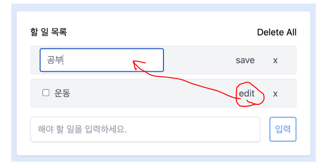<br />
<br />

> 다른 UI 제공을 위한 State 생성

```javascript
const [isEditing, setIsEditing] = useState(false);
const [editedTitle, setEditedTitle] = useState(title);
```

<br />

> Edit 버튼 추가 & 클릭 시 isEditing State 변경

```html
<div className="items-center">
  <button className="float-right px-4 py-2" onClick={() => handleClick(id)}>
    x
  </button>
  <button className="float-right px-4 py-2" onClick={() => setIsEditing(true)}>
    edit
  </button>
</div>
```

<br />

> 조건에 따른 UI 렌더링

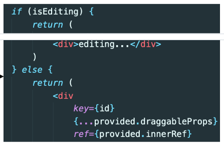<br />
<br />

> editing 시 UI 작성
```javascript
if (isEditing) {
  return (
    // 조건에 따른 UI 렌더링
    <div className="flex items-center justify-between w-full px-4 py-1 my-2 bg-gray-100 text-gray-600 border rounded">
      <form>
        <input type="text" value={editedTitle} className="w-full px-3 py-2 mr-4 text-gray-500 rounded" />
      </form>

      <div className="items-center">
        <button className="float-right px-4 py-2" onClick={() => setIsEditing(false)}>
          x
        </button>
        <button type="submit" className="float-right px-4 py-2">
          save
        </button>
      </div>
    </div>
  );
} else {
  return (
    <div
      key={id}
      {...provided.draggableProps}
      ref={provided.innerRef}
      {...provided.dragHandleProps}
      className={`
        ${snapshot.isDragging ? "bg-gray-400" : "bg-gray-100"}
        flex items-center justify-between w-full px-4 py-1 my-2 text-gray-600 border rounded
    `}>
      <div className="items-center">
        <input
          type="checkbox"
          id={`ck-${id}`}
          onChange={() => {
            handleCompleChange(id);
          }}
          defaultChecked={false}
        />
```

<br />

> editing 입력할 때 editedTitle State 변경
```javascript
const handleEditChange = (e) => {
  setEditedTitle(e.target.value);
}

<form>
  <input
    type="text"
    value={editedTitle}
    className="w-full px-3 py-2 mr-4 text-gray-500 rounded"
    onChange={handleEditChange}
    autoFocus
  />
</form>
```

<br />

> editing 입력 후 Save

```javascript
const handleSubmit = (e) => {
  e.preventDefault();

  let newTodoData = todoData.map((data) => {
    if (data.id === id) {
      data.title = editedTitle;
    }

    return data;
  });

  setTodoData(newTodoData);
  setIsEditing(false);
};


// form 안에 없기 때문에 onClick 이벤트와 onSubmit 이벤트로 연결
<form onSubmit={handleSubmit}>
  <input
    type="text"
    value={editedTitle}
    className="w-full px-3 py-2 mr-4 text-gray-500 rounded"
    onChange={handleEditChange}
    autoFocus
  />
</form>

<button
  type="submit"
  className="float-right px-4 py-2"
  onClick={handleSubmit}
>
  save
</button>
```

<br />
<br />
<br />

#### 3-11. localStorage에 todoData 값 담기
`localStorage`에 `todoData` 값을 담아서 페이지를 refresh 해도 `todoData`가 계속 남아 있을 수 있게 해준다.

> localStorage를 사용해서 데이터를 저장하기

- [MDN, local storage 자세히 보기](https://developer.mozilla.org/ko/docs/Web/API/Window/localStorage)
- 저장할 때
  ```javascript
  // localStorage.setItem('key', 'value');
  localStorage.setItem('myCat', 'Tom');
  ```

<br />
<br />

> setTodoData를 이용해서 todoData State 를 바꿔줄 때 localStorage에도 같이 바꿔주기

```javascript
// App.js
const handleClick = useCallback((id) => {
  let newTodoData = todoData.filter(data => data.id !== id);

  setTodoData(newTodoData);

  localStorage.setItem("todoData", JSON.stringify(newTodoData));
}, [todoData]);
```

- **객체나 배열을 저장해줄 시에는 `JSON.stringfy`를 이용해서 텍스트로 변환해준 후 저장**을 해준다.<br />
  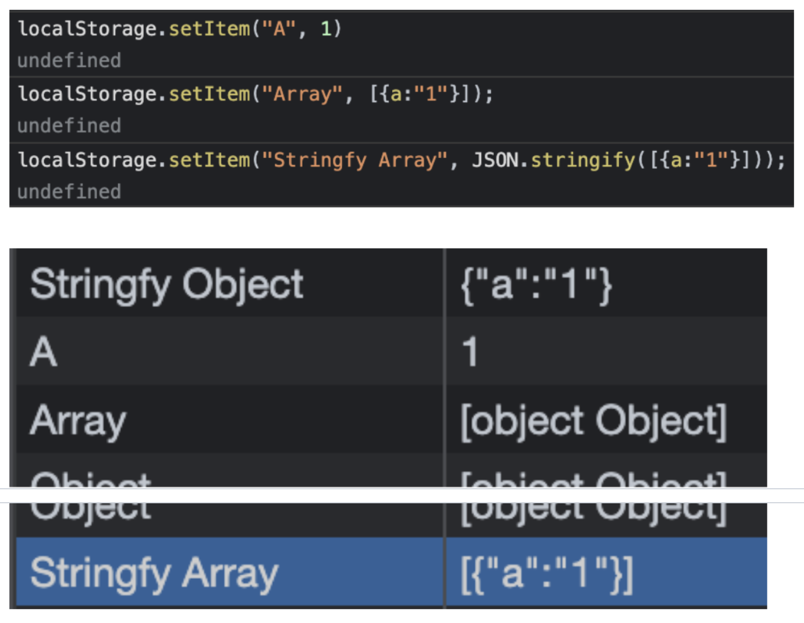;

- `setTodoData` 를 검색하여 해당 부분에 `localStorage.setItem()`을 추가 적용한다.
  ```javascript
  // javascript
  const handleSubmit = (e) => {
    e.preventDefault();

    let newTodo = {
      id: Date.now(),
      title: value,
      completed: false,
    }

    setTodoData(prev => [...prev, newTodo]);

    // ...prev 경우, 기존 데이터로 ...todoData로 대체 적용한다.
    localStorage.setItem("todoData", JSON.stringify([...todoData, newTodo]));
    setValue("");
  }
  ```

  <br />
  <br />

> localStorage에 저장된 todoData 활용하기

- 수정 전 
  ```javascript
  function App() {
    const [todoData, setTodoData] = useState([]);
  ```

- 수정 후
  ```javascript
  const initialTodoData = localStorage.getItem("todoData") ? JSON.parse(localStorage.getItem("todoData")) : [];
  
  function App() {
    const [todoData, setTodoData] = useState(initialTodoData);
  ```

<br />
<br />
<br />

## 4. Netflix 앱 만들기 시작
- [#4 Netflix 앱 만들기 시작-1.pdf](https://github.com/eunhye8767/study-react/blob/master/inflearn/johnAhn/react__A-Z/%EC%88%98%EC%97%85%EC%9E%90%EB%A3%8C/%EA%B0%95%EC%9D%98%EB%8F%84%ED%91%9C%EC%9E%90%EB%A3%8C-PDF/%234%20Netflix%20%E1%84%8B%E1%85%A2%E1%86%B8%20%E1%84%86%E1%85%A1%E1%86%AB%E1%84%83%E1%85%B3%E1%86%AF%E1%84%80%E1%85%B5%20%E1%84%89%E1%85%B5%E1%84%8C%E1%85%A1%E1%86%A8-1.pdf)
- [#4 Netflix 앱 만들기 시작-2.pdf](https://github.com/eunhye8767/study-react/blob/master/inflearn/johnAhn/react__A-Z/%EC%88%98%EC%97%85%EC%9E%90%EB%A3%8C/%EA%B0%95%EC%9D%98%EB%8F%84%ED%91%9C%EC%9E%90%EB%A3%8C-PDF/%234%20Netflix%20%E1%84%8B%E1%85%A2%E1%86%B8%20%E1%84%86%E1%85%A1%E1%86%AB%E1%84%83%E1%85%B3%E1%86%AF%E1%84%80%E1%85%B5%20%E1%84%89%E1%85%B5%E1%84%8C%E1%85%A1%E1%86%A8-2.pdf)

<br />
<br />

#### 4-1. create-react-app 으로 프로젝트 시작

> create-react-app 으로 프로젝트 만들기

- `react-netflix-clone` 프로젝트 폴더 생성

<br />
<br />

> the Movie DB API 생성

- [the Movie DB API 바로가기](https://www.themoviedb.org/)
- 가입 후, `API_KEY` 받는다.<br />`settings > API` : 생성을 누른 후 `developer` 선택 후 진행.
  ```
  eb590f23d26955d7ae6c6edc0288ff8e
  ```

<br />
<br />

> API URL

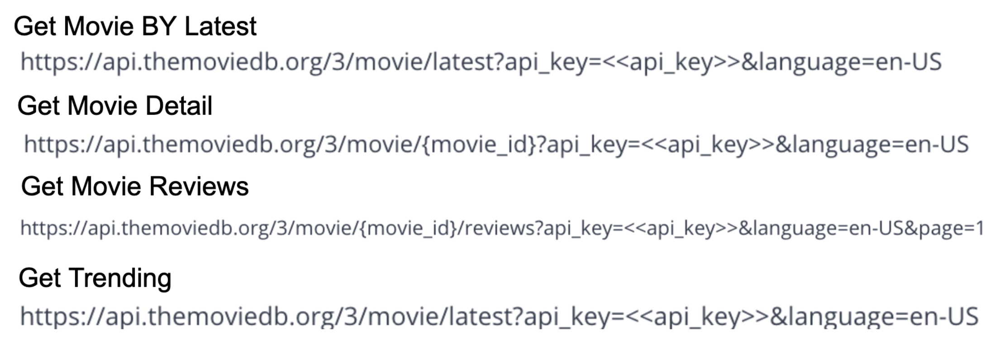<br />

```
https://api.themoviedb.org/3/
```

- Get Movie BY Latest :
  ```
  https://api.themoviedb.org/3/movie/latest?api_key=eb590f23d26955d7ae6c6edc0288ff8e&language=en-US
  ```

- Get Movie Detail
  ```
  <!-- movie_id : 변동 -->
  https://api.themoviedb.org/3/movie/movie_id?api_key=eb590f23d26955d7ae6c6edc0288ff8e&language=en-US
  ```

- Get Movie Reviews 
  ```
  <!-- movie_id : 변동 -->
  https://api.themoviedb.org/3/movie/movie_id/reviews?api_key=eb590f23d26955d7ae6c6edc0288ff8e&language=en-US&page=1
  ```

- Get Trending
  ```
  https://api.themoviedb.org/3/movie/latest?api_key=eb590f23d26955d7ae6c6edc0288ff8e&language=en-US
  ```

<br />
<br />

> API URL - 이미지 가져오기

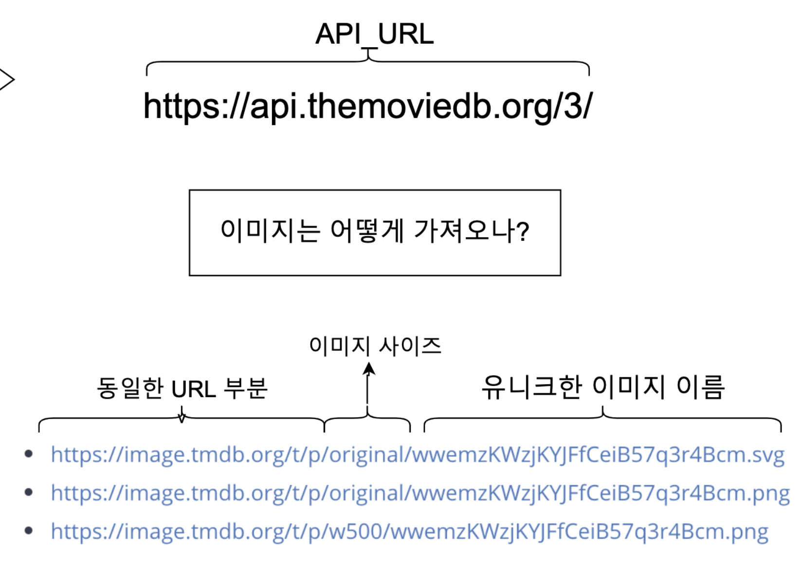<br />

```
https://image.tmdb.org/3
```

- `https://image.tmdb.org/t/p/original/wwemzKWzjKYJFfCeiB57q3r4Bcm.svg` <br />: 넷플릭스 로고 svg
- `https://image.tmdb.org/t/p/original/wwemzKWzjKYJFfCeiB57q3r4Bcm.png` <br />: 넷플릭스 로고 png
- `https://image.tmdb.org/t/p/w500/wwemzKWzjKYJFfCeiB57q3r4Bcm.png` <br />: 넷플릭스 로고 - 가로너비 500 png

<br />
<br />


#### 4-2. The Movie DB API 요청을 위한 Axios 인스턴스 생성 및 요청 보내기

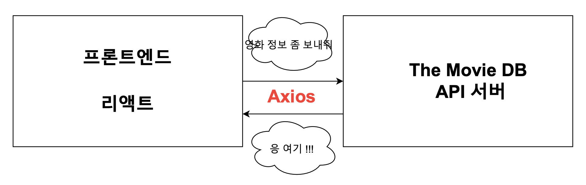

> Axios란?

- `Axios`는 브라우저, node.js를 위한 `Promise API`를 활용하는 **HTTP 비동기 통신 라이브러리.**
- 쉽게 말해서 백엔드랑 프론트엔드랑 통신을 쉽게하기 위해 Ajax와 더불어 사용한다.

<br />
<br />

> Axios 사용 방법

- axios 모듈 설치 
  ```
  npm install axios --save 
  ```
  ```javascript
  // axios.get(경로)
  axios.get('https://api.themoviedb.org/3/trending/all/week')
  ```

<br />  
<br />  

> Axios 인스턴스화 하는 이유
- 중복(=반복)된 부분을 계속 입력하지 않아도 되기 때문에

<br />
<br />

> Axios 인스턴스 만드는 순서

- `api` 폴더를 만들고, `axios.js` 파일과 `requests.js` 파일을 만든다.
- `api/axios.js`
  ```javascript
  import axios from "axios";

  const instance = axios.create({
    baseURL: 'https://api.themoviedb.org/3',
    params: {
      api_key: "eb590f23d26955d7ae6c6edc0288ff8e",
      language: "ko-KR",
    }
  })

  export default instance;
  ```

- `api/requests.js`
  ```javascript
  const requests = {
    fetchNowPlaying : `movie/now_playing`,
    fetchNetflixOriginals: `/discover/tv?with_networks=213`,
    fetchTrending: `/trending/all/week`,
    fetchTopRated: `/movie/top_rated`,
    fetchActionMovies: `/discover/movie?with_genres=28`,
    fetchComedyMovies: `/discover/movie?with_genres=35`,
    fetchHorrorMovies: `/discover/movie?with_genres=27`,
    fetchRomanceMovies: `/discover/movie?with_genres=10749`,
    fetchDocumentaries: `/discover/movie?with_genres=99`,
  }

  export default requests;
  ```

<br />
<br />
<br />

#### 4-3. 넷플릭스 애플리케이션 전체 구조 생성하기
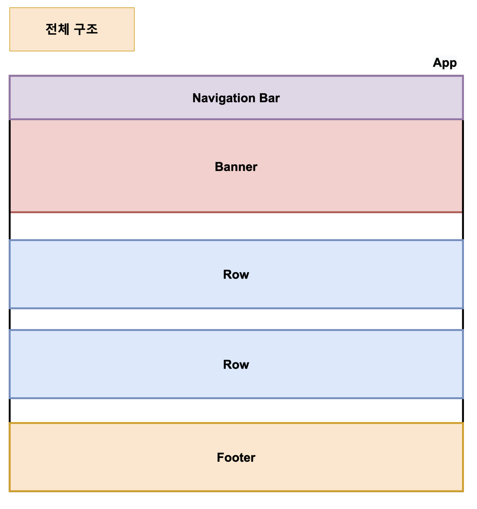<br />

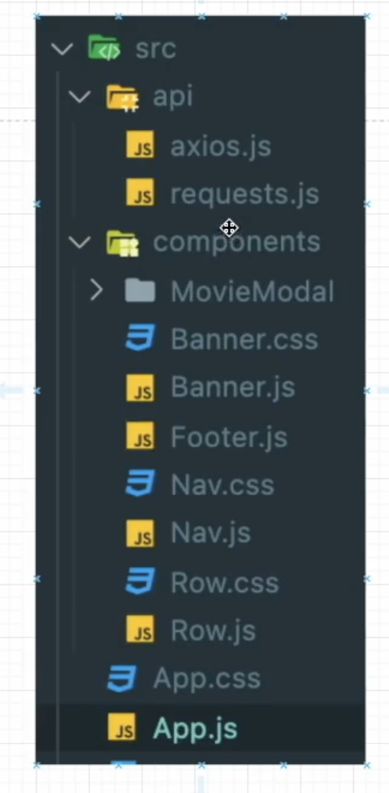<br />

- 위 그림과 같은 구조로 폴더 생성 및 파일을 만든다.

<br />
<br />
<br />

#### 4-4. 네이게이션 생성
- `onClick={ () => window.location.reload() }` : 클릭 시, 현재 페이지 리오더
- `object-fit: contain;` <br />
  [MDN, object-fit 자세히보기](https://developer.mozilla.org/en-US/docs/Web/CSS/object-fit)<br />
  `img` 태그에 적용하는 css 속성.<br />
  `fill, contain, cover, none, scale-down` 속성값을 상황에 맞게 적용.<br />
  예상 이미지 값은 mdn 사이트 참조.

  <br />
  <br />
  <br />

#### 4-5. 이미지 배너 생성하기
- `Math.floor(Math.random() * max)` == 자바스크립트로 랜덤 숫자 가져오기
- `?.`**(옵셔널 체이닝 연산자)** : 옵셔널 체이닝 연산자를 이용한 object 검증방법
  ```javascript
  var obj = undefined;

  console.log(obj?.data); // undefined
  ```
  ```javascript
  var obj = {
      data : 'test',
  }

  console.log(obj?.data); // test
  ```
- **글자 자르기 (자바스크립트)**
  ```javascript
  const truncate = (str, n) => {
    return str?.length > n ? str.substr(0, n - 1) + "..." : str;
  }

  // 100글자 이상일 때 ... 으로 보여지게 적용
  {truncate(movie?.overview, 100)}
  ```

<br />
<br />
<br />

#### 4-6. Styled Component 란?
- `Css-in-JS`라고 하는 Javascript 파일 안에서 CSS를 처리 할 수 있게 해주는 대표적인 라이브러리.
- [공홈 바로가기](https://styled-components.com/docs/basics)

<br />

> 설치 방법

- 터미널 설치
  ```javascript
  // # with npm
  npm install --save styled-components

  // # with yarn
  yarn add styled-components
  ```

- 사용법 예제 1
  ```javascript
  // Create a Title component that'll render an <h1> tag with some styles
  const Title = styled.h1`
    font-size: 1.5em;
    text-align: center;
    color: palevioletred;
  `;

  // Create a Wrapper component that'll render a <section> tag with some styles
  const Wrapper = styled.section`
    padding: 4em;
    background: papayawhip;
  `;

  // Use Title and Wrapper like any other React component – except they're styled!
  render(
    <Wrapper>
      <Title>
        Hello World!
      </Title>
    </Wrapper>
  );
  ```

- 사용법 예제 2 (props 사용)
  ```javascript
  const Button = styled.button`
    /* Adapt the colors based on primary prop */
    background: ${props => props.primary ? "palevioletred" : "white"};
    color: ${props => props.primary ? "white" : "palevioletred"};

    font-size: 1em;
    margin: 1em;
    padding: 0.25em 1em;
    border: 2px solid palevioletred;
    border-radius: 3px;
  `;

  render(
    <div>
      <Button>Normal</Button>
      <Button primary>Primary</Button>
    </div>
  );
  ```
  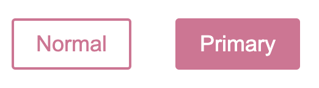
  <br />

- 사용법 예제 3 (상속)
  ```javascript
  // The Button from the last section without the interpolations
  const Button = styled.button`
    color: palevioletred;
    font-size: 1em;
    margin: 1em;
    padding: 0.25em 1em;
    border: 2px solid palevioletred;
    border-radius: 3px;
  `;

  // A new component based on Button, but with some override styles
  const TomatoButton = styled(Button)`
    color: tomato;
    border-color: tomato;
  `;

  render(
    <div>
      <Button>Normal Button</Button>
      <TomatoButton>Tomato Button</TomatoButton>
    </div>
  );
  ```
  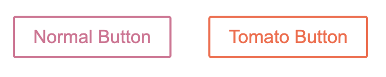

- 사용법 그 외 : <br />[해당 문서](https://styled-components.com/docs/basics)를 살펴보면 아래 이미지처럼 사용 예제를 볼 수 있다.<br />
  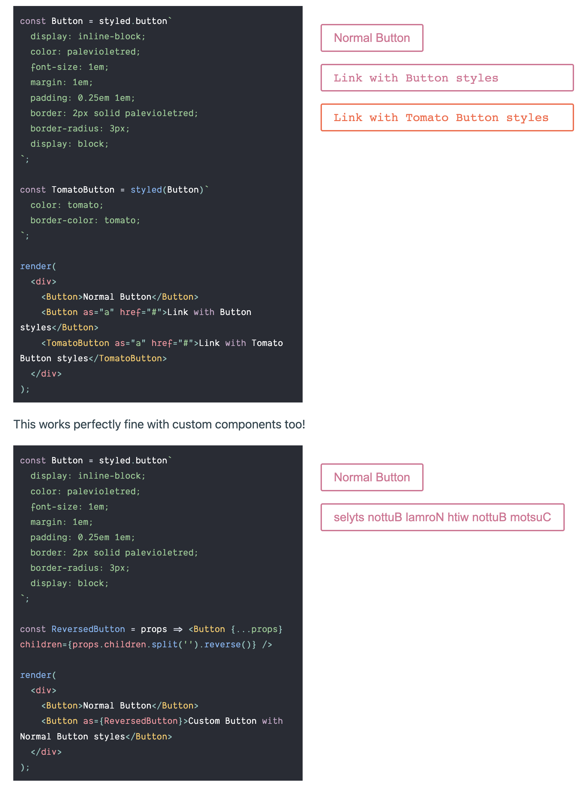
<br />
<br />
<br />

## 5. Netflix 앱 완성하기
- [#5 넷플릭스 앱 모달 및 이미지 불러오기-1.pdf](https://github.com/eunhye8767/study-react/blob/9e5f3342538bc6958a5dc143e04fd1db047fc1b6/inflearn/johnAhn/react__A-Z/%EC%88%98%EC%97%85%EC%9E%90%EB%A3%8C/%EA%B0%95%EC%9D%98%EB%8F%84%ED%91%9C%EC%9E%90%EB%A3%8C-PDF/%235%20%EB%84%B7%ED%94%8C%EB%A6%AD%EC%8A%A4%20%EC%95%B1%20%EB%AA%A8%EB%8B%AC%20%EB%B0%8F%20%EC%9D%B4%EB%AF%B8%EC%A7%80%20%EB%B6%88%EB%9F%AC%EC%98%A4%EA%B8%B0-1.pdf)
- [#5 넷플릭스 앱 모달 및 이미지 불러오기-2.pdf](https://github.com/eunhye8767/study-react/blob/9e5f3342538bc6958a5dc143e04fd1db047fc1b6/inflearn/johnAhn/react__A-Z/%EC%88%98%EC%97%85%EC%9E%90%EB%A3%8C/%EA%B0%95%EC%9D%98%EB%8F%84%ED%91%9C%EC%9E%90%EB%A3%8C-PDF/%235%20%EB%84%B7%ED%94%8C%EB%A6%AD%EC%8A%A4%20%EC%95%B1%20%EB%AA%A8%EB%8B%AC%20%EB%B0%8F%20%EC%9D%B4%EB%AF%B8%EC%A7%80%20%EB%B6%88%EB%9F%AC%EC%98%A4%EA%B8%B0-2.pdf)
- [#5 넷플릭스 앱 모달 및 이미지 불러오기-3.pdf](https://github.com/eunhye8767/study-react/blob/9e5f3342538bc6958a5dc143e04fd1db047fc1b6/inflearn/johnAhn/react__A-Z/%EC%88%98%EC%97%85%EC%9E%90%EB%A3%8C/%EA%B0%95%EC%9D%98%EB%8F%84%ED%91%9C%EC%9E%90%EB%A3%8C-PDF/%235%20%EB%84%B7%ED%94%8C%EB%A6%AD%EC%8A%A4%20%EC%95%B1%20%EB%AA%A8%EB%8B%AC%20%EB%B0%8F%20%EC%9D%B4%EB%AF%B8%EC%A7%80%20%EB%B6%88%EB%9F%AC%EC%98%A4%EA%B8%B0-3.pdf)

<br />
<br />

> scrollLeft

- [MDN, scrollLeft 자세히 보기](https://developer.mozilla.org/en-US/docs/Web/API/Element/scrollLeft)
  ```javascript
  const button = document.getElementById('slide');

  button.onclick = () => {
    document.getElementById('container').scrollLeft += 20;
  };
  ```
  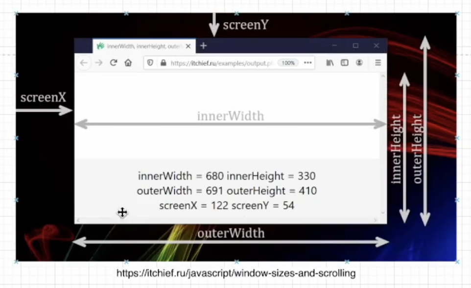

<br />
<br />

> React Router Dom

**React Router DOM**을 사용하면 웹 앱에서 동적 라우팅을 구현할 수 있다.<br />
라우팅이 실행 중인 앱 외 부의 구성에서 처리되는 기존 라우팅 아키텍처와 달리 **React Router DOM**은<br />
앱 및 플랫폼의 요구 사항에 따라 **컴포넌트 기반 라우팅을 용이**하게 합니다.

<br />
<br />

> React Router Dom 설치하기

```
npm install react-router-dom --save
yarn add react-router-dom
```

<br />
<br />

> React Router 설정하기
설치가 완료된 후 가장 먼저 할 일은 앱 어디에서나 React Router를 사용할 수 있도록 하는 것이다.<br />
이렇게 하려면 src 폴더에서 `index.js` 파일을 열고<br /> 
react-router-dom에서 `BrowserRouter`를 가져온 다음<br /> 
루트 구성 요소(App 구성 요소)를 그 안에 래핑한다.

<br />

#### 1 BrowserRouter로 루트 컴포넌트 감싸주 기
<br />
<br />

- BrowserRouter :<br />HTML5 History API(pushState, replaceState 및 popstate 이벤트)를 사용하여 UI를 URL과 동기화된 상태로 유지.

<br />

#### 2 여러 컴포넌트 생성 및 라우트 정의하기
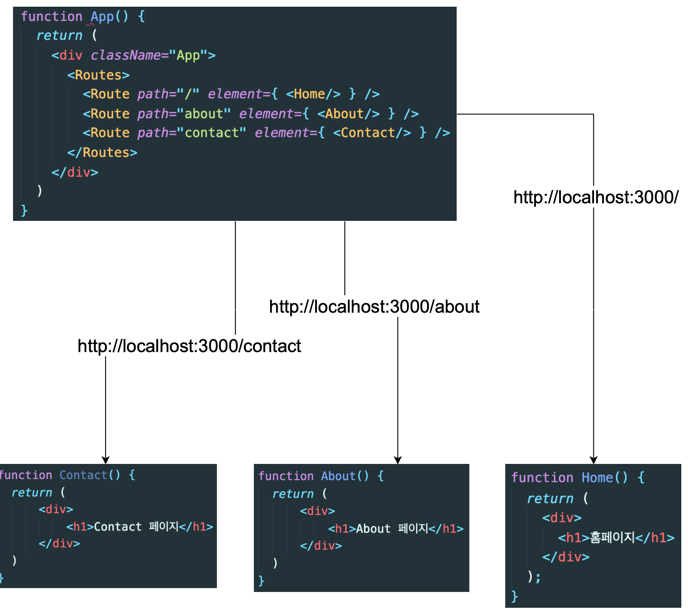<br />
<br />

- Routes :<br />Routes는 앱에서 생성될 모든 개별 경로에 대한 컨테이너/ 상위 역할을 합니다.<br />Route로 생성된 자식 컴포넌트 중에서 매칭되는 첫번째 Route를 렌더링 해줍니다.
- Route :<br />Route 는 단일 경로를 만드는 데 사용됩니다. 두 가지 속성 을 취합니다.<br />path 는 원하는 컴포넌트의 URL 경로를 지정합니다. 이 경 로 이름을 원하는 대로 정할 수 있습니다. <br />위에서 첫 번째 경로 이름이 백슬래시(/)임을 알 수 있습니다. 경로 이름이 백 슬래시인 컴포넌트는 앱이 처음 로드될 때마다 먼저 렌더링 됩니다.<br /> 이는 홈 구성 요소가 렌더링되는 첫 번째 구성 요소 Route가 됨을 의미합니다<br />element 경로에 맞게가 렌더링되어야 하는 컴포넌트를 지 정합니다.

<br />

#### 3 `<Link />` 를 이용해 경로를 이동하기
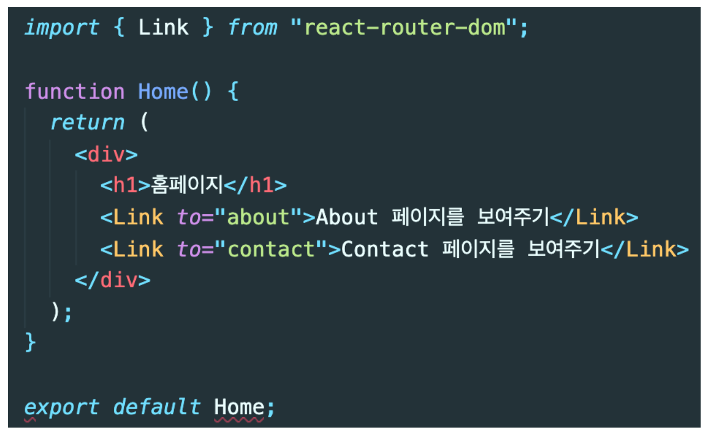<br />
<br />

- Link 구성 요소는 HTML의 앵커 요소(<a />)와 유사합니다. 그것의 to 속성은 링크가 당신을 데려가는 경로를 지정합니다.
- 앱 구성 요소에 나열된 경로 이름을 생성했기 때문에 링크를 클릭하면 경로를 살펴보 고 해당 경로 이름으로 구성 요소를 렌더링합니다.

<br />

#### 4 중첩 라우팅(Nested Routes)
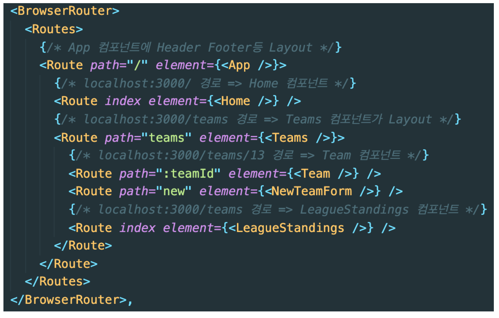<br />
<br />

- 이것은 React Router의 가장 강력한 기능 중 하나이므로 복잡한 레이아웃 코드를 어지 럽힐 필요가 없습니다. <br />대부분의 레이아웃은 URL의 세그먼트에 연결되며 React Router는 이를 완전히 수용합니다.

<br />

#### 5 Outlet
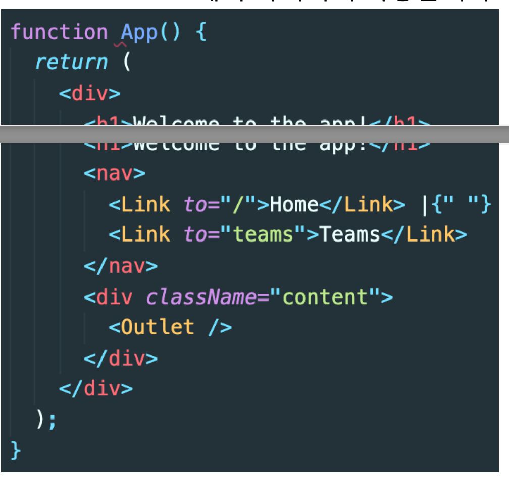<br />
<br />

- 자식 경로 요소를 렌더링하려면 부모 경로 요소에서 `<Outlet>`을 사용해야 합니다.<br />이렇 게 하면 하위 경로가 렌더링될 때 중첩된 UI가 표시될 수 있습니다.<br />부모 라우트가 정확 히 일치하면 자식 인덱스 라우트를 렌더링하거나 인덱스 라우트가 없으면 아무것도 렌 더링하지 않습니다.<br />`react-router-dom`에서 가져와서 사용합니다.

<br />

#### 6 useNavigate
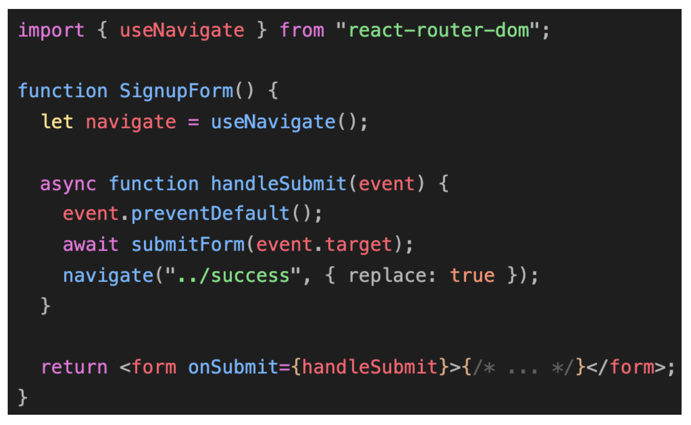<br />
<br />

- 경로를 바꿔줍니다.<Br />`navigate('/home') ===> localhost:3000/home` 으로 갑니다.

<br />

#### 7 useParams
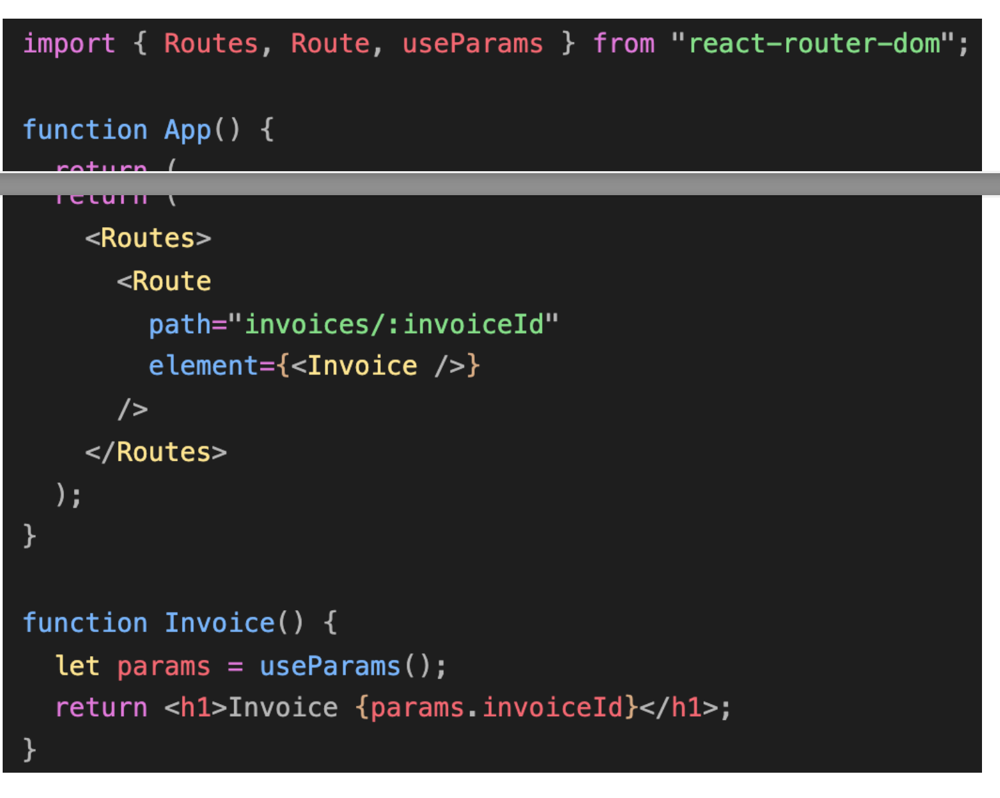<br />
<br />

- `:style` 문법을 path 경로에 사용하였다면 `useParams()`로 읽을 수 있습니다.<br />아래는 `:invoiceId`가 무엇인지 알기위해 `usePrams`를 사용했습니다.

<br />

#### 8 useLocation
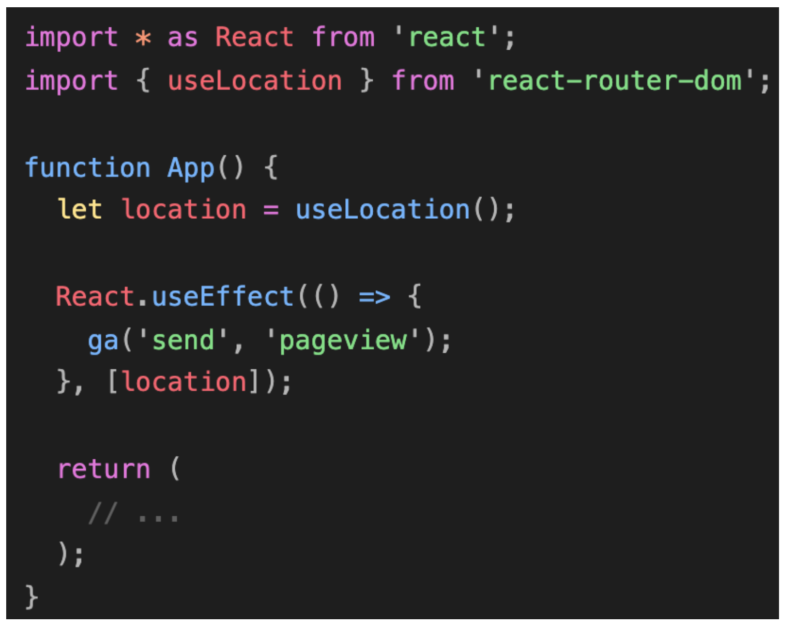<br />
<br />

- 이 Hooks 는 현재 위치 객체를 반환합니다.<br />이것은 현재 위치가 변경될 때마다 일부 side effect를 수행하려는 경우에 유용할 수 있습니다.
- `useLocation()`을 콘솔로그로 출력해보면 아래와 같이 나온다.<Br />
  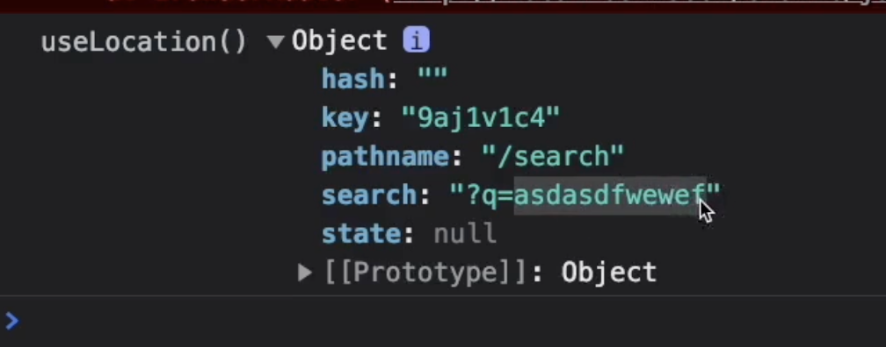<br />

<br />

#### 9 useRoutes (★★★)
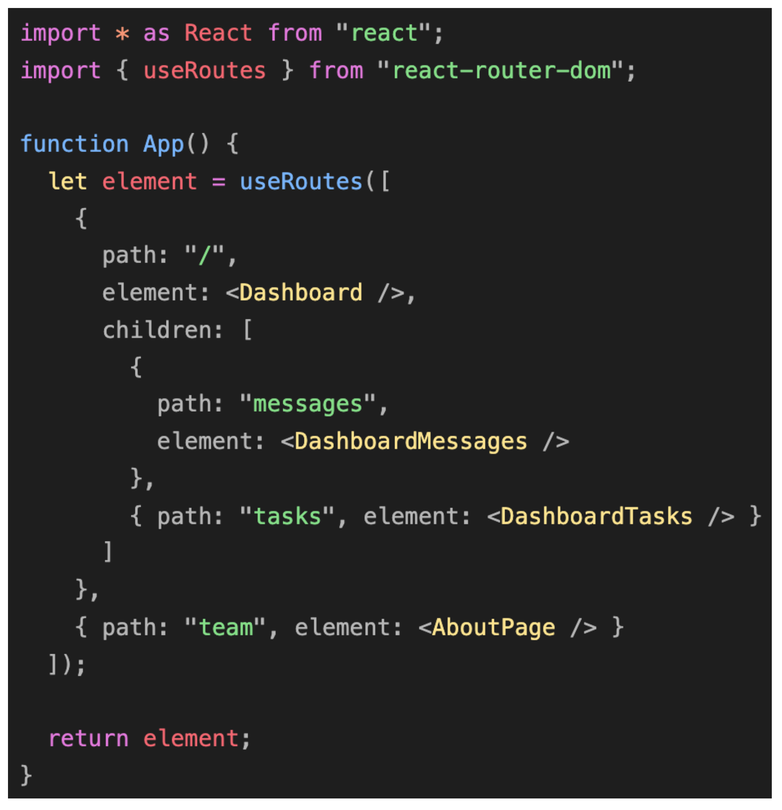<br />
<br />

- useRoutes Hooks는 와 `<Routes>`와 기능적으로 동일하지만 `<Route>`요소 대신 JavaScript 객체를 사용하여 경로를 정의합니다. 
- 이러한 객체는 일반 `<Route>` 요소와 동일한 속성을 갖지만 **JSX가 필요하지 않습니다.**
<br />
<br />
<br />

#### 10 useDebounce Custom Hooks 만들기 (★★★)

아래 그림을 보면 검색 입력에 입력할 때 입력 결과가 나타날 때까지 지연이 있습니다. <br />
이 기능은 debounce디바운스라는 function에 의해 제어됩니다. <br />
debounce function 은 사용자가 미리 결정된 시간 동 안 타이핑을 멈출 때까지 keyup 이벤트의 처리를 지연시킵니다.<br />
이렇게 하면 UI 코드가 모든 이벤트를 처리할 필요가 없고 서버로 전송되는 API 호출 수도 크게 줄어듭니다.<br />
입력된 모든 문자를 처리하면 성능이 저하되고 백엔드에 불필요한 로드가 추가될 수 있습니다.<br />
<br />

- 적용 예시 : 검색창
  - 검색할 때 아래 `function`을 계속 부르다 보니 성능에 부담을 주게 된다
    ```javascript
    const fetchSearchMovie = async (searchTerm) => {
      try {
        const request = await axios.get(
          `/search/multi?include_adult=false&query=${searchTerm}`
        )
        setSearchResults(request.data.results);
      } catch (error) {
        console.log("error", error);
      }
    }
    ```
  
  - 때문에 `useDebounce` `hooks`를 만들어서 타이핑 시 요청하지 않게 제어하도록 한다!
<br />
<br />
<br />

> 모달 창 외부 클릭 시 모달 닫게 만드는 Custom Hooks 생성

1. 어디를 클릭하는 지 구분 (모달 창 안 or 밖)
  - useRef 라는 것을 이용해서 구분할 수 있습니다.
  - **useRef 란?** 특정 DOM을 선택할 때 사용하는 React Hooks 입니다.

2. 특정 DOM 선택하 기
  ```javascript
  function MyComponent() {
    const myRef = useRef(null);

    return (
      <div ref={myRef} />
    )
  }  
  ```
  <br />

  - useRef()를 이용해서 Ref 객체를 만들고, 이 객체를 특정 DOM에 ref 값으로 설정합니다. <br />
  이렇게 되면 Ref 객체의 .current 값이 특정 DOM을 가리키게 됩니다.
    ```javascript
    const ref = useRef();

    <div className="presentation">
      <div className="wrapper-modal">
        <div className="modal" ref={ref}>
    ```
  <br />

  - **DOM을 직접 선택해야 할 경우들**
    1. 엘리먼트 크기를 가져와야 할 때
    2. 스크롤바 위치를 가져와야 할 때
    3. 엘리먼트에 포커스를 설정 해줘야 할 때 등등등

<br />
<br />
<br />

> API_KEY 환경변수로 숨기기

- root 폴더에 `.env` 파일을 만든다.
  ```javascript
  // .env
  REACT_APP_MOVIE_DB_API_KEY=apikey입력
  ```

- API_KEY 키를 `.env` 파일에 적용한 후, `src/api/axios.js`에 적용한다.
  ```javascript
  // api/axios.js

  const instance = axios.create({
    params: {
      api_key: process.env.REACT_APP_MOVIE_DB_API_KEY,
  ```

<br />
<br />
<br />

> github를 이용해서 배포하기

- gh-pages 모듈 설치
  ```
  npm install gh-pages --save-dev
  ```

- 홈페이지 url 작성 (homepage 내용 추가)
  ```
  // package.json
  "homepage": "https://{깃허브 유저 이름}.github.io/{저장소 이름}/",
  ```

- 배포를 위한 script 추가 (predeploy, deploy 추가)
  ```
  // package.json
  "scripts": {
    "start": "react-scripts start",
    "build": "react-scripts build",
    "predeploy": "npm run build",
    "deploy": "gh-pages -d build",
    "test": "react-scripts test",
    "eject": "react-scripts eject"
  },
  ```

- react router dom의 기본 경로 변경
  - 만약 기본 경로가 `https://~~~/react-netflix(basename)`
  ```
  ReactDOM.render(
    <BrowserRouter basename="deploy-test">
      <App />
    </BrowserRouter>.
    document.getElementById('root')
  )
  ```

- deploy 시작 !!!
  ```
  npm run deploy
  ```

  <br />
  <br />
  <br />

## 6. React TDD 기본
- [#6 React TDD 기본](https://github.com/eunhye8767/study-react/blob/44d410cf2defa9b9240281b9707fa40fba117036/inflearn/johnAhn/react__A-Z/%EC%88%98%EC%97%85%EC%9E%90%EB%A3%8C/%EA%B0%95%EC%9D%98%EB%8F%84%ED%91%9C%EC%9E%90%EB%A3%8C-PDF/%236%20React%20TDD%20%E1%84%80%E1%85%B5%E1%84%87%E1%85%A9%E1%86%AB.pdf)

<br />

> 테스트 주도 개발(Test Driven Development)이란 무엇인가?

- 실제 코드를 작성하기 전에 테스트 코드를 먼저 작성합니다.
  1. 원하고자 하는 기능의 테스트 코드 작성 
  2. 테스트 실행 > Fail
  3. 테스트 코드에 맞는 실제 코드 작성
  4. 테스트 실행 > Pass

- TDD를 하면 좋은 점
  1. TDD를 하므로 인해 많은 기능을 테스트하기에 소스 코드에 안정감이 부여된다.
  2. 실제 개발하면서 많은 시간이 소요되는 부분은 디버깅 부분이기에 TDD를 사용하면 디버깅 시간이 줄어들고 실제 개발 시간도 줄어듭니다.
  3. 소스 코드 하나 하나를 더욱 신중하게 짤 수 있기 때문에 깨끗한 코드가 나올 확률이 높습니다.

  <br />
  <br />

> React Testing Library 란?

- [공식문서 바로가기](https://testing-library.com/docs/react-testing-library/intro/)
- React Testing Library는 React 구성 요소 작업을 위한 API를 추가하여 DOM Testing Library 위에 구축됩니다.
- DOM Testing Library란 Dom 노드(Node)를 테스트하기 위한 매우 가벼운 솔루션입니다.
- **Create React App으로 생성된 프로젝트는 즉시 React Testing Library를 지원**합니다. <br />그렇지 않은 경우 다음과 같이 npm을 통 해 추가할 수 있습니다.
  ```
  npm install --save-dev @testing-library/react
  ```
- **React Testing Library == 리액트 컴포넌트를 테스트하는 가벼운 솔루션!**

<br />
<br />

> Jest 란?
- FaceBook에 의해서 만들어진 테스팅 프레임 워크입니다.
- 최소한의 설정으로 동작하며 Test Case 를 만들어서 어플리케이션 코드가 잘 돌아가는지 확인해줍니다.
- **단위 (Unit) 테스트를 위해서 이용**합니다.
- **Create React App으로 생성된 프로젝트**는 따로 설치하지 않아도 된다.

<br />
<br />

> React Testing Library 주요 API

1. React Testing Library 실행에 앞서 테스트할 폴더를 생성
  - 테스트할 폴더 (폴더명 작명) : react-testing-app
  - 특정 폴더 내에서 설치할 경우 `./` 경로로 적용
  ```
  npx create-react-app react-testing-app
  ```

2. `react-testing-app` 폴더 생성 완료 후, `npm test` 명령어를 실행한다.<br />
  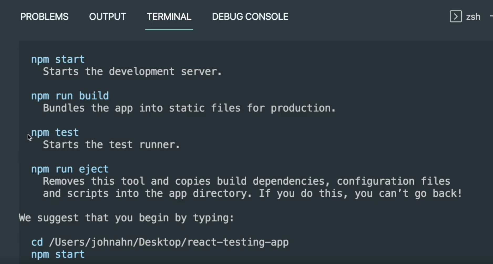<br />

3. `npm test`를 실행하면 아래와 같이 터미널에서 보여지는 것을 확인할 수 있다.
  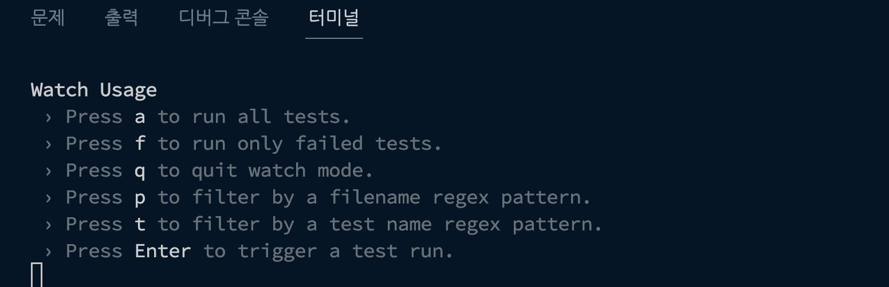<br />

4. `a` 키를 누르면 테스트가 모든 테스트가 진행되는 것을 볼 수 있다.<br />현재 진행중인 테스트를 종료할 땐 `q` 키를 누른다.<br />
  <br />
  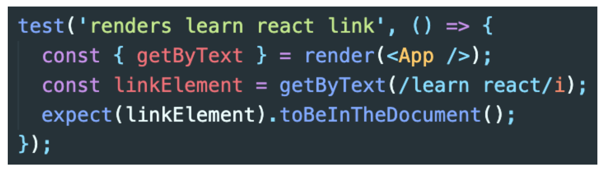<br />
  <br />

5. **"render" 함수**
  - DOM에 컴포넌트를 랜더링하는 함수 인자로 랜더링할 React 컴포넌트가 들어감.
  - Return은 RTL에서 제공하는 쿼리 함수와 기타 유틸리티 함수를 담고 있는 객체를<br />리턴(Destructuring 문법으로 원하는 쿼리 함수만 얻어올 수 있다.)<br /><br />====> **소스 코드가 복잡해지면 비추천!!! screen 객체를 사용**하기<br />왜냐면 사용해야 할 쿼리가 많아질수록 코드가 복잡해질 수 있음.
    ```javascript
    const linkElement = screen.getByText(/learn react/i);

    // 비추천
    const { getByText } = render(<App />);
    const linkElement = getByText(/learn react/i);
    ```

<br />
<br />

> 쿼리 함수에 대해서

- [공식 문서 바로가기](https://testing-library.com/docs/queries/about/)
- **쿼리 함수란 ?**<br />쿼리는 **페이지에서 요소를 찾기 위해 테스트 라이브러리가 제공하는 방법**입니다.<br />여러 유형의 쿼리(`"get", "find", "query")`가 있습니다.<br />**이들 간의 차이점은 요소가 발견되지 않으면 쿼리에서 오류가 발생하는지 또는 Promise를 반환하고 다시 시도하는지 여부**입니다.<br />선택하는 페이지 콘텐츠에 따라 다른 쿼리가 다소 적절할 수 있습니다.<br />
  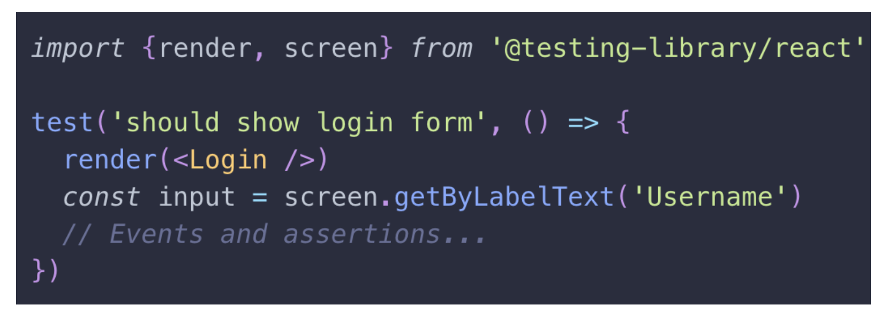<br />
  <br />

- `getBy...`<br />쿼리에 대해 일치하는 노드를 반환 하고 일치하는 요소가 없거나 둘 이상의 일치가 발견되면 설명 **오류를 발생**시킵니다.<br />(둘 이상의 요소가 예상되는 경우 대신 `getAllBy` 사용.)

- `queryBy...`<br />쿼리에 대해 일치하는 노드를 반환 하고 일치하는 **요소가 없으면 null을 반환**합니다. 이것은 존재하지 않는 요소를 어설션하는 데 유용합니다.<br />둘 이상의 일치 항목이 발견되면 오류를 발생합니다.<br />(확인된 경우 대신 `queryAllBy` 사용.)

- `findBy...`<br />주어진 쿼리와 일치하는 요소가 발 견되면 **Promise**를 반환합니다.<br />요소가 발견되지 않거나 기본 제한 시간 1000ms 후에 둘 이상의 요소가 발견되면 약속이 거부됩니다.<br />둘 이상의 요소를 찾아야 하는 경우 `findAllBy`를 사용하세요.

- 총 정리한 내용을 표로 나타내면,<br />
  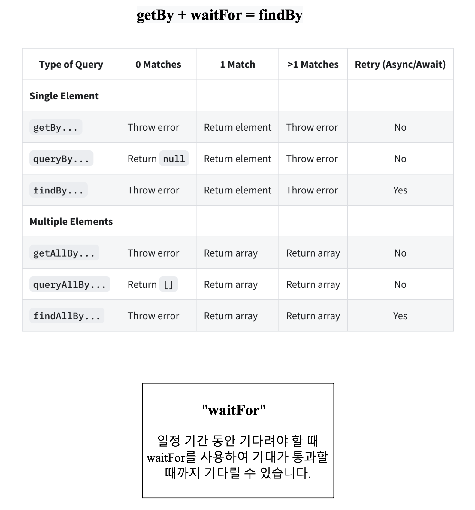

<br />
<br />

> Prettier 설치 및 설정

테스팅할 때 matcher를 알맞게 쓰는지 확신이 들지 않을 때가 있으며,<br />코드의 형식이나 자바스크립트 문법 등을 올바르게 쓰지 못할 때가 있습니다.<br />그러한 부분을 도와주는 모듈을 설치해주는 시간을 갖겠습니다.<br />

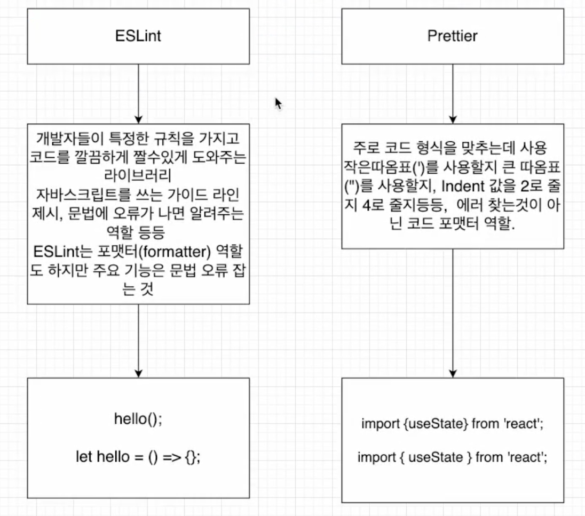<br />

- **Prettier는**<br />코드 형식을 맞추는데 사용합니다.<br />테스팅을 위해서 특화된 것은 아니지만 ESLint와 함께 자주 사용하기에  Prettier도 설치해보겠습니다.<br />
  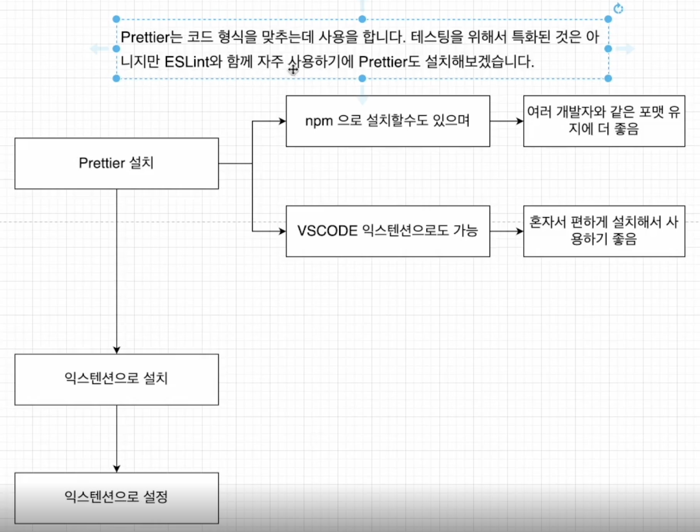<br />

- vscode 익스텐션 설치 => Prettier - Code formatter<br />(mac, vscode 익스텐션 - 단축키 : `shift + option + f`)

<br />
<br />

> ESLint 설치 및 설정하기

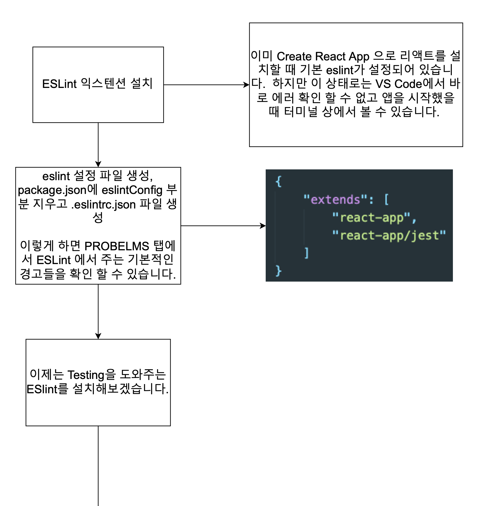<br />
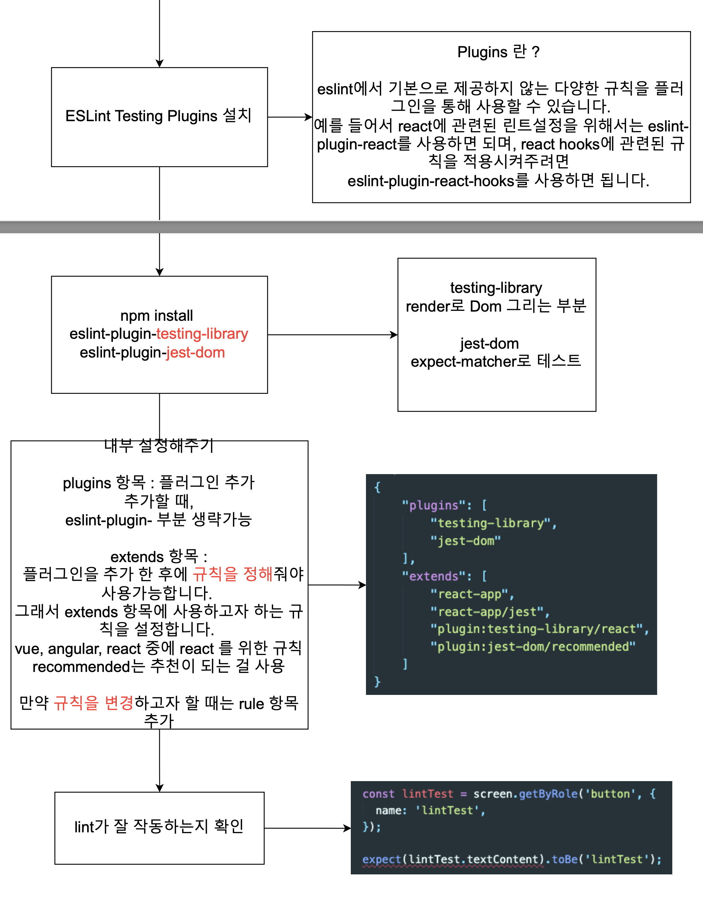<br />

<br />

1. 프로젝트 root 폴더 기준, `.eslintrc.json` 파일을 생성한다.
2. `package.json`에서 `eslintConfig` 전체를 지운다. (잘라내기)
  ```javascript
  // package.json
  "eslintConfig": {
    "extends": [
      "react-app",
      "react-app/jest"
    ]
  },
  ```

3. `.eslintrc.json`에 아래와 같이 붙여 넣는다.
  ```javascript
  {
    "extends": [
      "react-app",
      "react-app/jest"
    ]
  }
  ```

4. 이제는 Testing을 도와주는 ESlint를 설치해보겠습니다.
5. ESLint Testing Plugins 설치
  - Plugins 란 ?<Br />eslint에서 기본으로 제공하지 않는 다양한 규칙을 플러그인을 통해 사용할 수 있습니다.<br />예를 들어서 react에 관련된 린트설정을 위해서는 `eslint-plugin-react`를 사용하면 되며,<br />react hooks에 관련된 규칙을 적용시켜주려면 `eslint-plugin-react-hooks`를 사용하면 됩니다.
  <br />

  - testing-library render로 Dom 그리는 부분<br />jest-dom expect-matcher로 테스트
  ```
  npm install eslint-plugin-testing-library eslint-plugin-jest-dom
  ```

6. 내부 설정해주기
  - plugins 항목 : 플러그인 추가 추가할 때, eslint-plugin- 부분 생략가능
  - extends 항목 : 플러그인을 추가 한 후에 **규칙을 정해줘야 사용**가능합니다.<br />그래서 extends 항목에 사용하고자 하는 규칙을 설정합니다.<br />vue, angular, react 중에 react 를 위한 규칙 recommended는 추천이 되는 걸 사용. **만약 규칙을 변경하고자 할 때는 rule 항목 추가.**
  ```javascript
  // .eslintrc.json
  {
    "plugins" : [
      "testing-library",
      "jest-dom"
    ],
    "extends" : [
      "plugin:testing-library/react",
      "plugin:jest-dom/recommended"
    ]
  }
  ```

7. lint가 잘 작동하는지 확인
  ```javascript
  const lintTest = screen.getByRole('button', {
    name: 'lintTest',
  })

  expect(lintTest.textContent).toBe('lintTest');
  ```

  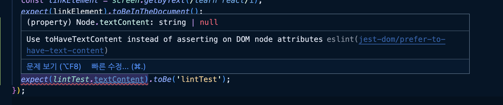<br />
  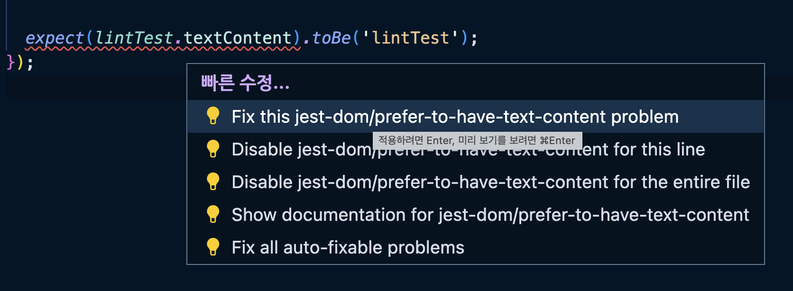<br />
  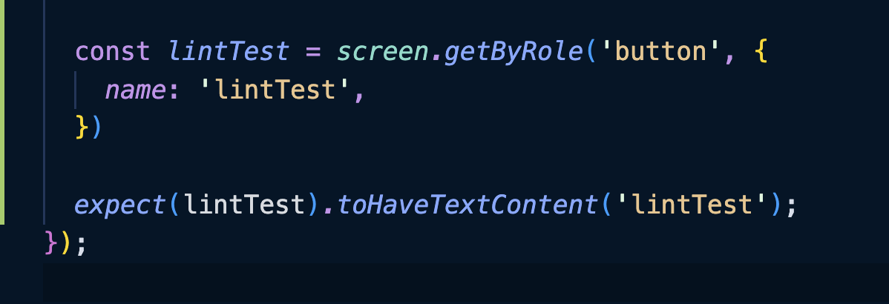<br />

  - 해당 문법이 맞긴 하지만, `eslint`에서 해결방안을 제시. 즉 lint가 잘 작동하는 것을 알 수 있다.

<br />
<br />
<br />

## 7. React TDD 를 이용한 간단한 앱 생성 및 배포

- [#7 React TDD 를 이용한 간단한 앱 생성 및 배포.pdf 바로가기](https://github.com/eunhye8767/study-react/blob/da435ee931171f3d6220356b2532ca2acf9de3c7/inflearn/johnAhn/react__A-Z/%EC%88%98%EC%97%85%EC%9E%90%EB%A3%8C/%EA%B0%95%EC%9D%98%EB%8F%84%ED%91%9C%EC%9E%90%EB%A3%8C-PDF/%237%20React%20TDD%20%E1%84%85%E1%85%B3%E1%86%AF%20%E1%84%8B%E1%85%B5%E1%84%8B%E1%85%AD%E1%86%BC%E1%84%92%E1%85%A1%E1%86%AB%20%E1%84%80%E1%85%A1%E1%86%AB%E1%84%83%E1%85%A1%E1%86%AB%E1%84%92%E1%85%A1%E1%86%AB%20%E1%84%8B%E1%85%A2%E1%86%B8%20%E1%84%89%E1%85%A2%E1%86%BC%E1%84%89%E1%85%A5%E1%86%BC%20%E1%84%86%E1%85%B5%E1%86%BE%20%E1%84%87%E1%85%A2%E1%84%91%E1%85%A9.pdf)

<br />
<br />

> FireEvent API

- https://testing-library.com/docs/dom-testing-library/api-events/
- 유저가 발생시키는 액션(이벤트)에 대한 테스트를 해야 하는 경우 사용합니다. (적은 이벤트 경우)
- 대부분의 경우, `@testing-library/user-event.` 사용한다.

> testing-library/jest-dom
- https://github.com/testing-library/jest-dom
- ex. toHaveStyle 

