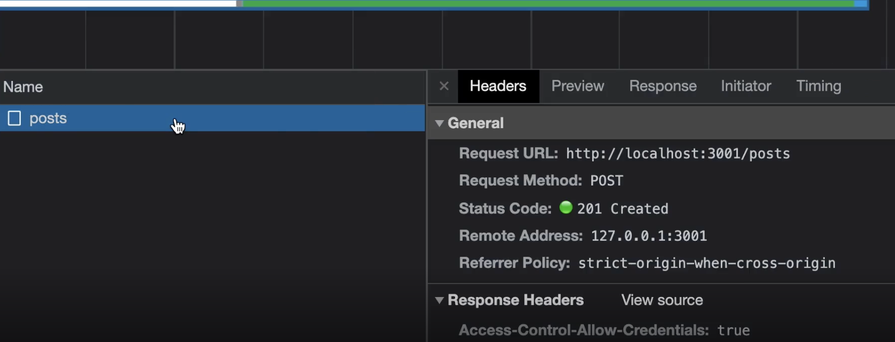
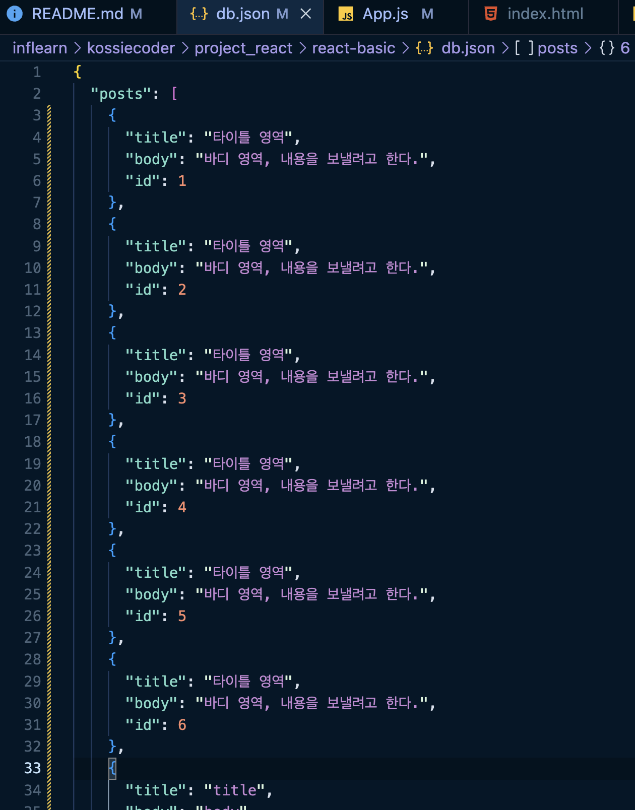

# 프로젝트로 배우는 React.js

#### 1. useState(prevState)
```javascript
import { useState } from 'react';

const [number, setNumber] = useState(1);

const handleChange = () => {
  setNumber(prevState => prevState * 2);
  console.log(number)
}
```

- `prevState` <br >
=> 작명 가능하나 통상적으로 prevState 칭함.<br />
=> 이전 state 값을 가져와서 변경할 수 있음.
- `console.log(number)` <br />
=> 바뀐 useState 값이 나오는 것이 아닌 이전 `number` 값이 나온다.<br />
=> 리-렌더링 후 바뀌기 때문에 바뀌기 전 `number` 값이 나오는 것이다.

<br />
<br />
<br />

#### 2. json-server
- 리액트에서 사용하는 (가짜)데이터 베이스 패키지
- [npm, json-server](https://www.npmjs.com/package/json-server)
  - `json-server command not found` 에러 발생 시 전역으로 설치
  ```
  // 글로벌용(전역)
  npm install -g json-server

  // 해당 프로젝트에만 설치 (-g 빼고 설치)
  npm i json-server
  ```
  - https://github.com/typicode/json-server#routes
    - **GET** : 가져올 때
    - **POST** : 보낼 때
    - **DELETE** : 지울 때
    ```
    GET    /posts
    GET    /posts/1
    POST   /posts
    PUT    /posts/1
    PATCH  /posts/1
    DELETE /posts/1
    ```

- 루트폴더에 `db.json` 파일 생성.
  ```javascript
  // 예시
  {
    "posts": [
      { "id": 1, "title": "json-server", "author": "typicode" }
    ],
    "comments": [
      { "id": 1, "body": "some comment", "postId": 1 }
    ],
    "profile": { "name": "typicode" }
  }
  ```

- 새로 만든 `db.json`을 `json-server`로 실행.
  ```
  json-server --watch db.json

  // 포트 번호 적용할 때
  json-server --watch db.json --port 3001
  ```

- 터미널에서 아래 URL 주소 확인 가능. => /posts 부분이 db.json 파일.
  ```
  Resources
  http://localhost:3000/posts

  Home
  http://localhost:3000
  ```
<br />
<br />
<br />

#### 3. DB에 데이터 저장
- DB에 데이터 저장하기에 앞서 `axios`를 설치.
  - [npm, axios](https://www.npmjs.com/package/axios)
  ```
  npm i axios
  ```
- `json-server`
  ```
  Plural routes
  GET    /posts        
  GET    /posts/1   
  POST   /posts  
  PUT    /posts/1      (아이디가 1인 posts를 전체 업데이트 시)
  PATCH  /posts/1      (아이디가 1인 posts를 부분 업데이트 시)
  DELETE /posts/1
  ```

- `axios post` 적용
  ```javascript
  import axios from "axios";

  const onSubmit = () => {
    axios.post("http://localhost:3000/posts", {
      title,
      body
    })
  }
  ```

- `axios post`를 통해 보내게 되면 브라우저, 네트워크 탭에서 보낸 것을 확인할 수 있다. (터미널에서도 확인 가능)<br />
  

- `db.json` 파일에 보낸 데이터가 등록된 것을 확인 할 수 있다.<br />
  

<br />
<br />
<br />

#### 4. db 실행 명령어 스크립트에 넣기
- `package.json` 파일에 db를 실행시켜주는 명령어 코드를 추가 한다.
  ```javascript
  // package.json
  "scripts": {
    "start": "react-scripts start",
    "db": "json-server --watch db.json --port 3001",
  ```
- `db`를 실행시키고자 할 땐, `npm run db`

<br />
<br />
<br />

#### 5. React Router
- [react router (공홈)](https://reactrouter.com/en/main)
- 라우터(React Router) 설치
  ```
  npm install react-router-dom
  ```
- 라우터 기본 구조
  ```javascript
  import {
    BrowserRouter as Router, // BrowserRouter => Router로 사용
    Switch,
    Route,
    Link
  } from "react-router-dom"

  function App() {
    return (
      <Router>
        <div>
          <Link to="/">Home</Link>
          <Link to="/blogs">Blogs</Link>
        </div>
        
        <Switch>
          <Route path="/" exact>Home page</Route>
          <Route path="/blogs">Blogs page</Route>
        </Switch>
      </Router>
    )
  }
  ```
  - `<Route path="/" exact>` : `path="/"` 처럼 주소(경로)가 "/"일 때만 해당 컴포넌트 출력.
  - `<Route path="/">` :  `path="/"`처럼 주소(경로)에 들어갈 때 해당 컴포넌트 출력.

  <br />
  <br />
  <br />

#### 6. NavLink
- `NavLink`를 이용하여 `active` 효과를 줄 수 있다.
- [react router - navlink 공홈](https://reactrouter.com/en/main/components/nav-link)
  ```javascript
  import * as React from "react";
  import { NavLink } from "react-router-dom";

  function NavList() {
    let activeStyle = {
      textDecoration: "underline",
    };

    let activeClassName = "underline";

    return (
      <nav>
        <ul>
          <li>
            <NavLink
              to="messages"
              style={({ isActive }) =>
                isActive ? activeStyle : undefined
              }
            >
              Messages
            </NavLink>
          </li>
          <li>
            <NavLink
              to="tasks"
              className={({ isActive }) =>
                isActive ? activeClassName : undefined
              }
            >
              Tasks
            </NavLink>
          </li>
  ```

- [v5 router](https://v5.reactrouter.com/web/api/NavLink/exact-bool)
  - **exact: bool** : 정확한 주소일 때. ex) /profile/edit 일 때 activeClass 적용 불가.
    ```html
    <NavLink exact to="/profile">
      Profile
    </NavLink>
    ```

  - **strict: bool** : 엄격한
    ```html
    <NavLink strict to="/events/">
      Events
    </NavLink>
    ```

  - exact, strice 모드 외에 다른 모드도 있다. <br />상황에 따라 맞는 모드를 적용하면 될 듯 하다. (가이드 참고, 버전에 따라 다를 수 있음.)

  <br />
  <br />
  <br />

#### 7. props children
- **기본 타입**
  - `pages/ListPage.js`
    ```javascript
    return (
      <div>
        <h1>Blogs</h1>
        {posts.map((post) => {
          return (
            <Card key={post.id} title={post.title}>
              <div className="d-flex justify-content-between">
                <div>{post.title}</div>
                <div>buttons</div>
              </div>
            </Card>
          );
        })}
      </div>
    );
    ```

  - `components/Card.js`
    - `<div className="d-flex justify-content-between">` 영역이 `children`으로 들어가게 된다.
    ```javascript
    const Card = ({title, children}) => {
      return (
        <div className="card mb-3">
          <div className="card-body">{children}</div>
        </div>
      );
    };

    export default Card;
    ```

- **children 있을 때? 없을 때? 구분지어 적용**
  - `pages/ListPage.js`
    ```javascript
    return (
      <div>
        <h1>Blogs</h1>
        {posts.map((post) => {
          return (
            <Card key={post.id} title={post.title}>
              <button>버튼</button>
            </Card>
          );
        })}
      </div>
    );
    ```

  - `components/Card.js`
    - `<div className="d-flex justify-content-between">` 영역이 `children`으로 들어가게 된다.
    ```javascript
    const Card = ({ title, children }) => {
      return (
        <div className="card mb-3">
          <div className="card-body">
            <div className="d-flex justify-content-between">
              <div>{title}</div>
              {children && <div>{children}</div>}
            </div>
          </div>
        </div>
      );
    };
    ```

<br />
<br />
<br />

#### 8. prop-types
- props 별로 타입을 정해놓으면 그거에 맞는 정보를 알맞게 가져올 수 있다.
- [npmjs, prop-types 자세히보기](https://www.npmjs.com/package/prop-types)
  <br />

```javascript
// Card.js
import PropTypes, { string } from "prop-types";

const Card = ({ title, children }) => {
  return (
    <div className="card mb-3">
      <div className="card-body">
        <div className="d-flex justify-content-between">
          <div>{title}</div>
          {children && <div>{children}</div>}
        </div>
      </div>
    </div>
  );
};

Card.propType = {
  title: PropTypes.string,
}

// 필수 항목
Card.propType = {
  title: PropTypes.string.isRequired,
}

// 기본값 적용
Card.defaultProps = {
  title: "Title"
}

export default Card;
```

- **props types**
   - `import PropTypes from "prop-types";` 에서 `import { string } from "prop-types";`으로 <br />import 할 경우, `title: string,`으로 적용이 가능하다.
  ```javascript
  Card.propType = {
    title: PropTypes.string,
  }
  ```

- **props를 보내주지 않았을 때, 기본으로 특정 값을 보여지게 적용할 때**
  ```javascript
  Card.defaultProps = {
    title: "Title"
  }
  ```

- **특정 props를 필수 항목으로 적용해야 할 때** : `isRequired`를 적용한다.
  ```javascript
  Card.propType = {
    title: PropTypes.string.isRequired,
  }
  ```

- **children props type 정할 때**
  - 본 프로젝트에서는 리액트 엘리먼트로 적용하며, 기본값은 null
  - 만약, children에 "hi" 처럼 텍스트로 적용할 경우 에러가 발생하게 된다. (앨리먼트가 아니기 때문에!)
  ```javascript
  // 필수 항목
  Card.propType = {
    title: PropTypes.string.isRequired,
    children: PropTypes.element,
  }

  // 기본값 적용
  Card.defaultProps = {
    children: null
  }
  ```

<br />
<br />
<br />

#### 9. useHistory
- router v5 => `useHistory` <br />router v6 => `useNavigate`
- [참고 사이트](https://kangdanne.tistory.com/167)

<br />
<br />
<br />

#### 10. 이벤트 버블링
- 부모로 이벤트가 올라가는 현상을 막아줄 땐
  ```javascript
  const click = (e) => {
    e.stopPropagation();
  }
  ```
<br />
<br />
<br />

#### 11. filter 함수
```javascript
const arr = [1,2,3];
const result1 = arr.filter((value) => {
  return value !== 1;
})

console.log(result1) // [2,3]

const result2 = arr.filter((value) => {
  return value < 3;
})

console.log(result2) // [1,2]
```

<br />
<br />
<br />

#### 12. useParams
- `useParams()`을 이용하여 현 페이지 내 파라미터 값을 가져올 수 있다.
  ```javascript
  // routes.js
  {
    path: '/blogs/:id',
    component: ShowPage
  }
  ```
  ```javascript
  // ShowPage.js
  import React from 'react'
  import { useParams } from 'react-router-dom'

  const ShowPage = () => {
    // routes에서 id로 적용해서 동일하게 id를 넣어주면 된다.
    const { id } = useParams();

    console.log(id);
    return (
      <div>
        show page
      </div>
    )
  }

  export default ShowPage
  ```

<br />
<br />
<br />

#### 13. 블로그 생성된 시간 추가
- 블로그 글을 작성할 때 `BlogForm.js` 파일에 현재 시간을 넘겨준다. <br />`Date.now()` 함수를 이용한다.
  ```javascript
  const onSubmit = () => {
    axios
      .post("http://localhost:3001/posts", {
        // 보낼 데이터 영역
        title,
        body,
        createdAt: Date.now()
      })
      .then(() => {
        history.push("/blogs");
      });
  };
  ```

- `1677065410005` 처럼 숫자가 쭉 나열되서 나오는 것을 확인할 수 있다.

- 해당 숫자를 날짜로 변환해주는 함수를 만들어 준다.
  ```javascript
  const printDate = (timestamp) => {
    return new Date(timestamp).toLocaleString();
  }

  printDate(post.createdAt)
  ```